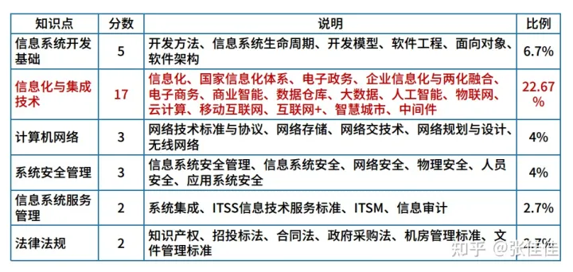

研究下可以抵扣个税的证书
在个税APP申报的列表里面有，哪些可以抵扣
https://zhuanlan.zhihu.com/p/355346189
专业技术人员职业资格包括**教师资格证、法律职业资格证、医生资格证、新闻记者职业资格证、导游资格证等。**
纳税人一个年度内多个证书也只能扣3600元，在个税APP中填写一个证书即可。
 
# 无线电执照
https://zhuanlan.zhihu.com/p/104765218
江苏省工业和信息化厅网站：[gxt.jiangsu.gov.cn](https://link.zhihu.com/?target=http%3A//gxt.jiangsu.gov.cn/)
**南京市**：由南京市无线电管理委员会办公室组织，网上报名网站：[nj.wxmktx.cn](https://link.zhihu.com/?target=http%3A//nj.wxmktx.cn/)咨询电话：025-86266652、86266670
**无锡市**：无锡市经济和信息化委员会，网上报名技术咨询电话：0510-87902353
好像很简单的样子

# 软考中项

## 备考1
但是直接刷题是没用的，没有建构完整的知识体系。应该先看一遍书，看完了书之后再做题巩固，不会再回到书本搞清楚！
网上也有一些刷题软件，可以利用，有真题+模拟题，分章节的，也可以选择一整套的模式，记录错题集，推荐一个软件“软考通”。
下午是案例题，计算题一定要把握好，一些计算公式，背熟！
系统集成的复习时间一般在2~4个月，每天至少保证2个小时的复习时间，想要通过考试难度不大。

