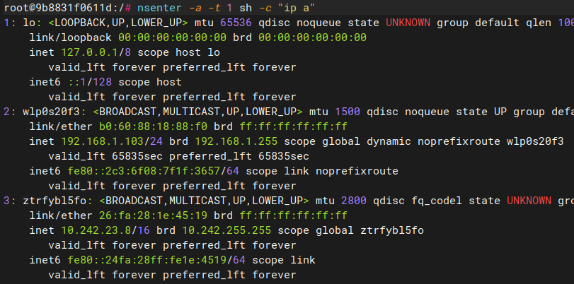
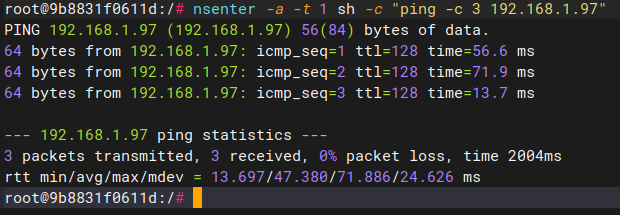
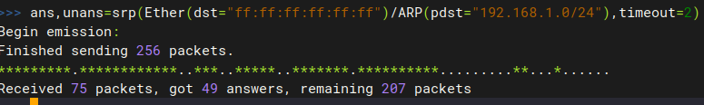
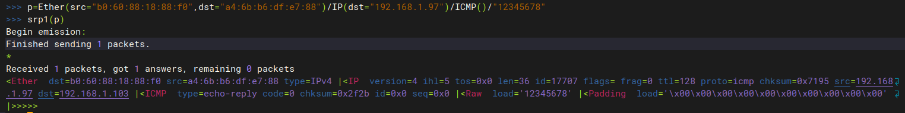

# docker network test using scapy
## environment setup
```bash
# create new bridge network
sudo docker network create brtest
# start 3 ubuntu containers using bridged network, 1 in priviledge + bridge mode, 1 in host mode
sudo docker run -it --network=brtest --name ubuntu_br --restart=always ubuntu
# open another terminal
sudo docker run -it --network=brtest --pid=host --name ubuntu_brpp --privileged ubuntu
# open another terminal
sudo docker run -it --network=host --name ubuntu_h ubuntu
# install dependencies on all containers
sed -i s@/archive.ubuntu.com/@/mirrors.aliyun.com/@g /etc/apt/sources.list 
sed -i s@/security.ubuntu.com/@/mirrors.aliyun.com/@g /etc/apt/sources.list  
apt-get clean  
apt-get update
# install 
apt install python3 python3-pip python3-scapy iproute2 net-tools -y
ip a

```
# test 1 bridge+host+nsenter to ping another laptop
so if we run below command in ubuntu_brpp container, we shall see the output of 
host "ip a"
```bash
nsenter -a -t 1 sh -c "ip a"
```

If we run below command to ping another laptop which is in the sanme LAN as host.
```bash
nsenter -a -t 1 sh -c "ping 192.168.1.97"
```
we shall see it like below:

and wireshark on that laptop will show:

# test 2 bridge + nsenter to ping another laptop
not worked, cause different network segment

# test 3 host mode to ping another laptop
In host mode, without --pid parameter via docker run. Using scapy to send ARP broadcast in L2.


Change the packet to customized data "12345678"
```bash
p=Ether(src="b0:60:88:18:88:f0",dst="a4:6b:b6:df:e7:88")/IP(dst="192.168.1.97")/ICMP()/"12345678"
srp1(p)
```



