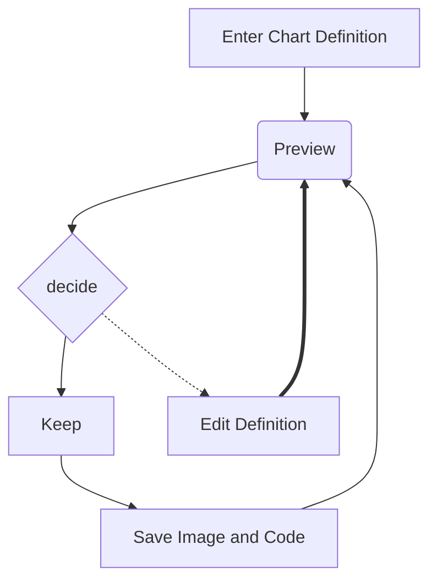
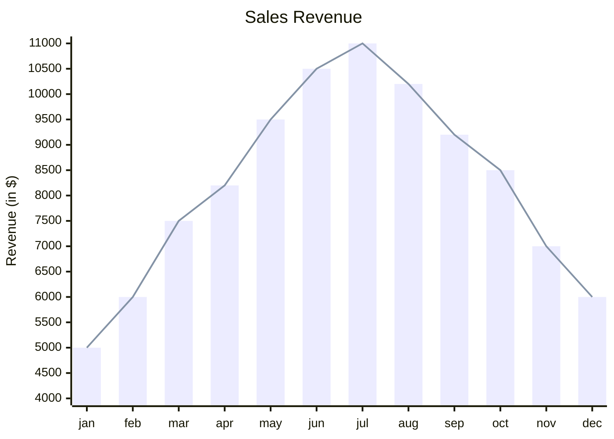

#todo #diary
# ubuntu虚拟机的设置
[[../../80_Development/8010_工作环境搭建/Ubuntu 虚拟机]]

# Mermaid
[[../../03_学千种技/030_我的“工具箱”/202501-6-笔记软件/20250109-Obsidian官方教程拾遗]]
## 教程和学习
Mermaid中文网：[关于 Mermaid | Mermaid 中文网](https://mermaid.nodejs.cn/intro/)
Mermaid在线编辑器：[Mermaid 在线编辑器](https://mermaid-live.nodejs.cn/edit#pako:eNqdVG1vmzAY_CuWq06bRJhDAinOVKkk1bS3ZgrRPmxMlQsmsQo2M0ZNFuW_z0BCIEs0af6AefDd-eA5s4WhiCjEcClJtgKf5wEHelxfgw88KxR40KsYfOLiJaHRkoL3FeyjP3sAU6JIjb77EcBTSEkEr0vgm3dP8u1tdanh23oC4NWvQqgxi-oZ72uumY99a1BXRot4YISCK8pVlzbLqCRKSBCuCNc2WJqRUOWmaV4WSqkikX6Ng9K2gzmgclHIkHZ3-0JY6YHwkII5zYRUwELW0HTObdbyHbOI8qMYMl27A921ql0Af4Je7xZ4AW_a4t3PF-CrFCHNc8aXwC-eqtbVgHxfAU-35ASq1Y6GIiZpqJjgYOEdn3p9TVvQtQL3vMyFbBxYesFnKUuIZGoDJiQJi4SUAo0s5VHL56xQOj8YtEh-KCStAV6lOumKVuv_CEsVjv9JjE6DpNFjCT1DHtrOZXLeWDy27cY6i1REFXlX_xtJDn5Petv6Wr7aJGWLqjpMSJ5PaQzKaFbnKGZJgq-oE7uxkSspnim-QshxXHdf9l5YpFbYytbjE42s7n9LJkYothuZwWDQ1eib9t8qoupm10vXjOsidMlMSwzcGZPmvdq76Ei0rI6hAVMqU8Ii_W-qMhBAtaIpDSDWtxGRzwEM-E7jSKGEv-EhxEoW1IBSFMsVxDFJcl0Vmd6NThnR5yJtnmaEfxeiU0O8hWuIHdPVwxrag5Fj28h1bANuILZsfVTdERogZCN7dGPtDPi7Uujv_gDFuKiA)

## 使用
markdown文件里直接用, obsidian 直接支持，vscode需要装一个preview插件。

### 基本语法

- 定义方向：graph TD（从上到下）、graph LR（从左到右）、graph RL（从右到左）、graph BT（从下到上）。
- 节点：
    - 默认节点：A[文本]→ 显示为矩形，内容为“文本”。
    - 圆角节点：B(文本)→ 圆角矩形。
    - 菱形节点：C{文本}→ 菱形。
    - 圆形节点：D((文本))→ 圆形。
- 连接线：
    - 实线：A –> B
    - 虚线：A -.-> B
    - 加粗线：A ==> B
    - 带文本的线：A — 文本 –> B

### 通用graph
用`graph`关键字即可。

### 子图
在节点中使用`subgraph`关键字

### 支持XY图！！
简单的数据图表都可以做了

