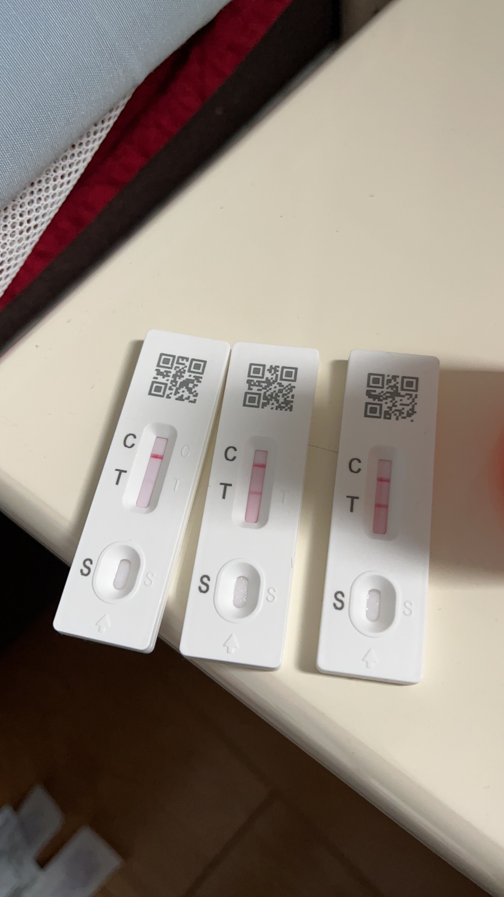

>  2022年12月8日，国务院发布“新十条”，持续了三年整的疫情正式放开。意味着全民免疫开始了。
>
> http://www.gov.cn/zhengce/2022-12/08/content_5730631.htm

新冠疫情从2020年1月份，准确说是2019年12月底开始，到正式放开，整整三年。这三年经历了最开始的alpha变种，delta，到现在百花齐放乱七八糟的omicron，传染性R0已经达到了20以上，也从主要攻击肺部转为上呼吸道。据说上海已经发现了最新的XBB，算了，天地不仁，我们自求多福吧。

本文仅记录开放前后得新冠的历程。我相信不会只有一波的，我们也不会只中招一次。

# 2022年12月第一波

阳性和转阴都是靠抗原测的。

## 我

### 2022年12月13日 

预约了爱康的体检，虽然需要48小时内的核酸阴性（这时候还有核酸小屋，在天鹅湖做的单人单管，花费16大洋），但这个确实是风险最大的一次暴露，不知道是否这次被传染，距离我抗原阳性还有9天。

### 2022年12月20日

办公室第一个阳性出现，此人午睡后觉得自己发烧了，当场做了个抗原，阳性。我在下午三点左右回家，开始次卧自我隔离。

### 2022年12月21日

在次卧憋了一天多，到晚上实在憋不住了，遂在家里中断隔离，本质上还是内心深处不相信omicron这样隔离有用，而且家里房子小，厕所和厨房等无法做到真正隔离。当晚还和佑佑妈妈有亲密接触，后续她是家里第二个阳了的，估计和这个有关系。

整日体温维持在37°。

### 2022年12月22日 有症状第一天

办公室第二个阳的出现，坐我旁边的。

我的嗓子变声了，起床后体温维持在37.5°。

09：50 AM

做了个抗原还没阳。开始咳嗽。

10：00 AM

体温升高到37.7，又看了一眼刚才做的抗原，妈的，居然两道杠了。所以说抗原做了要等一会再看。

14：31 PM

睡了一觉，味觉还在，37.8°，头疼。

20：06 PM

38.2°，嗓子一直痒，有点头晕。半小时后到了38.4°，服用一片布洛芬缓释胶囊（芬必得）。

21：00 PM

流鼻涕加重。

22：08 PM

体温39.1°，整夜发烧很难受，感觉冷，睡眠很浅，夹杂着咳嗽和流鼻涕。

### 2022年12月23日 有症状第二天

08：23 AM

体温38.2°，整个人不舒服，全身乏力，咳嗽有痰，头疼。啥也不想做，就想躺着，明明口干舌燥嘴唇干裂，但连喝水都不想拿。又做了一次抗原，T的那条线颜色深多了。

09：40 AM

又到了38.5°，补充布洛芬。

19：32 PM

下午时候找出来佑佑剩的大半瓶泰诺林（对乙酰氨基酚），吃了大概15ml，体温下降了一些。到了晚上体温回升的很明显，扛不住了，把剩下的都喝了。

### 2022年12月24日 有症状第三天

昨晚是最艰难的一晚。三点发烧，头疼疼醒了，右耳后面电击似的那种疼，每隔两三秒来一次，整个右脸跟着抽搐。体温39.2°，一次性吃了两粒布洛芬。头疼试了好几种躺着的姿势，最后发现脑袋朝右一定角度，正好压着电击部位的时候可以不那么疼，保持这个姿势睡到了天亮。

08：48 AM

退烧到37.5°。

20：53 PM

体温37.8°，恢复了一定精力。看到了无锡发布的公众号里，目前BF7占60%，BF5.2占30%，BA5.1占10%。我也不知道自己是哪种。

### 2022年12月25日 有症状第四天

08：09 AM

体温37.3°，咳嗽不止。

### 2022年12月26日 有症状第五天

抗原颜色深度秒杀娃和娃他妈的，看来我体内的病毒载量最多。

依次为佑佑，佑佑妈妈，我的。

到这天体力恢复了不少，忙里偷闲洗了个澡。

### 2022年12月27日 —— 2022年12月29日

一直咳嗽，无力，说不出话。晚上睡觉因为鼻子不通气，一直用嘴呼吸，导致嘴唇一直干裂。

29日 11：04AM

第九天的抗原终于一道杠了。

### 阶段性总结

新冠绝对不是钟南山所谓的99%的人7天内能好，更不是张文宏之类的说的90%无症状。好久没这么发烧了，差点把我命都弄没了。

到今天（20230102），依然时不时会咳嗽。味觉仍未恢复，吃东西唱不出来味道。

整个发烧期间，静息心率从平均53-55次提升到了71-74次。体重从75kg掉到了72kg。

不知道什么时候整个人才能恢复到新冠以前。

## 佑佑她妈

### 2022年12月24日 有症状第一天

阳，第一天，嗓子变声了。抗原弱阳。

### 2022年12月25日 有症状第二天

开始发烧。

18：29 PM，抗原终于两道杠了。

### 2022年12月31日 有症状第八天

抗原转阴，仍咳嗽。

## 佑佑

### 2022年12月24日 有症状第一天

晚上开始发烧，抗原还是阴的。

### 2022年12月25日 有症状第二天

10：45 AM

体温38.8°，美林5ml，之后温度降了。

11：48 AM

抗原阳了。体温37.5°。

16：00 PM

体温38.4°，美林5ml。

20：08 PM

体温37.8°。

22：03 PM

体温38°。

22：13 PM

体温38.5°，美林5ml。

### 2022年12月26日 

体温没上过38度，一直37+，慢慢的不发烧了，无咳嗽，无其他症状。

### 2023年1月1日 

抗原阴了。

## 佑佑姥姥

### 2022年12月26日 有症状第一天

嗓子变声了。

### 2023年1月2日 有症状第八天

抗原转阴