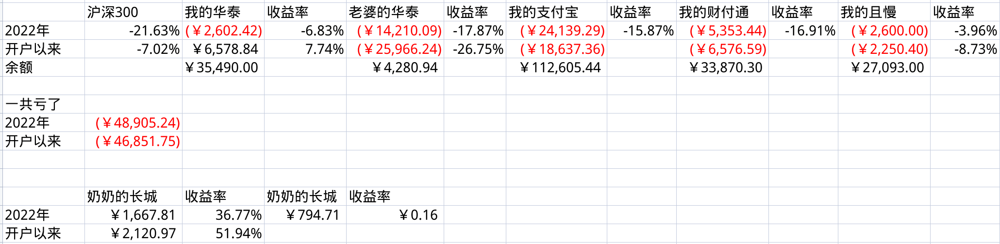

# 2022年度总结之财务篇

总结就是一句话：**亏了不少，结余上涨。**

按照挖财，只计算收入+支出，不列入理财和股市涨跌的情况下，结余34.5W（不算公积金），比21年增加，有史以来结余最多的一年。如果算上公积金，大概在45W。

## 亏了不少，是指有几个失误

### 博世CBS补充养老

博世CBS补充养老亏掉了，差不多有3个W。虽说这笔钱只能退休后提取，但是认真说，这个失误是怪自己。只记得要把其中的薪酬延付部分在离职前改成养老，却忽略了必须待满4年才归属的条款。这个条款实在是不记得了，看了那么多遍CBS手册，也没记住这句话，能怪谁呢？

此外，也是佩服博世的操作，本质上CBS并不是企业年金，而是一笔多余的太平洋养老理财，和今年开始推行的个人养老账户倒是挺像。

### 理财

理财亏了不少，既由于股市大环境不好，也是由于自己认知不行。上半年觉得中概互联跌的差不多了，结果定投中没忍住，最后割肉惨痛离场。下半年梭哈了一大笔新能源和创业板指数，结果也是死活扶不上去。

注：红色的是负值，即亏损。

真的是不算不知道，一算吓一跳，这一年居然亏了4.9W，天啊。虽然收益率上来看还行，还跑赢了沪深300，但绝对值上真的是惨不忍睹啊。亏损中有已经清仓的，大概在1.6W，其余的3.3W算是浮亏吧。

千万不能让卢老师知道，要不以后都没得玩了。

### 西门子补充医疗团体险

属于西门子弹性福利，每年有一定真金白银拿出来，可以选择给自己和家属增加补充医疗保险，不选择的话剩下的钱就来年1月份当工资发放。22年1月份选择的时候还犹豫了一下，要不要把佑佑的医疗报销从50%提升到报销90%，大概多花1300元钱，最终没有选择升级。

娃的医疗保险是个复杂的事情，还牵扯到定点医院，事业单位子女统筹等等。22年1月份选择的时候万万没想到这一年中佑佑会做个手术，而且这个手术的执行我和佑佑妈妈都毅然决然的选择了在儿童医院进行，而不是之前选择定点的江大附院。这样一来，住院的所有费用都要用商业险来承担了，最终去掉自费，1.4W的费用报销了40%（也就是20%自费，剩80%商业险报销50%，即40%）。以后说啥，在西门子一天，就给佑佑把商业医疗险报销额度提升到90%，管他用到没用到，这就是保险的意义。

### 卢老师的工资

疫情原因，教师总是在财政紧张时期最先受伤的。最后计算了一下，大概比去年少了2W。

## 结余上涨，是有几个开源

### 我的工资

根据和Mattias的君子协定，9月份时候会给我升职，升职前靠加班工资补，升职后加20%。最终老马如实遵守了规定。

此外，12月31日最后一天的时候收到了调薪letter，在10月份升职加薪后，从23年1月份开始再加薪3.6个点（900大洋）。虽然不多，但说实话已经超过我的心理预期了。

### 我的年终奖

西门子的bonus系数133%，所以大概多了1.1W。

### 几个小增项

* 西门子3个专利，多了5k一共
* 西门子年会1.6k的餐补，充了巴奴火锅

### 卢老师的小增项

* 给几个学校培训了竞赛相关的内容，大概有个5k
* 稿费几百

## 结余上涨，还有几个节流

### 佑佑上学

这一年佑佑从宋庆龄苗苗园转回了保利实验幼儿园，上了一学期苗班，一学期小班。学费从1.5*2=3W左右，降低到1.1+0.6=1.7W，省了1.3W。

### 老破小出租

虽然租给卢玲娜，还把租金从1.8K降低到了1.6K，包了水电煤气。但是这好歹算个收入吧。

# 2023 展望

## 收入预期下降

我的工资应该没啥大变化了，反而可能减少，原因有几个：

* 疫情结束，公司的疫情补贴少了1.5k至少
* 专利不知道情况如何
* 年终奖系数会不会再到133%

无锡的教师降薪应该是在明面上的，所以估计还会下降几个W

## 支出增加

佑佑爷爷奶奶来无锡，大概率需要在保利再租一套房子，怎么也得3K一个月，再加上其他多出来的开支，哎。

## 结余预期

最后能结余20W，就算烧高香了。