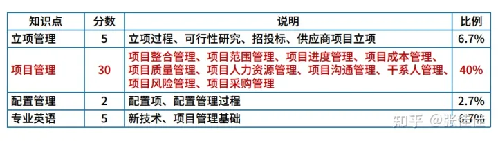
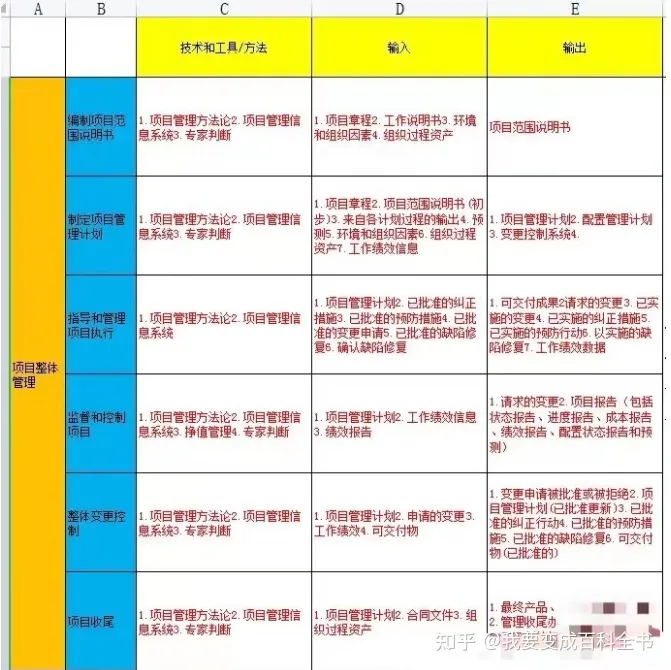
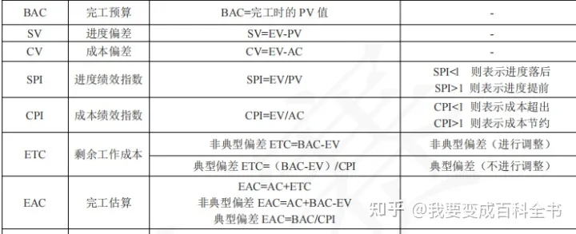

研究下可以抵扣个税的证书
在个税APP申报的列表里面有，哪些可以抵扣
https://zhuanlan.zhihu.com/p/355346189
专业技术人员职业资格包括**教师资格证、法律职业资格证、医生资格证、新闻记者职业资格证、导游资格证等。**
纳税人一个年度内多个证书也只能扣3600元，在个税APP中填写一个证书即可。
 
# 无线电执照
https://zhuanlan.zhihu.com/p/104765218
江苏省工业和信息化厅网站：[gxt.jiangsu.gov.cn](https://link.zhihu.com/?target=http%3A//gxt.jiangsu.gov.cn/)
**南京市**：由南京市无线电管理委员会办公室组织，网上报名网站：[nj.wxmktx.cn](https://link.zhihu.com/?target=http%3A//nj.wxmktx.cn/)咨询电话：025-86266652、86266670
**无锡市**：无锡市经济和信息化委员会，网上报名技术咨询电话：0510-87902353
好像很简单的样子

# 软考中项

## 备考1
但是直接刷题是没用的，没有建构完整的知识体系。应该先看一遍书，看完了书之后再做题巩固，不会再回到书本搞清楚！
网上也有一些刷题软件，可以利用，有真题+模拟题，分章节的，也可以选择一整套的模式，记录错题集，推荐一个软件“软考通”。
下午是案例题，计算题一定要把握好，一些计算公式，背熟！
系统集成的复习时间一般在2~4个月，每天至少保证2个小时的复习时间，想要通过考试难度不大。
1. 看书+视频
2. 抓重点
45分万岁！
其中，系统集成考试需要掌握IT技术相关知识、理解并掌握项目管理部分五大过程组，十大知识领域四十七个过程的因果联系。
这个可以整理成一页纸，也好打印和背诵！

3. 刷题+复习

## 备考2
1. 综合科目
综合科目的题型都是选择题，所以复习方法就是——在熟悉知识点的前提下多刷题。因为综合知识是以选择题为主，所以选择题一些常用的答题方法要活用，比如排除法、比较法、逆向思维法等等。综合知识历年真题考查的重点，特别是多次考到的知识点一定要着重复习。每天可以练练 10 道题，花不了多久时间，但积累下来带给你的不仅是做题的感觉，还有每天都能加深下对试题所考查的知识点理解记忆。
2. 案例科目
案例是简答题，带有一定的主观性，阅卷是按点给分的，所以复习方法是在熟悉知识点的基础上多做历年真题，了解常考知识点，关于计算公式一定要理解记忆。
答题时要注意一些方法技巧：
① 回答问题的文字要简练，答案长度适中；
② 尽量使用专业化的术语(看书时多注意积累)；
③ 紧密联系知识点，答题要有次序，最好分条说明，比如1、2、3、4、5等等；
④ 过程要清晰，计算题要写出对应的公式，即使结果不对，写了公式也是要给分的；
⑤ 书写工整，见字如面、字如其人，字漂亮了阅卷老师阅卷时自然会有好印象，相信能多给的分不会少给的。
⑥ 和题目相关的知识点如果不太确定的，就把能想到的都写上，多写不扣分，不写没有分。
⑦ 不要留空白，遇到自己不会的题，尽量往对应的相关知识领域上靠拢。

## 备考3

## 其他
历年真题做近5到8年的，从最近的往前做，做错的题目也要弄懂，真题中每题都要弄懂。

