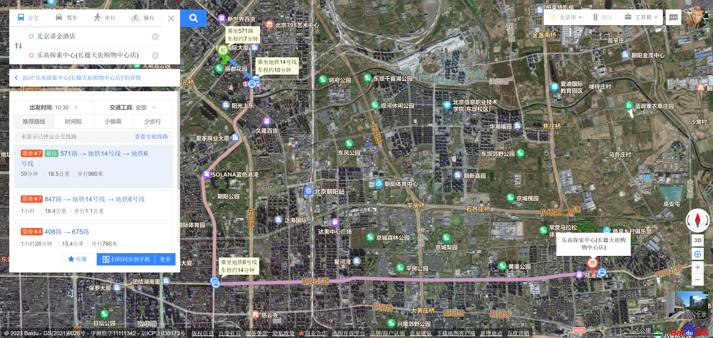
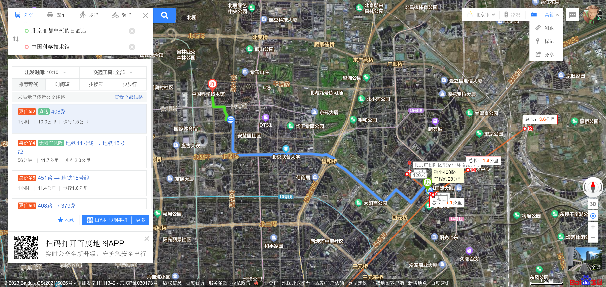
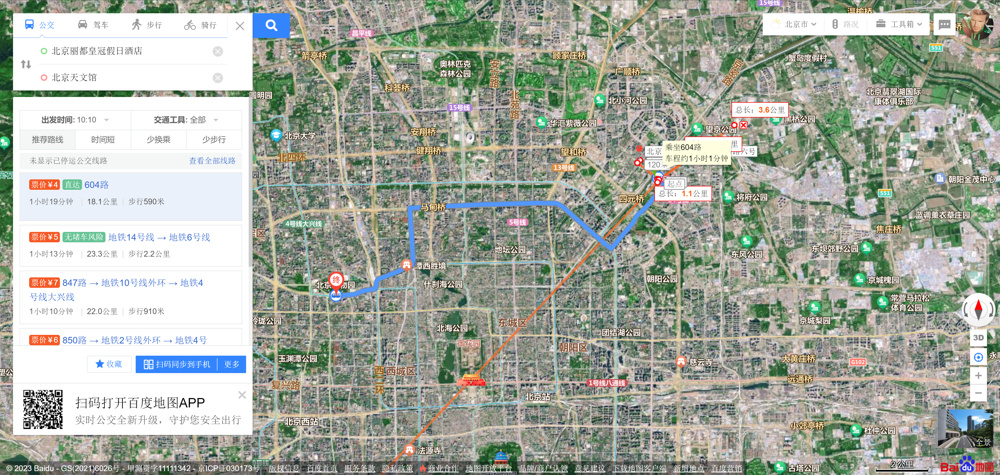

这次是出公差，但是机缘巧合，居然可以带上娃和媳妇。
# 初步计划
## 7.2 
高铁到北京
入住宾馆
晚饭
## 7.3
### 我：
公司
### 娃和媳妇：
？
### 晚上
## 7.4 
### 我：
公司
### 娃和媳妇：
？
## 7.5 
请假？
## 7.6 
请假？
## 7.7
退房，高铁回无锡

# 初步景点
## 乐高探索中心

## 天坛-前门-天安门-故宫-王府井？
暂定7月5日
## 场馆类
http://bj.bendibao.com/tour/201487/160282_6.shtm

## 798
开放时间：10：00-18：00
https://zhuanlan.zhihu.com/p/621551164
https://zhuanlan.zhihu.com/p/623647179
## 中国铁道博物馆

## 中国电影博物馆

## 民航博物馆

## 中国科学技术馆

## 北京天文馆

# 住宿和出行
公交  下载北京一卡通  有优惠  支付宝半价
## 中成天坛假日？
550一天，是个不错的带娃逛前门-故宫一线的好选择。

# Refs
https://zhuanlan.zhihu.com/p/629202216
