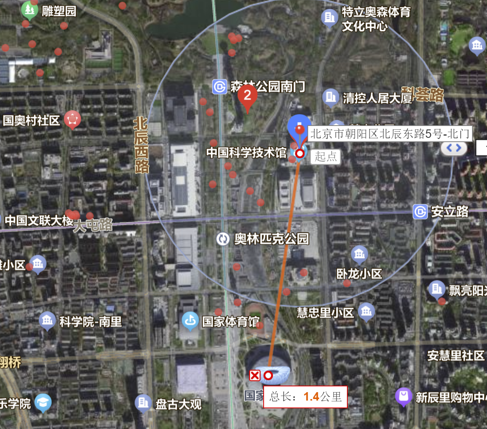

这次是出公差，但是机缘巧合，居然可以带上娃和媳妇。
# 初步计划

| 日期 | 上午               | 下午                               | 晚上 | 说明                           |
| ---- | ------------------ | ---------------------------------- | ---- | ------------------------------ |
| 7.2  | 高铁               | 国博？-天坛-前门-天安门            |      | 行李先寄存在南京南站，然后出发 |
| 7.3  | 乐高探索中心       | 随意-铁道博物馆（东郊）-电影博物馆 | 798  |                                |
| 7.4  | 鸟巢-水立方-奥运塔 | 科技馆                             |      |                                |
| 7.5  | 清华北大颐和园？                   |                                    |      |                                |
| 7.6  | 自然醒，退房             |     高铁                               |      |                                |

上午：鸟巢 + 水立方
下午：科技馆 + 奥林匹克塔
晚上：
## 7.5 
请假？
## 7.6 
请假？
## 7.7
退房，高铁回无锡

# 初步景点
## 乐高探索中心

## 天坛-前门-天安门-故宫-王府井？
暂定7月5日
## 场馆类
http://bj.bendibao.com/tour/201487/160282_6.shtm

## 798
开放时间：10：00-18：00
https://zhuanlan.zhihu.com/p/621551164
https://zhuanlan.zhihu.com/p/623647179
## 中国铁道博物馆

## 中国电影博物馆

## 民航博物馆

## 中国科学技术馆

## 北京天文馆

# 住宿和出行
公交  下载北京一卡通  有优惠  支付宝半价
## 中成天坛假日？
550一天，是个不错的带娃逛前门-故宫一线的好选择。

# Refs
https://zhuanlan.zhihu.com/p/629202216

卢玲珠 331082198712219229
杨少鹏 370284198903210032
杨谦润 320211201903158710