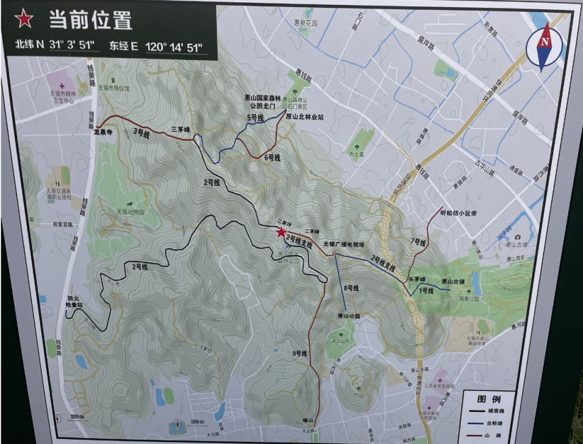

# 锡山
锡惠公园里面矮的那个。

# 惠山
从广义的角度来看，锡山是惠山的余脉，海拔70多米的锡山，是体弱的小孩与老人重阳登高的首选，而最高海拔328米的惠山，则属于年轻人的挑战项目，惠山由头茅峰、二茅峰、三茅峰三座山峰组成，登山者主要从[锡惠公园](https://www.zhihu.com/search?q=%E9%94%A1%E6%83%A0%E5%85%AC%E5%9B%AD&search_source=Entity&hybrid_search_source=Entity&hybrid_search_extra=%7B%22sourceType%22%3A%22answer%22%2C%22sourceId%22%3A2684847959%7D)内登头茅峰，从石门路和惠山森林公路路径登三茅峰，这两处登顶后，都能够俯瞰到无锡主城区和太湖风景，含金量不低。

## 高度
![[imgs/Pasted image 20231218133053.png]]
头茅峰（172米）、二茅峰（302米）、三茅峰（328.98米）

## 日出观赏点
* 头茅峰下锡惠索道，观景平台处；
* 三茅峰老祖庙对面

## 路线

经典线路一：锡惠黄公涧线(E1线)
经典线路二：青山一村线(E3线)
经典线路三：青山[公园](http://wx.bendibao.com/news/zhuantigongyuanyuyue/)台阶线(S2线)
经典线路四：东大池线(S4线)
经典线路五：盘山公路(W1线)

### 经典线路一：锡惠黄公涧线(1号线)

一条是杜鹃园后，上行的话基本是沿着惠山登山缆车的线路上山，终点为锡惠索道的上站。
另外一条则是在黄公涧，沿着黄公涧的一侧上山，这条线路也就是我们所说的锡惠黄公涧线，无锡登协称他为E1线。
这俩的区别：是不是在缆车下面，缆车下面没那么陡。

**起点**：在锡惠公园内，上山的路都已经铺上了台阶。

**终点**：头茅峰。

**攀爬难度**：3.5/5

**耗时**：一般在20分钟左右。
#### PB 
上山：
~~2023.12.23 16mins03s到邮局那~~
2024.1.13 15mins17s到邮局那

**特点**：一是这条上山道全是石阶，比较方便攀爬，也是无锡老年常见的爬山线路之一。二是山道旁，正好是黄公涧，雨季的话，水色一路，风景不错。不过雨后这条路很滑，要是穿专业级别的登山鞋反而很容易在光滑的石阶上打滑。

**我的习惯**: E1登山线上，然后到缆车那里，从缆车那里下山。可以改成走到头茅峰，然后再走回到缆车下，这样应该能一个小时至少。

### 经典路线二： 消防通道（2号线）

**起点**：无锡市惠山国家森林公园管理处
**终点**：三茅峰，路过二茅峰等
**耗时**：待测
**特点**：最长，最慢，走起来最容易，都是柏油马路
**攀爬难度**：2.5/5

### 经典线路三：龙泉寺（3号线）
**起点**：龙泉寺
**终点**：三茅峰
**耗时**：待测
**特点**：
**攀爬难度**：2.5/5
### 经典线路五、六：龙海寺（5，6号线）
**特点**：这条线路沿路分布了14个道教景观点，有龙海寺、玉皇殿、雷尊殿、离垢庵、张仙殿等佛道胜地。一年四季，很多香客都从此处的石门古道上山。

**起点**：惠钱路森林公园
**终点**：三茅峰
**攀爬难度**：★★★☆☆
**耗时**：待测
**特点**：

### 经典线路七：听松坊（7号线）
**特点**：

**起点**：听松坊小区旁
**终点**：头茅峰
**攀爬难度**：★★★☆☆
**耗时**：待测
**特点**：

### 经典线路八：青山公园台阶线(8号线)

**特点**：一共是~~1668~~ 1700层台阶，中途有三座休息凉亭。一排台阶，笔直地升到山顶，两侧还设扶手栏杆。由于这条路的单一性和安全性，所以这条路也成为很多夜间爬山者下山的首选。

**起点**：青山公园
**终点**：电视塔
**攀爬难度**：★★★☆☆
**耗时**：待测
**特点**：

### 经典线路九：璋山（9号线）
**特点**：

**起点**：璋山南侧惠山森林公园
**终点**：消防通道上
**攀爬难度**：★★★☆☆
**耗时**：待测
**特点**：

### 其它路线
#### 经典线路二：青山一村线(E3线)

**特点**：这条线路是登惠山免费线路之一，也是距离无锡市中心最近的一个上山口。由于两侧没有过多的树木遮掩，在这条路上，你随时都可以看到山下景色。

**终点**：惠山的头茅峰，与锡惠缆车线汇合。

**起点**：青山一村115号

**攀爬程度**：★★★☆☆

**适合人群**：不熟悉路况的爬山爱好者 情侣 学生

#### 经典线路四：东大池线(S4线)

**特点**：东大池梁巷线是这些线路中最长、分支线路最多的一条。这条线路为无锡户外运动俱乐部和无锡登协的定点

这条路分支众多，不建议新手或不熟悉路况的爬山者从这条道上山。从这条道上山至三茅峰，一般需要40分钟左右。

**起点**：东大池

**终点**：莲花山的顶

**攀爬难度**：★★★★★

**适合人群**：户外运动爱好者 登山爱好者

# 鹿顶山
在著名的[鼋头渚风景区](https://www.zhihu.com/search?q=%E9%BC%8B%E5%A4%B4%E6%B8%9A%E9%A3%8E%E6%99%AF%E5%8C%BA&search_source=Entity&hybrid_search_source=Entity&hybrid_search_extra=%7B%22sourceType%22%3A%22answer%22%2C%22sourceId%22%3A2684847959%7D)内，有一座山顶之上矗立着一座巍峨的楼阁——[鹿顶迎晖阁](https://www.zhihu.com/search?q=%E9%B9%BF%E9%A1%B6%E8%BF%8E%E6%99%96%E9%98%81&search_source=Entity&hybrid_search_source=Entity&hybrid_search_extra=%7B%22sourceType%22%3A%22answer%22%2C%22sourceId%22%3A2684847959%7D)，这座鹿顶迎晖阁所在的山，便叫作鹿顶山。这座海拔96米的山峰虽然在无锡算不上什么高山，但其独一无二的地理位置，却使得它成为无锡颜值最高的山。

# 雪浪山

# 军璋

# 马迹山
在马山

# 小灵山
灵山大佛

# 黄塔山
苏南第一峰：611.5米
宜兴竹海之内，需要买票
