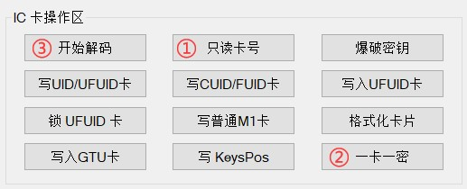

#门禁卡 #nfc #破解
# 购买原因
保利香槟这个小区使用梯控方式，也就是必须带卡，实在是不方便，还容易忘。如果手里有个东西，比如快递啥的，又麻烦。
NFC破解本身没什么难度，但随着厂商越来越不开放，所以需要借助这种“专业”工具。

# 商家资源
国产兼容卡、无漏洞卡解码工具：https://wwrb.lanzouw.com/iwJ1p0kr0v7g
PS：已经放在目录里的压缩包里了。使用的时候会自动download keys文件夹，所以小心别被覆盖或者文件路径错误。注意，不要使用工具插上之后自动填充了之后出现的下载链接，那个已经淘汰了。

NFC双频使用方法：https://www.acfun.cn/v/ac35372362

手机NFC模拟加密IC卡教程：https://www.acfun.cn/v/ac35372825
https://www.bilibili.com/video/BV18p4y1S7AV/?vd_source=462c9e0df89bcb23f1c5be85ce31d8ce

# 复制到手机NFC步骤
1. 读门禁卡，一键解码，成功后保存，比如目录里的poly23文件。
2. 再读门禁卡，只读卡号，成功后保存。
3. 把只读卡号之后的内容刷写到附赠的蓝色小卡里。（记得先格式化，参照下面如何格式化卡）
4. （小米）手机里选择“模拟门禁卡”，模拟（复制）刚才的小蓝卡。这时候手机里模拟了一张卡，就是只有卡号作为内容的卡。
5. 把手机NFC区域放到读卡设备上，就是类似刷卡动作，激活读卡设备的话设备的等会从红色变成绿色，然后在电脑的刷写软件里导入之前步骤1里保存的完整数据文件，点击“一键写入”。（PS：老版本这里是点击写M1卡）
6. 去电梯里试试吧。

# 复制到小米手环NFC步骤
我忘记具体步骤了，应该就是上面的Step4换成手环就可以了，anyway都是先复制卡号，然后再刷写完整版本到手环。

# 如何格式化卡
IC卡格式化步骤：先把需要格式化的卡放在机器上，点开始解码，解码成功后再点格式化卡片

# 其他
1. 部分卡无法解开，可以尝试使用“一卡一密”计算密钥尝试解密，使用方法如下：
只读卡号 > 一卡一密 > 开始解码（五分钟没好联系客服）
解码五分钟没好，拍照或者截图整个软件给客服，谢谢！

2. 如果都不行，就试试这个。国产兼容卡、无漏洞卡解码工具：https://kagongfang.lanzouw.com/iTCM1y9zawf
3. 西门子的卡，只需要复制卡号，然后写入到蓝色赠卡里就行了。
