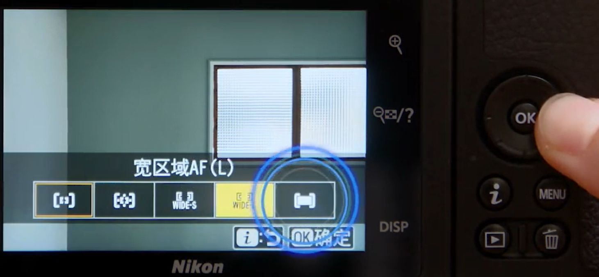

[尼康 - Z 50 视频教程 (nikon.com.cn)](https://www.nikon.com.cn/resources/digitutor/cn/z50/z_50.html)

# 抓拍中3个有用的功能
## 眼部AF（正确对焦于眼部）
操作：i->区域模式（第一行最后一个）->自动区域AF（最后一个）

人物离得近的时候是眼部AF，
## 曝光补偿（调整照片亮度）

## 静音拍摄（拍摄时静音快门）

# 拍摄出所需效果的照片或影像（优化校准）
其实就是用相机内置滤镜。
操作：i->第一个，效果->调整滤镜程度->ok

# 拍摄美丽的夜景

