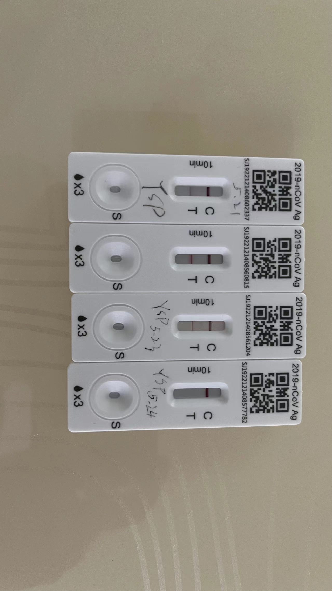

# 首阳
[[2022年终总结之新冠篇]]

# 二阳
起因是同办公室天天坐一起的饭搭子干珊珊先首阳（周二）了，从那之后每天嗓子都有感觉，但每天的抗原测试都是阴性。终于在周日，我也抗原阳性了。
## 症状
症状上比第一次轻太多了，也就开始时候每天清晨嗓子有感觉。此外抗原阳性的第二天和第三天鼻涕和喷嚏明显增多，第四天转阴之后突然也没了。
## 病程
2023.5.21抗原阳性，2023.5.24抗原转阴。

从抗原上看，比以前轻太多了，就第二天最宽最深，但也比不过首阳。
## 体温
全程没有超过37.5摄氏度。
* 5.21
	* 14:30 -> 37.3
* 5.22
	* 15:00 -> 37.4
	* 23:30 -> 37.0
* 5.23
	* 7:50 -> 36.9
	* 14:30 -> 37.2
* 5.24
	* 9:33 -> 36.6
	* 18:00 -> 37.0