# 2.1 Hadoop简介和版本演变
## 2.1.1 Hadoop简介
两大核心：HDFS，MapReduce
## 2.1.2 版本
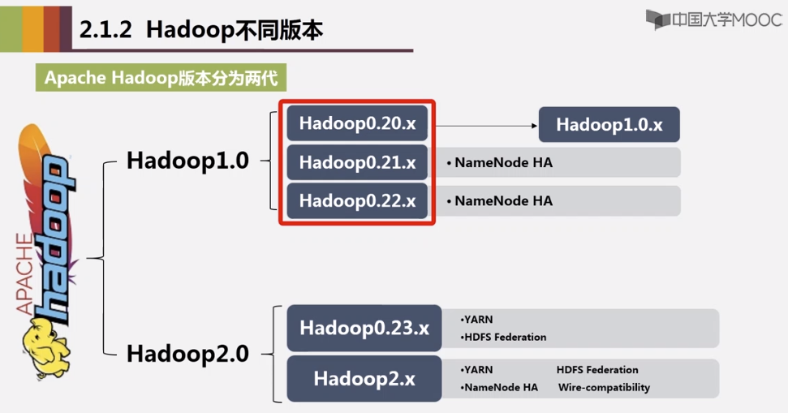

### 发行版
1. Hortonworks 企业版
2. Cloudera，CDH：cloudera distribution hadoop

# 2.2 Hadoop项目结构

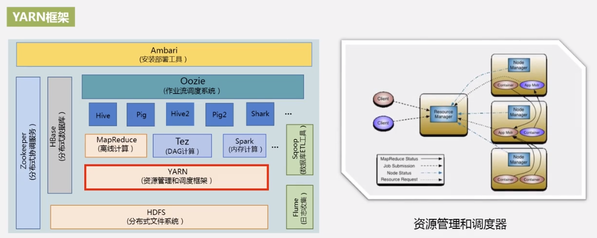

Spark基于内存，MapReduce基于磁盘。

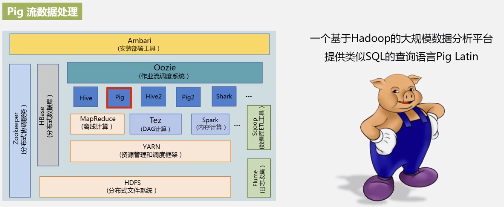
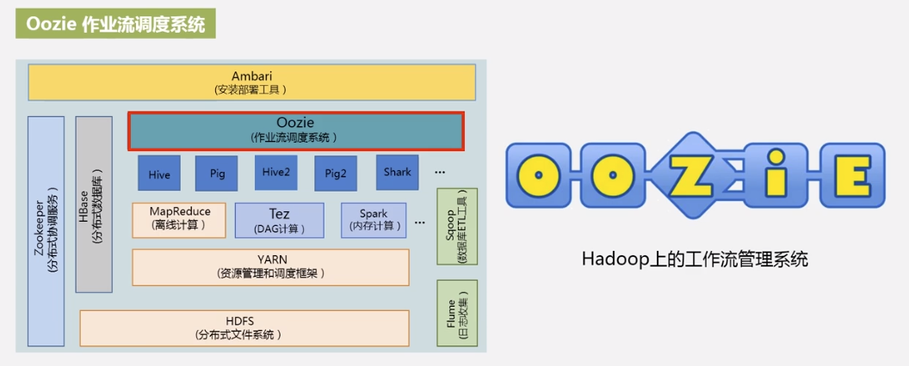
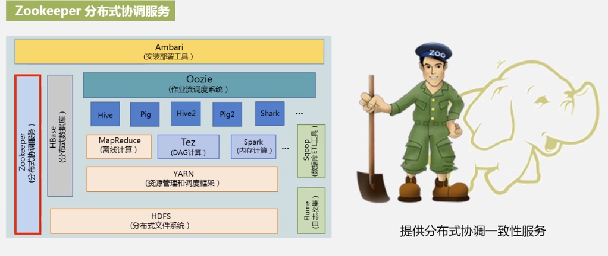
ZooKeeper作用：分布式锁管理，集群管理。
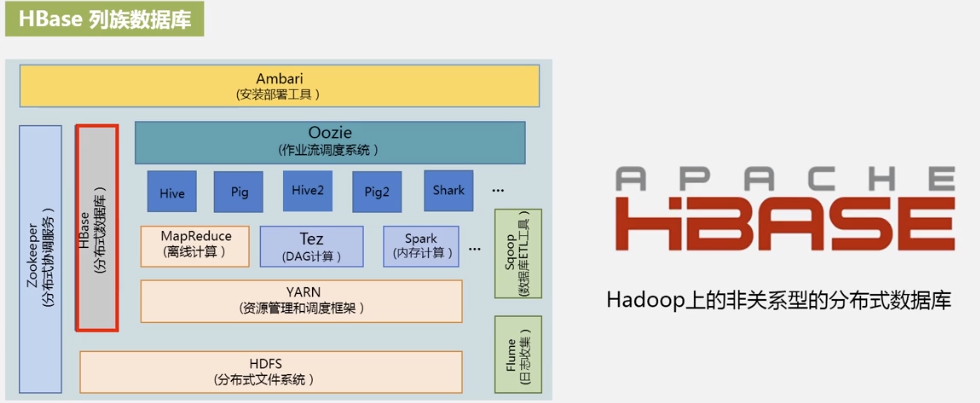
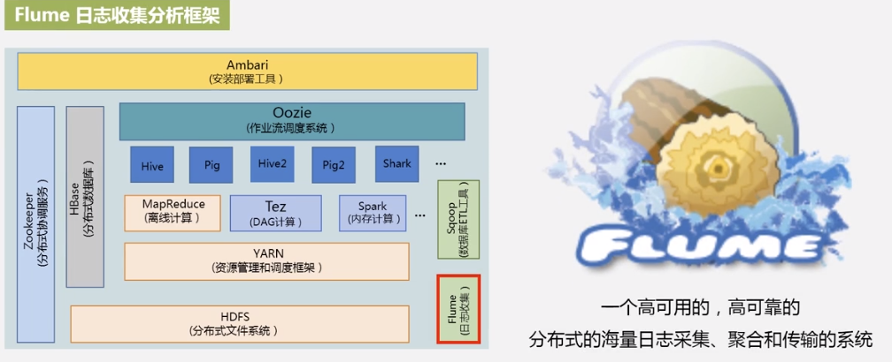
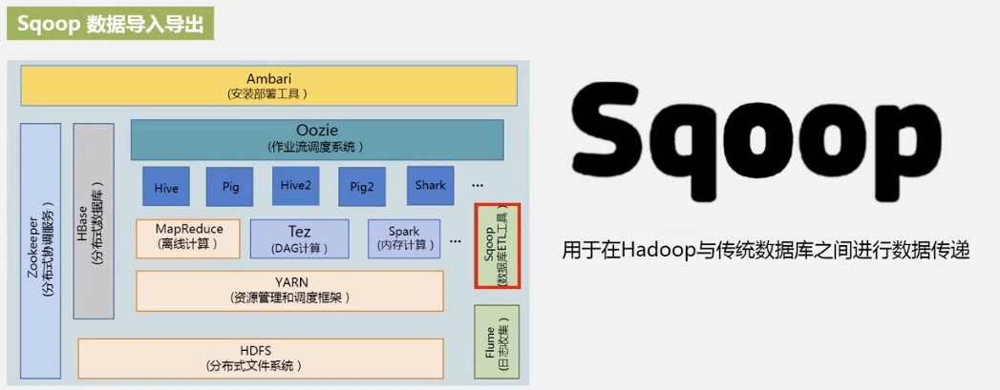
Sqoop：关系型数据库与Hadoop平台之间互导数据。

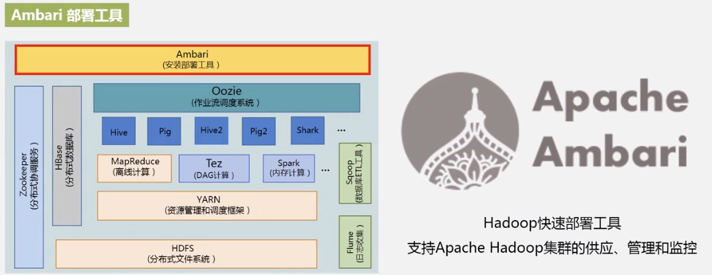
# 2.3 Linux和Hadoop安装
https://dblab.xmu.edu.cn/blog/2441/
# 2.4 Hadoop集群的部署和使用
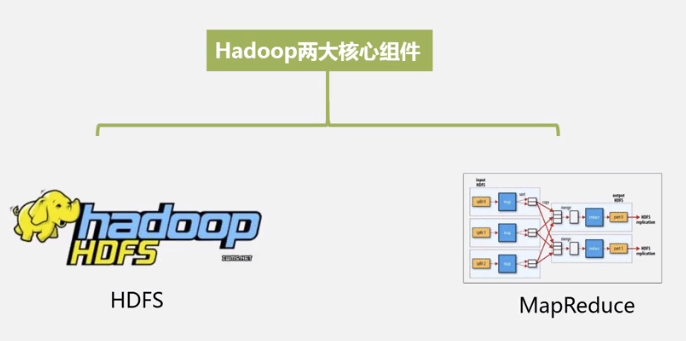
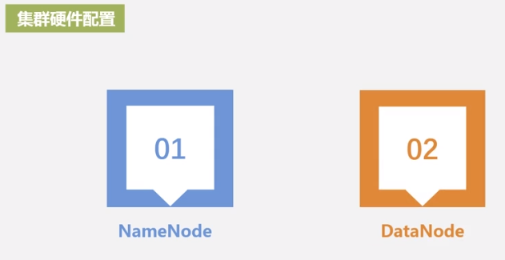
先访问NameNode获取数据存放在哪个DataNode，然后再去访问对应的DataNode。类似指针的概念。
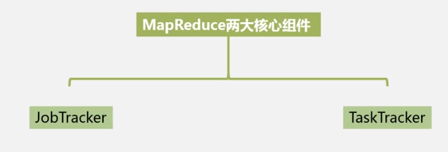
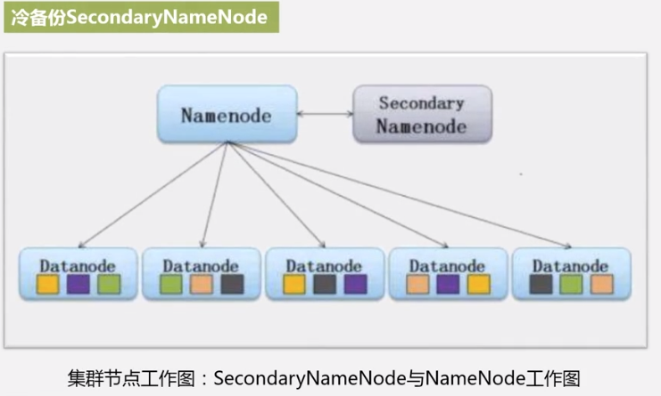
冷备份：出问题了不能马上切换，需要一定操作步骤。
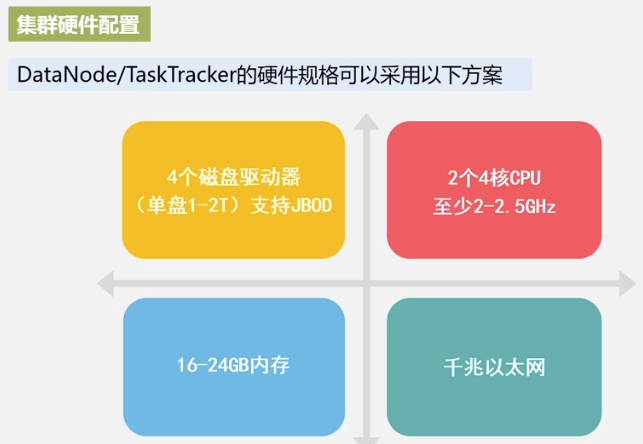

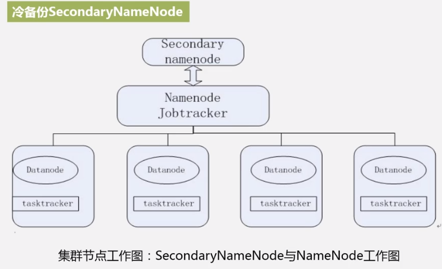
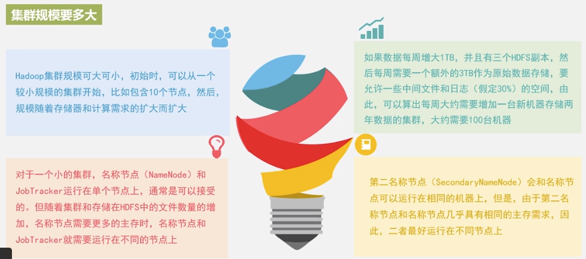
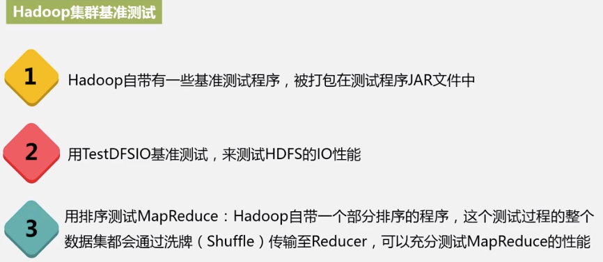

