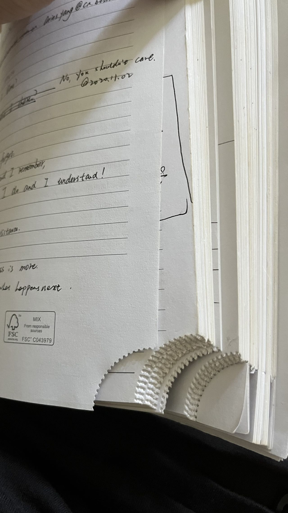

# Rexroth力士乐笔记整理-20220704
## 1 来源 
笔记本是2019年时候发的，还记得是Patrick Poa专门送到每个人手上。别的不说，本子质量确实不错，同时右下角的可撕设计可以很好的反映笔记本使用情况和进度。坏处呢就是本子太厚太重。

## 2 笔记内容范围
涵盖了从力士乐到博世软件中心的历程，有技术的也有非技术的。因为最后从博世软件中心离职的那个月读了不少杂七杂八的书，笔记也都在这个本子上。
## 3 笔记
1. I hear and I forget. 
   I see and I remember.
   I do and I understand.
2. Offer solution, not resistence.
3. Why would I share? You shouldn't care.
   Keep silent and see what happens next, figure out whether to show your real muscle or just let others show.
4. > Do not go gentle into that good night,   
   rage, rage against the dying ot the light.
   --Dylan Thomas
