#树莓派 #raspberrypi #4B #服务器
# 购买原因
原来有一个树莓派3B+，安装了一些服务，参照[[树莓派3B+(deprecated)]]。运行了一段时间后，发现这个小server跑飞过几次，而且经常在运行一些服务的时候卡死，比如运行node-red之类。所以买一个性能更强悍的4B就迫在眉睫。经过选型，最后购买了树莓派4B的4G内存版本，同时购买了个500W像素摄像头和7寸TNT电容触摸屏。
# 镜像烧录
## 下载ubuntu server镜像
用迅雷下 https://cdimage.ubuntu.com/releases/20.04.3/release/ubuntu-20.04.3-preinstalled-server-arm64+raspi.img.xz
下载完成后解压。
### ubuntu server和desktop有啥区别
https://blog.csdn.net/weixin_47274607/article/details/124437407
总而言之，不需要GUI时候就用server。其实连接hdmi之后也有命令行显示的。
## 使用balenaEtcher烧录到microSD卡
https://www.balena.io/etcher
几个OS都支持，按需下载。
这次用的是64G的闪迪microSD卡，烧录完成后validting到99%显示失败，两次都是这样。索性直接插到了树莓派上，开机，正常，就不管了。

# 配置
## 用户名和密码
ubuntu, fastroad
## 连接hdmi和有线键盘
注意hdmi需要用micro hdmi转接头，同时必须要在开机前插到树莓派上。
有线键盘用来修改密码。默认的登录用户名和密码都是ubuntu。
## 配置wifi
>参照refs里第二个。

Ubuntu从17.10开始，放弃在/etc/network/interfaces里面配置IP，改为在/etc/netplan/XX-installer-config.yaml的yaml文件中配置IP地址。

进入netplan目录,查看当前目录下的文件
```sh
cd /etc/netplan/ && ls
```
编辑文本，如下图所示：
```sh
sudo vim 50-cloud-init.yaml
```
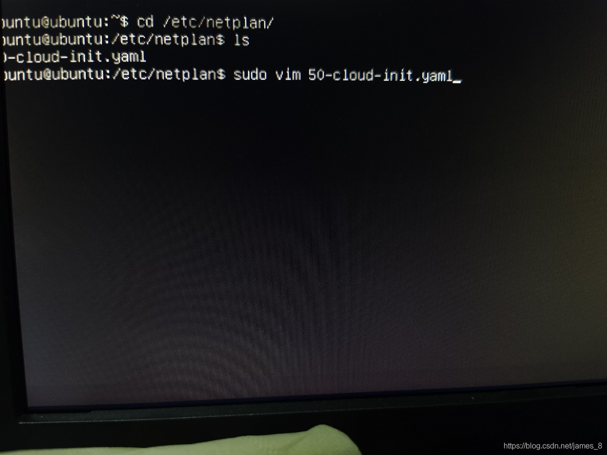
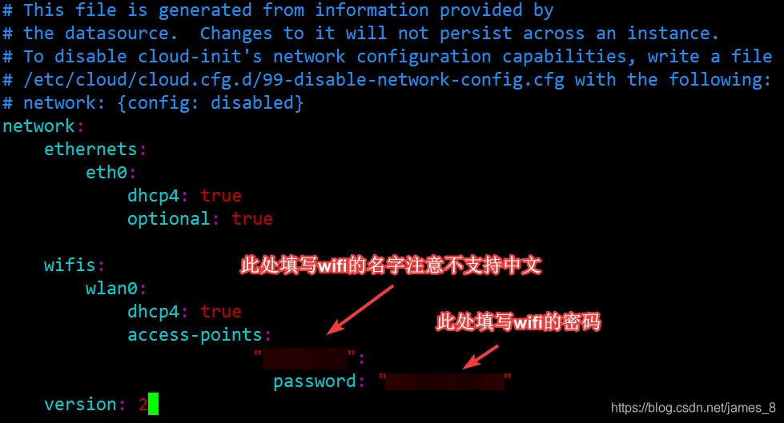
注意：
冒号后面需要一个空格 严格按照格式填写！！！
```txt
wifis:
    wlan0:
        dhcp4: true
        access-points:
                    "Si_AP Pro_IoT":
                      password: "WJZHNL7F3..."
version: 2
```
填写结束后 使用 sudo netplan apply 命令使网络生效。
使用
```sh
ip addr show
```
显示ip，同时ping一下其他局域网里的ip地址，测试是否联网成功。

## 固定IP
原因：原本的wifi设置是dhcp，但是后面某次重启后树莓派自动更换了ip，一气之下决定固定ip。结合安装cockpit时候的报错，最终修改配置文件如下。
```txt
network:
    ethernets:
        eth0:
            dhcp4: true
            optional: true
    wifis:
            wlan0:
                    dhcp4: false
                    addresses: [192.168.1.175/24]
                    optional: true
                    gateway4: 192.168.1.1
                    nameservers:
                      addresses: [192.168.1.1,114.114.114.114]
                    access-points:
                                "Si_AP Pro_IoT": 
                                  password: "WJZHNL7F3@Wx"    
    version: 2
    renderer: NetworkManager     
   
```
填写结束后 使用 sudo netplan apply 命令使网络生效。
之后在cockpit网络设置里可以发现已经生效了，如图。
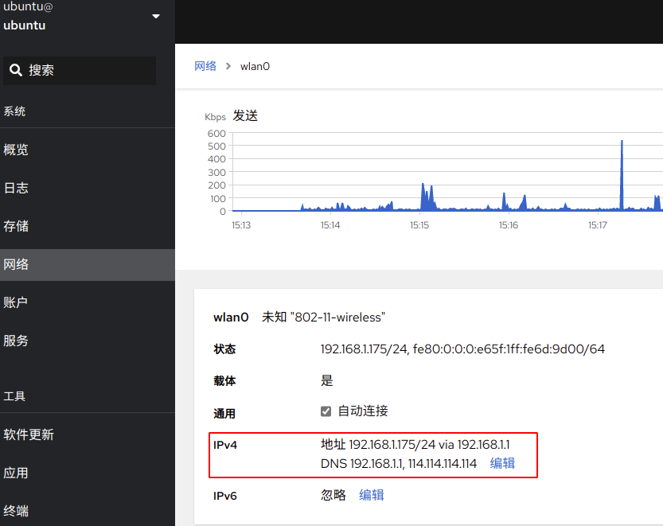
为什么不通过cockpit设置呢？
不好用啊，主要是不知道要写成这个样子，所以还是命令行的更简单。


## 更换apt源
>参照Refs3


## 挂载外部硬盘并设置开机自动启动
> 参照refs4和refs5

输入 sudo fdisk -l ， 这次我搞了个500G的机械硬盘
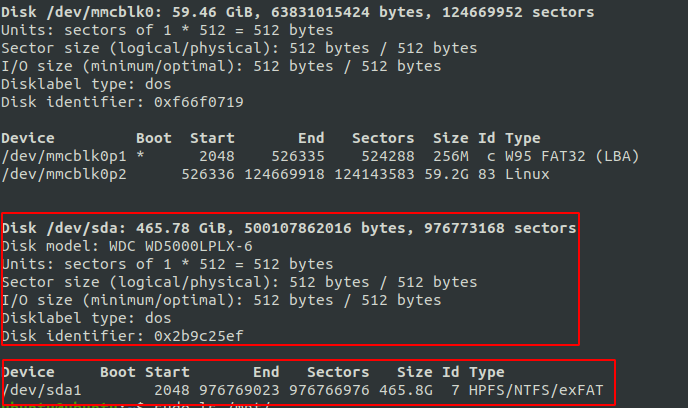
注意：
1. 看红色方框，第一个表示这是一块硬盘，第二个表示这个硬盘里面的分区，目前我就分了一个。我们实际要挂载的是分区。
2. 要挂载到的目标位置，通常是一个文件夹，需要提前建好。
```sh
sudo mkdir /mnt/external && sudo mount /dev/sda1 /mnt/external
```
单纯挂载到这里就完成了。
使用blkid查看硬盘uuid(必须要挂载上才能显示)
```sh
sudo blkid
```
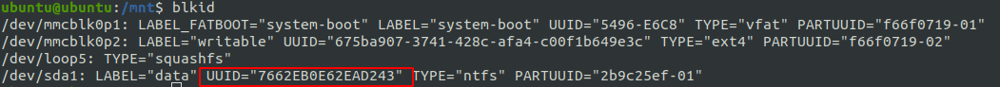
将下面的信息写到/etc/fstab 文件末尾
```txt
UUID=7662EB0E62EAD243 /mnt/external exfat defauts 0 0
```
说明：
* 要挂载的分区设备号 UUID=7662EB0E62EAD243
* 挂载点 /mnt/external
* 文件系统类型 ntfs(blkid命令输出里有)
* 挂载选项 defaults
* 是否备份 0
* 是否检测 0
```sh
sudo vim /etc/fstab
```
是配置生效
```sh
sudo mount -a
```
查看是否生效
```sh
df -h
```
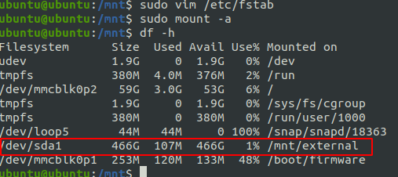
重启系统，看是否生效
```sh
sudo reboot
```
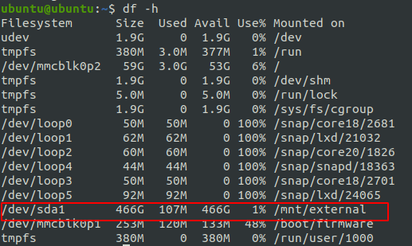
搞定
## 开通smb服务
### 树莓派上安装smb
创建需要共享的文件夹（可跳过）
```sh
sudo mkdir somepath
```
这次我直接使用的挂载的硬盘目录/mnt/external。
修改权限
```sh
sudo chmod -R 777 /mnt/external
```
安装 smb 服务，安装之后的路径为/etc/samba
```sh
sudo apt update && sudo apt install samba -y
```
添加smb密码文件
```sh
sudo touch /etc/samba/smbpasswd
```
添加用户并设置密码，这里继续使用ubuntu用户。不论哪个用户，在系统中这个用户必须存在
```sh
sudo smbpasswd -a ubuntu
```
如果需要更改密码，再次执行上面的命令即可。
在/etc/samba/smb.conf文件的末尾添加如下配置：
```txt
[ubuntu]
   comment = ubuntu
   path = /mnt/external
   writable = yes
   valid user = ubuntu
   available = yes
   create mask = 0777
   directory mask = 0777
   public = yes
```
重启smb服务
```sh
sudo /etc/init.d/smbd restart
```
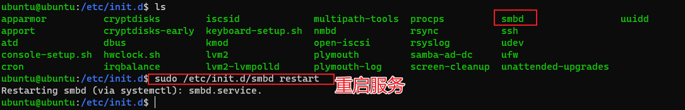
### Windows上挂载smb
>参照refs7

### Ubuntu上挂载smb
其他ubuntu主机访问树莓派开放的smb共享。
> 参照refs6

安装smbclient
```sh
sudo apt install smbclient
```
测试和查看共享
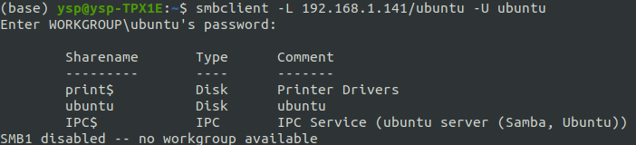
使用mount挂载
```sh
sudo mount //192.168.1.175/ubuntu /mnt -o username=ubuntu,pass=fastroad
```
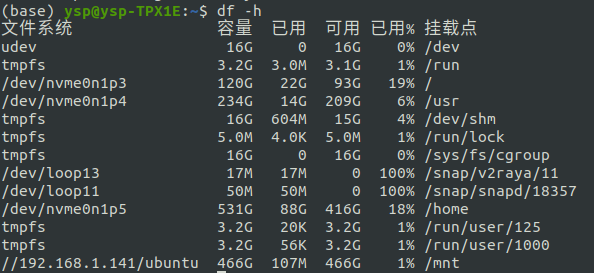
设置开机自动挂载
```txt
//192.168.1.175/ubuntu /mnt/external cifs username=ubuntu,password=fastroad 0 0
```

## Refs：
1. https://www.v2fy.com/p/2021-10-01-pi-server-1633066843000/
2. https://blog.csdn.net/james_8/article/details/110925190
3. https://blog.csdn.net/qq_42709046/article/details/119852016
4. https://www.v2fy.com/p/2021-10-17-mount-1634437477000/
5. https://blog.csdn.net/weixin_42129680/article/details/112977063
6. https://blog.csdn.net/faxiang1230/article/details/95978242
7. https://www.v2fy.com/p/2021-10-03-pi-smb-1633231650000/

# 软件安装
## docker
> Refs 1

脚本直接安装，一次成功
```sh
sudo curl -sSL https://get.docker.com | sh
```
设置开机启动
```sh
sudo systemctl enable docker
```
换国内源
> Refs 3

创建配置文件
```sh
sudo vim /etc/docker/daemon.json
```
添加镜像地址，写入文件
```json
{
    "registry-mirrors":[
                        "https://hub-mirror.c.163.com/",
                        "https://docker.mirrors.ustc.edu.cn/"
                        ]
}

```
重启docker 以及daemon
```sh
sudo systemctl daemon-reload
sudo systemctl restart docker
```
输入 sudo docker info查看是否生效
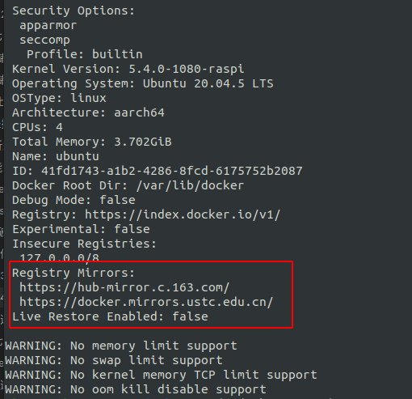


### portainer
> Refs 2


作为docker的图形化管理界面。
```sh
#创建 portainer 容器
sudo docker volume create portainer_data
 
#运行 portainer
sudo docker run -d -p 8000:8000 -p 9443:9443 --name portainer --restart=always -v /var/run/docker.sock:/var/run/docker.sock -v portainer_data:/data portainer/portainer-ce:latest
```
输入https://树莓派ip:9443登录并查看
	用户名：admin
	密码：fastroad12345

### emqx
> Refs 6

拉镜像，也可以portainer操作
```sh
sudo docker pull emqx/emqx:5.0.17
```
启动docker容器
```sh
sudo docker run -d --name emqx -p 1883:1883 -p 8083:8083 -p 8084:8084 -p 8883:8883 -p 18083:18083 emqx/emqx:5.0.17
```
访问
	树莓派ip:18083  admin fastroad12345

### mariadb
> Refs 9

pull镜像，我是通过portainer里pull下来的
```sh
sudo docker search mariadb
sudo docker pull mariadb
```
直接运行，设置好名称和root密码，注意这个时候并没有创建默认数据库
```sh
sudo docker run -itd --name mariadb-test -p 3306:3306 -e MYSQL_ROOT_PASSWORD=fastroad mariadb
```
这时候portainer的container已经可以显示这个容器了。ubuntu主机端使用dbvear-ce建立连接并访问，如图（注意ip和图里的可能不一样）
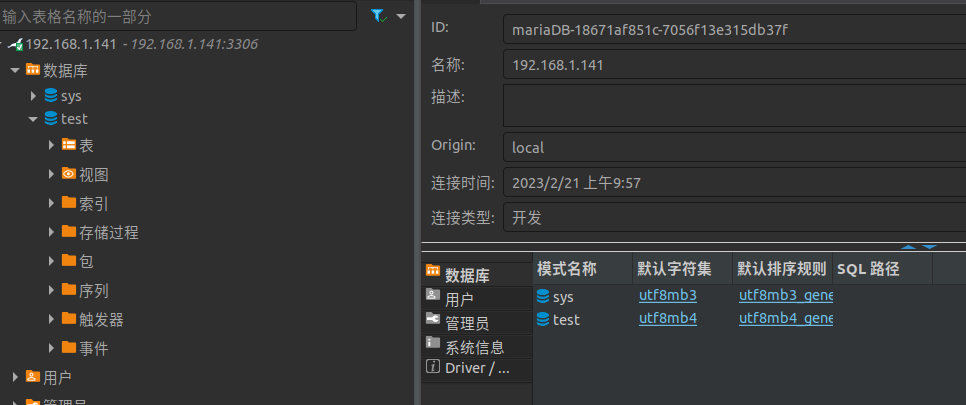
其中的test数据库是我在dbvear里建的。
连接
	root fastroad

### home-assistant
> Refs 11


登录
	树莓派ip:8123 ubuntu, fastroad
	
拉取镜像
```sh
sudo docker pull homeassistant/home-assistant
```
启动容器
```sh
sudo docker run -d \
  --name homeassistant \
  --privileged \
  --restart=unless-stopped \
  -e TZ=Asia/Shanghai \
  -v /data/homeassistant:/config \
  --network=host \
  homeassistant/home-assistant

```
注意上面的/data/homeassistant路径就是存放配置文件的地方
安装HACS
先建立所需的文件夹，再下载所需要的zip包并解压。
```sh
cd /data/homeassistant
sudo mkdir www
sudo mkdir custom_components
sudo mkdir custom_components/hacs
cd custom_components/hacs
wget https://download.fastgit.org/hacs/integration/releases/download/1.22.0/hacs.zip
sudo apt install unzip
sudo unzip hacs.zip
```
解压完毕，需要重启HA （侧边栏开发者工具->右上角重新启动） 
这个时候就可以在【配置】–> 【设备与服务】–>右下角【添加集成】中搜索到HACS了
注：这时候需要提前登录github
添加HACS时需要勾选所有选项，再点击下一步，会出现8位的授权码，点击打开github后输入，成功搞定。然后左边的菜单栏就有HACS了！如果没有的话重启HA也会有了。

点击侧边栏的HACS，右下角搜库，搜Xiaomi MIoT安装后重启HA。

高级模式
点击左下角头像->高级模式打开


### heimdall
> Refs 18

东西装得多了，服务开得多了，非常需要一个类似导航页面的东西。当然我也可以自己写，但还是想尝试下。找了一会找到了这个，看这名字多霸气，海姆达尔。
```sh
sudo docker pull linuxserver/heimdall
sudo docker run -d --name=heimdall -e PUID=1000 -e PGID=1000 -e \
  TZ=Asia/Shanghai \
  -p 1080:80 \
  -p 10443:443 \
  -v /path/to/appdata/config:/config \
  --restart unless-stopped \
  linuxserver/heimdall:latest
```
访问
树莓派ip:80 or https://树莓派ip:10443

### 其他
本来还跑了每日签到和青龙面板，后来移到玩客云里了。安装和配置在这里[[青龙面板&每日签到配置]]

## node.js & npm
> Refs 4

下载压缩包，注意树莓派4B的CPU BCM2711，armv8架构支持64位，同时这次安装的ubuntu server也是64位的。
```sh
wget https://nodejs.org/dist/v18.14.1/node-v18.14.1-linux-arm64.tar.xz
```
不确定CPU架构的话可以输入
```sh
uname -a
```
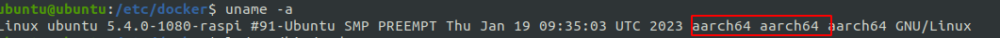
如图示就是64位的。
解压下载的压缩包
```sh
xz -d node-v18.14.1-linux-arm64.tar.xz 
tar -xavf node-v18.14.1-linux-arm64.tar
```
如果系统原来有/usr/bin/node目录，需要删除
```sh
sudo rm -rf /usr/bin/node
```
移动解压后的目录
```sh
sudo mv ./node-v18.14.1-linux-arm64/ /usr/local/node
```
建立软连接
```sh
sudo ln -s /usr/local/node/bin/node /usr/bin/node
sudo ln -s /usr/local/node/bin/npm /usr/bin/npm
```
测试是否成功
```sh
node -v & npm -v
```
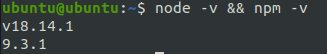

### node-red
安装
	既可以docker，也可以命令行，这里选择npm方式
```sh
sudo npm install -g node-red
```
建立软连接
```sh
sudo ln -s /usr/local/node/bin/node-red /usr/local/bin/
```
启动
```sh
node-red
```
输入树莓派ip:1880即可访问
注意：
这种启动方式并不会显示在 pm2 list 的结果中。

设置密码
参照 https://blog.csdn.net/qq_41790078/article/details/108052795
用到时候再说吧

### pm2
作为node.js的项目的启动啊管理啊什么的。
> Refs 5

安装
```sh
sudo npm install pm2 -g
```
建立软连接
```sh
sudo ln -s /usr/local/node/bin/pm2 /usr/local/bin/
```
输入 pm2 查看是否成功
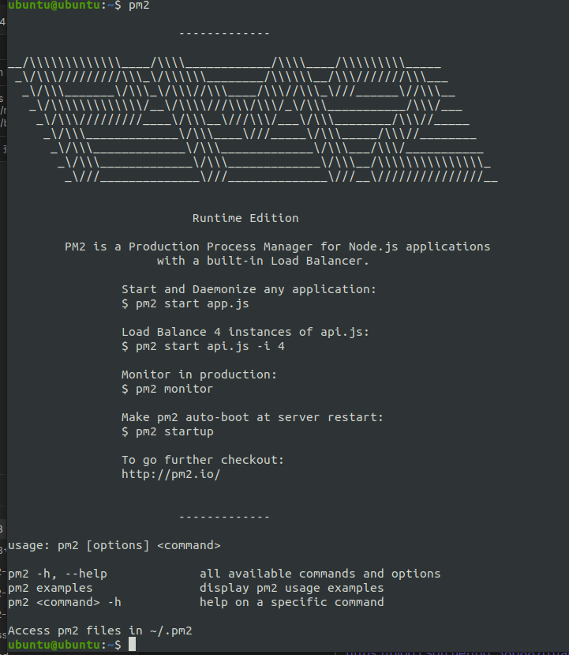
查看当前运行项目
```sh
pm2 list
```
通过pm2启动node-red
```sh
pm2 start node-red -n nodered
```
配置开机启动
```sh
pm2 save | pm2 startup
```
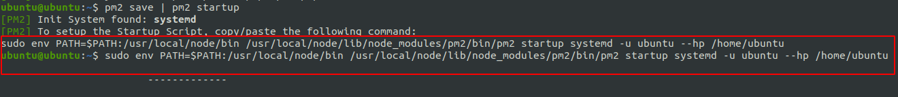
根据图里提示，复制命令并回车
```sh
sudo env PATH=$PATH:/usr/local/node/bin /usr/local/node/lib/node_modules/pm2/bin/pm2 startup systemd -u ubuntu --hp /home/ubuntu
```
重启树莓派后如下图，设置成功
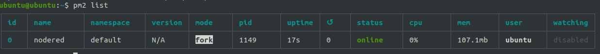

## sqlite
安装
```sh
sudo apt install sqlite3
```


## ZeroTier
> Refs 7


安装
```sh
curl -s https://install.zerotier.com | sudo bash
```
配置
	安装结束后，会有一个10位数字地址（比如c0d1805883），复制出来copy到zerotier网站，需要加入的network里。
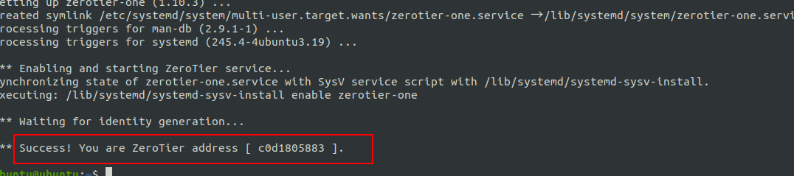
并在auth里选中
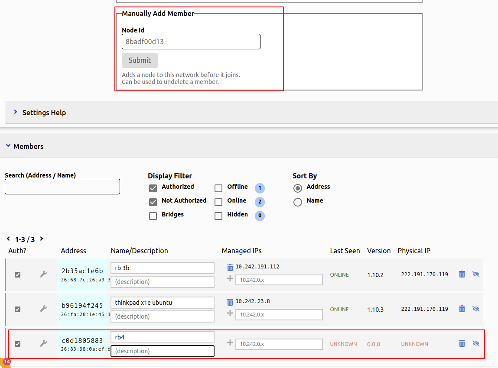
copy账户里加入的这个network id，树莓派里运行如下命令（3e开头的就是network id）
```sh
sudo zerotier-cli join 3efa5cb78a494324
```


这时候再到zerotier网页端就能看到有ip了

配置开机启动，就搞定了
```sh
sudo systemctl start zerotier-one
#启动
sudo systemctl stop zerotier-one
#停止
systemctl enable zerotier-one
#打开开机自启
systemctl disable zerotier-one
#关闭开机自启

```


## Grafana
安装的是Enterprise版本，官方说明了Enterprise版本也是免费的，并且包含了所有OSS版本的内容。
最开始想装的是docker版本，但官方的说明太复杂了，主要是配置和安装插件很麻烦，遂放弃。
后来又想根据ubuntu安装指南里https://grafana.com/docs/grafana/latest/setup-grafana/installation/debian/的apt方式安装，但需要科学上网，否则太慢了。遂放弃。最后使用了deb安装方式（Refs 10），deb包还是用ubuntu主机科学上网了下载下来copy到树莓派里的，服。
注意：deb包需要换成arm64架构的，这还是我碰巧凑出来的，真神奇。
```sh
sudo apt-get install -y adduser libfontconfig1
wget https://dl.grafana.com/enterprise/release/grafana-enterprise_9.3.6_arm64.deb
sudo dpkg -i grafana-enterprise_9.3.6_arm64.deb
```
访问
	树莓派ip:3000  admin, fastroad


## Cockpit
> Refs 12

背景
	想搞一个树莓派的Dashboard，能够看到一些cpu，内存占有率之类的东西，如果有一些logs就最好了。
选型
	主要是Cockpit和webmin之间的比较，最终Cockpit github有8k stars vs. 2.8k starts，所以选择cockpit。
安装
因为树莓派ubuntu是20.04 focal
```sh
sudo apt install -t focal-backports cockpit
```
访问
树莓派ip:9090, 用的是树莓派系统上的用户名和密码，即ubuntu fastroad。
注意安装完成，访问时候会有个报错，参照Refs13进行设置。如果是参照本文中的*固定IP*部分，其中那句networkmanager就是防止这个错误的，当然，如果没装network manager应该就没关系了。

## qbitorrent
安装
```sh
sudo apt install qbittorrent-nox
```
启动
```sh
qbittorrent-nox -d
```
打开web界面
	树莓派ip:8080 admin adminadmin
设置
1. 改中文，修改限速
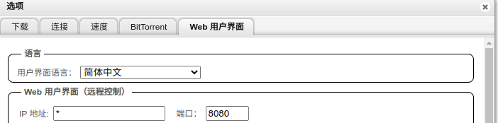
2. 改密码
   同上，就在那个图下面
3. 修改下载目录为提前建好的/mnt/external/qbdownload
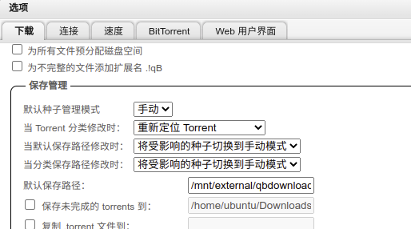
4. 添加tracker（https://zhuanlan.zhihu.com/p/345255439，https://trackerslist.com/#/zh?id=xiu2trackerslistcollection）
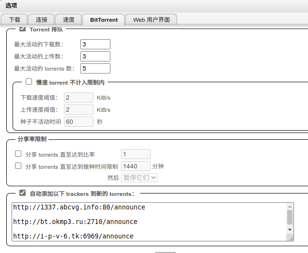   
5. 找种子，添加到qbittorrent，开始下载

## Miniconda
其实Miniconda就是我想要的，一般而言我用conda就是用两个东西：conda包管理和conda虚拟环境。关于Miniconda的介绍，以及vs Anaconda，官网有介绍https://docs.conda.io/en/latest/miniconda.html。
> Refs 14，17

注意：Refs14里说的不能用最新的安装包是真的，用的话会提示报错，但是换成了文章里的链接就好了。注意：不要加sudo运行sh脚本，这样会安装在用户目录下。
```sh
wget https://repo.anaconda.com/miniconda/Miniconda3-py37_4.9.2-Linux-aarch64.sh
sh Miniconda3-py37_4.9.2-Linux-aarch64.sh
```
安装时候先回车，然后yes，yes
安装结束后，添加环境变量
```sh
export PATH=~/miniconda3/bin:$PATH
```
试下conda list,ok。正式使用前，必须先建立新环境（miniconda果然够mini），并激活。
注意：激活不是conda activate，而是source activate
```sh
conda create -n tenv python=3.8
source activate tenv
```
检查下python版本
```sh
which python
```
输出如下


换源
```sh
conda config --add channels https://mirrors.tuna.tsinghua.edu.cn/anaconda/pkgs/free
conda config --add channels https://mirrors.tuna.tsinghua.edu.cn/anaconda/pkgs/main
conda config --set show_channel_urls yes
```

搞定！

## Jupyter notebook
在base环境下，没有增加开机自启动，所以需要

# 备份和恢复

## rpi-backup
> refs 15

怎么给树莓派做备份呢？
```sh
git clone https://github.com/nanhantianyi/rpi-backup.git && cd rpi-backup
sudo ./back.sh youImangeName.img
```

我的居然提示失败了，空间不足，wtf。
```sh
rsync: write failed on "/mnt/var/lib/docker/overlay2/cbf2f1ef43c33e5f3188dacb931819fa9df57262e2deca9224ee43280818f027/diff/opt/emqx/erts-12.3.2.2/bin/beam.smp": No space left on device (28)
rsync error: error in file IO (code 11) at receiver.c(374) [receiver=3.1.3]
```
用这个的好处是可以直接用balenaetcher做备份恢复。

## TimeShift
> refs 16

安装
```sh
sudo apt install timeshift
```
配置
```sh
sudo lsblk -f
```
用上面命令找出外接的硬盘的uuid，然后修改
```sh
sudo vim /etc/timeshift/timeshift.json
```
粘贴到第一个配置项里
```json
{
  "backup_device_uuid" : "7662EB0E62EAD243",
  "parent_device_uuid" : "",
  "do_first_run" : "true",
  "btrfs_mode" : "false",
  "include_btrfs_home" : "false",
  "stop_cron_emails" : "true",
  "schedule_monthly" : "false",
  "schedule_weekly" : "false",
  "schedule_daily" : "false",
  "schedule_hourly" : "false",
  "schedule_boot" : "false",
  "count_monthly" : "2",
  "count_weekly" : "3",
  "count_daily" : "5",
  "count_hourly" : "6",
  "count_boot" : "5",
  "snapshot_size" : "0",
  "snapshot_count" : "0",
  "exclude" : [
  ],
  "exclude-apps" : [
  ]
}
```
检查配置
```sh
sudo timeshift --list
```
创建快照
```sh
sudo timeshift --create --comments "1st backup at 2023-02-22 for rp4b + ubuntu server"
```
失败了，不知道是不是因为在下载，硬盘被占用
2023-02-23更新
先把外挂的硬盘umount了，然后运行上面创建快照的命令

我也没看懂报错啥意思，追着提示的/run目录一级一级搞下去，发现这不就是外挂的硬盘吗？！timeshift这货自动mount了硬盘，然后进行了备份。。。
这时候不要umount，保持外接硬盘mount在/run目录下，执行
```sh
sudo timeshift --list
```
如下图，status是ok，应该是备份成功了。。。


# 外设
## USB摄像头
我装在了raspbian的3B+上，但其实应该是一样的。
[[树莓派3B+]]


## Refs
1. https://blog.csdn.net/qq_38688701/article/details/108570099
2. https://docs.portainer.io/start/install-ce/server/docker/linux
3. https://blog.csdn.net/m0_37282062/article/details/115770314
4. https://zhuanlan.zhihu.com/p/127757097
5. https://blog.csdn.net/weixin_44614230/article/details/127564025
6. https://www.emqx.io/zh/downloads
7. https://www.zerotier.com/download/
8. https://www.v2fy.com/p/2021-10-19-qiandao-1634595237000/
9. https://www.jianshu.com/p/4c862d924a24
10. https://grafana.com/grafana/download?pg=get&plcmt=selfmanaged-box1-cta1&platform=linux
11. https://blog.csdn.net/weixin_43909881/article/details/126136328
12. https://cockpit-project.org/running.html#ubuntu
13. https://cloud.tencent.com/developer/article/2067252
14. https://blog.csdn.net/IT_lesliewu/article/details/124893143
15. https://shumeipai.nxez.com/2020/10/28/backup-the-raspberry-pi-system-as-an-img-file.html
16. https://skyao.io/learning-ubuntu-server/docs/installation/timeshift/create.html
17. https://blog.csdn.net/CallMeYunzi/article/details/106193745
18. https://blog.freecrazy.cn/posts/2021/12/heimdall/
19. https://blog.csdn.net/qq_45915007/article/details/107017819
20. https://blog.csdn.net/qq_39221949/article/details/124183815?spm=1001.2014.3001.5501
21. https://blog.csdn.net/Blue_W_Blue/article/details/124271487
22. https://blog.csdn.net/weixin_44501554/article/details/124281486