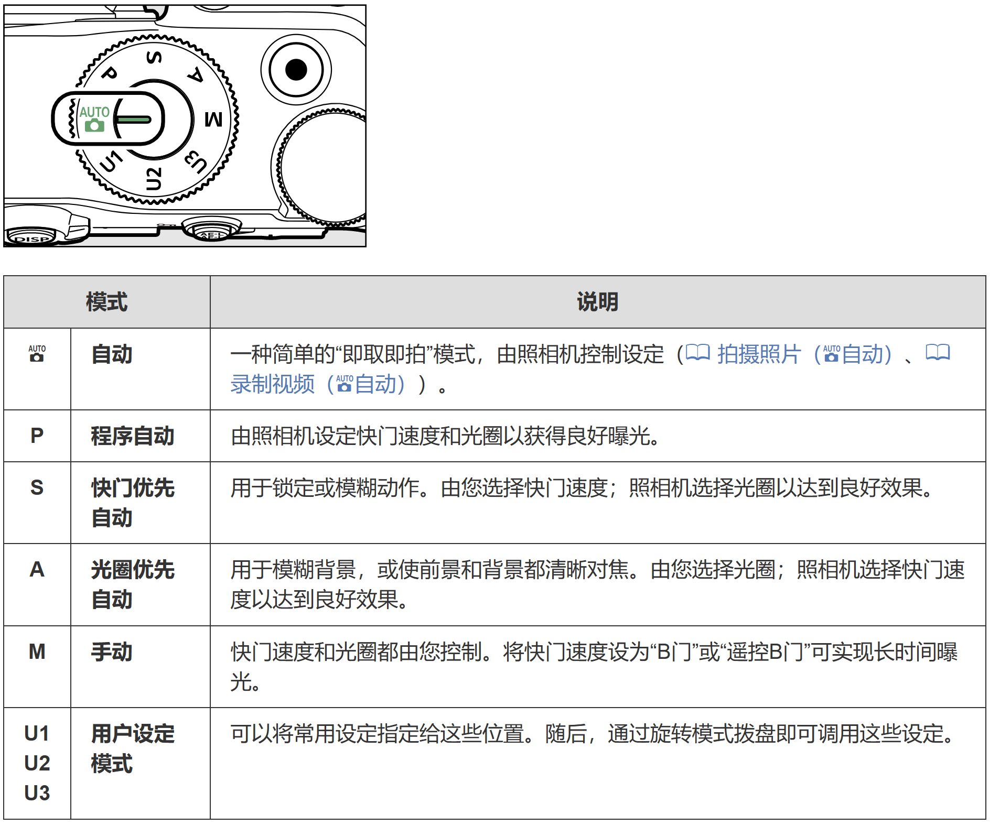

# 综述
光圈和焦距其实是镜头上的，快门和ISO是相机上的。

# 模式
以Z30为例，[模式拨盘 (nikonimglib.com)](https://onlinemanual.nikonimglib.com/z30/zh-cn-prc/06-01.html)。

## Auto档
纯自动，很多参数都不能调。模式也不可以，比如测光啊什么的。
## P档
又叫程序自动曝光。就是相机有一堆预设，自动选择。ISO自己调？

> 调至P档后，可以拨动前后轮盘来调节光圈和快门。当调节快门盘时，测光系统会根据测光结果，按照预设程序对自动对快门速度做出相应的调整。

> 在单反相机的P档下可以手动设置测光、感光度、白平衡、对焦、Dlighting、闪光、曝光补偿等，单反相机也会自动组合光圈、快门参数，也可以由拍摄者按照拍摄需要设置光圈、快门参数组合来拍摄。

> P档的模式下，首先相机会判断当前场景的情况，然后将当前情况和机内芯片上储存的经典场景做对比，最后选择一个最接近当前场景的模式来设置相机参数来拍摄。所以相机是不会考虑个人想法的，完全按照机内预设来设置拍摄参数。这些参数包括色温、光圈、快门速度、ISO感光度、照片风格等等。

## S档
shutter，快门优先。也就是我就管快门，相机帮我调光圈。
用处：
## A档
Aperture，光圈优先。我管光圈，相机帮我调快门。
用处：
1. 可以用来调整景深，是非常常用的模式。
2. 
## M档
快门和光圈都是我来管。

Auto也叫全自动；P，S，A叫做半自动；M纯手动。

## P档和Auto有啥区别？
>Auto则是纯自动。纯手动是，光圈快门的组合只能自己去调节，相机不会帮你做任何设置。
  而P则属于程序自动，相机根据测光给你的是光圈和快门的组合值，你可以调节这个组合值，使其产生不同的效果，无法过曝或欠曝，所以P档也往往被称为手动档里的自动档，但毕竟还是手动。

# 光圈 Aperture

# 快门 Shutter

# ISO

# 焦距 Focal length

