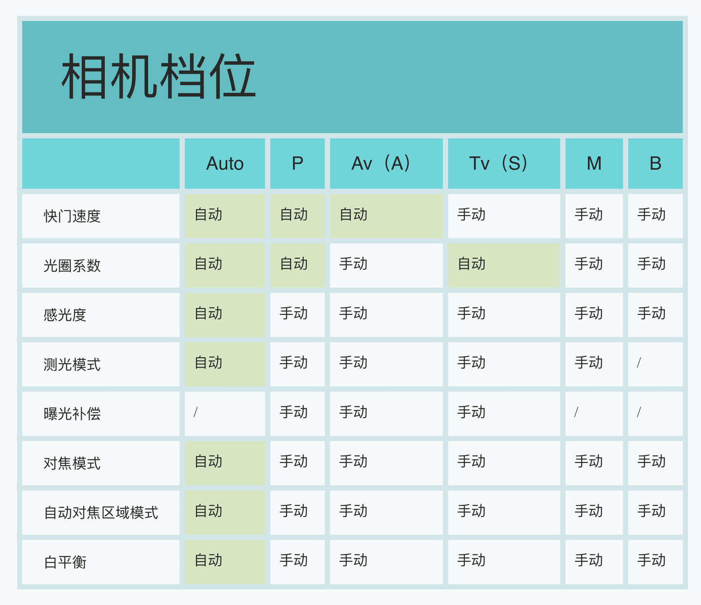
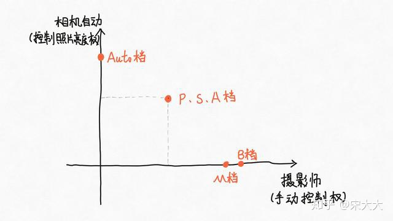

# 综述
光圈和焦距其实是镜头上的，快门和ISO是相机上的。

# 模式
以Z30为例，[模式拨盘 (nikonimglib.com)](https://onlinemanual.nikonimglib.com/z30/zh-cn-prc/06-01.html)。

## 概述
一张图总结：

所以，Auto也叫全自动；P，S，A叫做半自动；M和B纯手动。
同时，6种模式，8个参数。拍照就是选定某种模式，调节这8个参数。
```txt
控制照片曝光亮度的参数：
	快门速度、光圈系数、感光度、测光模式、曝光补偿

控制照片对焦的参数：
	对焦模式、自动对焦区域模式

控制照片色调的参数：
	白平衡

```
并且我们会发现其中除了全自动档Auto档比较特殊之外，表格中另外5个档位的对应的【控制照片的对焦】和【控制照片色调】的三个参数其实都是需要手动设置的，并没有什么不同，在参数设置上有区别的都集中在【控制照片亮度】的参数上，也就是说**Auto档、P档、Av档（A档）、Tv档（S档）、M档、B档的根本性不同在于“谁来控制照片的亮度”**。

在【影响/控制照片亮度】的这5个参数里，**曝光三要素（快门、光圈、ISO）的参数组合起到决定照片亮度的作用**，换句话说，**在同样的拍摄光线中，只要曝光三要素参数的组合不发生变化，照片的亮度就不会变。**

**测光模式的参数作用是：计算照片的曝光量，在允许相机自动设置（任何一个）曝光三要素的档位下，分配（任何一个）曝光三要素的参数**。

**曝光补偿的参数作用是：在相机计算的曝光量基础上，在允许相机自动设置（任何一个）曝光三要素的档位下，（通过改变曝光三要素的手段）增加/减少最终曝光量。**



所以，究其根本，我们选择哪一个拍摄档位，其实选择的是让“谁”来控制照片的曝光亮度。

## 全自动档
完全由相机决定bao'guang'san'yao'he
### Auto档
纯自动，很多参数都不能调。模式也不可以，比如测光啊什么的。
## 半自动档
### P档
又叫程序自动曝光。就是相机有一堆预设，自动选择。ISO自己调？

> 调至P档后，可以拨动前后轮盘来调节光圈和快门。当调节快门盘时，测光系统会根据测光结果，按照预设程序对自动对快门速度做出相应的调整。

> 在单反相机的P档下可以手动设置测光、感光度、白平衡、对焦、Dlighting、闪光、曝光补偿等，单反相机也会自动组合光圈、快门参数，也可以由拍摄者按照拍摄需要设置光圈、快门参数组合来拍摄。

> P档的模式下，首先相机会判断当前场景的情况，然后将当前情况和机内芯片上储存的经典场景做对比，最后选择一个最接近当前场景的模式来设置相机参数来拍摄。所以相机是不会考虑个人想法的，完全按照机内预设来设置拍摄参数。这些参数包括色温、光圈、快门速度、ISO感光度、照片风格等等。

#### P档和Auto有啥区别？
>Auto则是纯自动。纯手动是，光圈快门的组合只能自己去调节，相机不会帮你做任何设置。
  而P则属于程序自动，相机根据测光给你的是光圈和快门的组合值，你可以调节这个组合值，使其产生不同的效果，无法过曝或欠曝，所以P档也往往被称为手动档里的自动档，但毕竟还是手动。


### S档
shutter，快门优先。也就是我就管快门，相机帮我调光圈。
用处：
1. 运动物体
2. 慢门风光
3. 
### A档
Aperture，光圈优先。我管光圈，相机帮我调快门。
用处：
1. 可以用来调整浅景深人像，是非常常用的模式。
2. 对快门没有要求的场景，比如常规风光。

## 纯手动挡
### M档
快门和光圈都是我来管。完全控制参数。
用处：
1. 超长时间拍摄

### B档（门）


## Refs
1. [经验分享：专业摄影师常用6大拍摄档位剖析，学摄影不迷茫 - 知乎 (zhihu.com)](https://zhuanlan.zhihu.com/p/160148357)
2. 


# 光圈 Aperture


# 快门 Shutter


# 感光度ISO


# 焦距 Focal length


