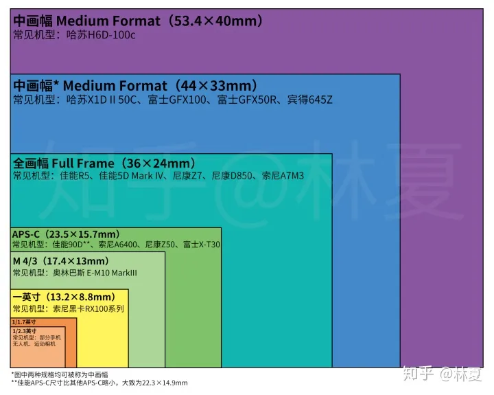
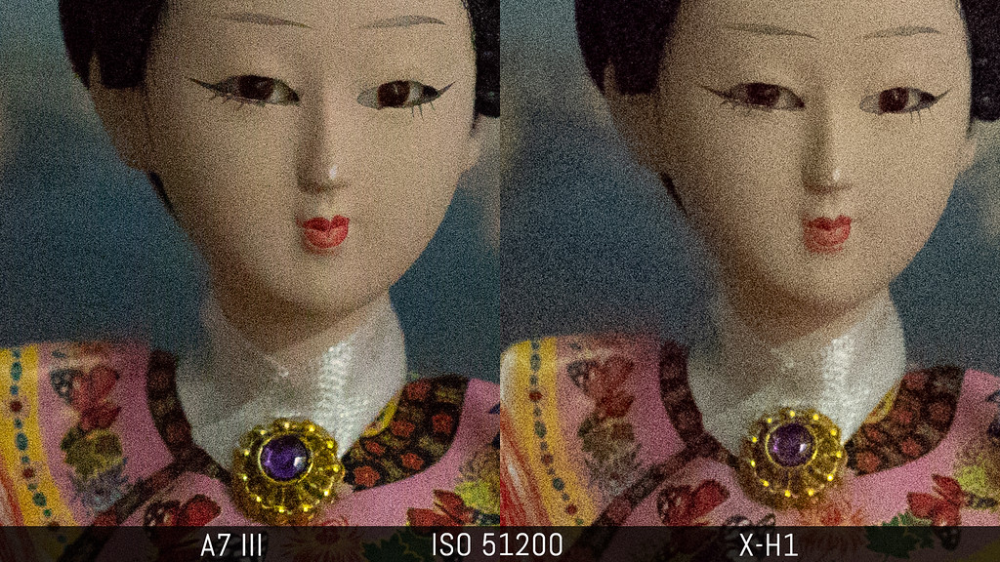
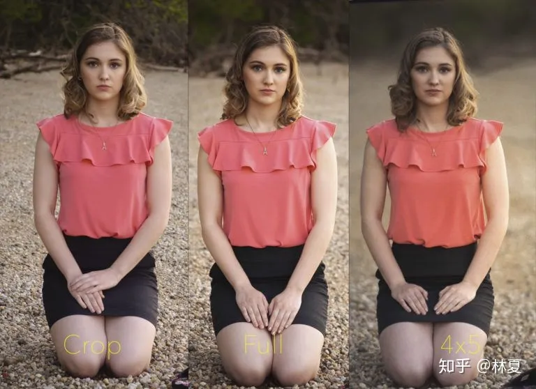

# 常见术语
## 动态范围 Dynamic range

## 高感 

## 画幅

### “底大一级压死人”，同时期产品画幅越大画质越好
老法师常说“底大一级压死人”，这个“底”是指图像传感器，“大一级”就是指面积更大。这句话的意思是说传感器大的相机可以吊打传感器小的相机。没错，理论上传感器面积越大，接收的光线就越大，转换出的信息就越丰富，最终画质就越好。下图是一个全画幅相机（左）和一个APS-C相机（右）在高感光度下的照片对比，可以明显看出全画幅相机在低亮度条件下的画质优势。不过画幅对画质的影响也不是绝对的，因为技术在不断进步，所以我们还得考虑到时间因素——现在部分APS-C的相机已经可以达到几年前一些全画幅相机的画质水平了。
**一句话，单位像素获得的光越多，存储的信息越多，画质越好。**

### 同档光圈，画幅越大，景深越浅，背景虚化越好
更大面积传感器不仅会带来更好的画质，还会间接带来更浅的景深，也就是更强的背景虚化效果（Bokeh）。虽然理论上只要保持光圈物理直径一致，景深就不会受到画幅的影响。但实际使用中，在考虑到构图取景、等效概念、实际产品等现实因素，更大画幅的相机确实更容易拍出浅景深。如下图所示，在视角不变的情况下，残幅（APS-C）、全画幅、大画幅相机在f4.5光圈下有着巨大的景深差异。这其实也解释了为什么大多数手机、卡片机的虚化效果较差（当然现在有些手机可以用算法模拟出背景虚化，但这不在这里的讨论范围之内）所以如果你喜欢背景虚化效果，应该尽量考虑更大画幅的相机。

# 问题
# 为什么像素不是越高越好？

