# Q简语和缩写
1. QRM  ： 我遇到其它电台干扰
2.  QRN ：我受到天电干扰
3. QRZ？： 谁在呼叫我？
4. QTH XXXX  ： 我的电台位置XXXX
5. QSL ：我给你收据（QSL），我已收妥
	1. 填写和邮寄QSL卡片时的正确做法有：**迫切需要方卡回寄卡片时，应直接向对方地址邮寄卡片并附加SASE**
6. OM ： 老朋友
7. ARDF ： 业余无线电测向
8. RIG ： 电台设备
9. VOX ： 发信机声控
10. PTT ： 按键发射
11. SQL ： 静噪控制
12. CTCSS ： 亚静音控制
    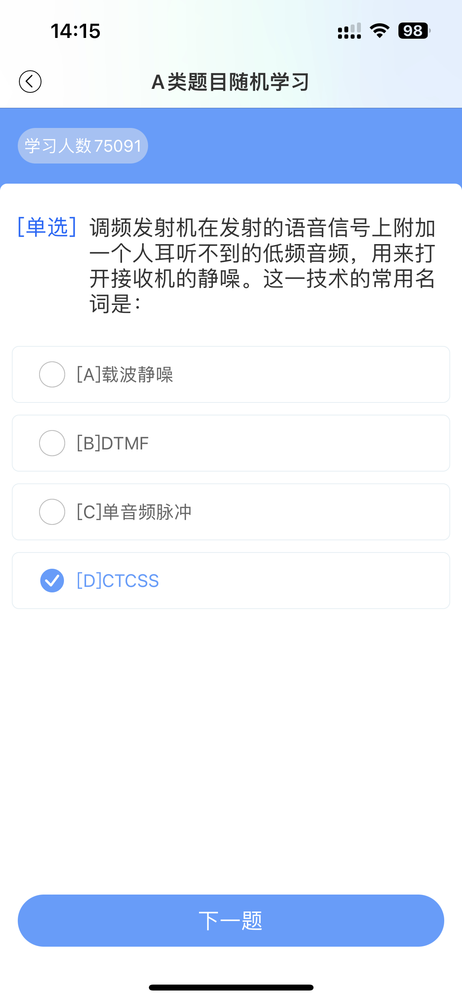
13. WX ： 天气
14. TX，XMTR ：发信机
15. RX，RCVR ：收信机
16. XCVR ： 收发信机
17. DTMF ： 双声多频编码
18. Roger ：明白。回答起始语，相当于”明白“，仅在已完成抄收对方刚才发送的信息时使用。
19. CQ：当一部电台在呼叫”CQ“时，他的意思是？**非特指的呼叫任何一部电台。**

# 天线类型和其他相关
1. BEAM：定向天线
2. DP：偶极天线
3. GP：垂直接地天线
4. YAGI：八木天线
5. VER：垂直天线
6. ”橡皮天线“劣势：**相对于全尺寸天线，它的发射和接收功率较低**。
7. 在零仰角附近的具有主辐射瓣的垂直接地天线，其振子长度应为：**1/4波长的奇数倍**
8. 下列关于直列天线的描述，哪一项是正确的？：**该天线发射的电磁波电场垂直于地面**

# 其它
1. 我国CQ分区（3个）：23，24，27
2. 我国ITU分区（5个）：33，42，43，44，50
3. 接收机灵敏度：灵敏度**越小**，接受最小信号能力**越强**。
4. 静噪灵敏度是指：能够使静噪电路退出静噪状态的射频信号的最小输入电平
5. 430MHz：
	1. 卫星通信不应占用的（找438）：435~438MHz
6. 144MHz：
	1. 145.8 - 146 MHz
7. NFM，WFM
	1. NFM->WFM: 可以听到信号，非线性失真
	2. WFM->NFM: 可以听到，高频声音小
8. A类：30~3000MHz内各业余业务和卫星业余业务频段。
9. 家用微波炉的工作频带：UHF特高频
10. 哪一项决定了FM信号的频偏？：取决于被调制信号的幅度。
11. 对于给定的FM发射设备，决定其射频输出信号实际占用带宽的因素是：**所传输信号的最高频率越高、幅度越大，射频输出占用带宽越高**
12. 无线电发射机的效率是指：**输出到天线系统的信号功率与发射机所消耗的电源功率之比**
13. 同通常的调频方式进行语音通信，必要带宽约为：**6.25kHz**
14. 下列哪一项术语表述了接收机区分不同信号的能力？**选择性**

# 波长和频率
1. 6米（**唯一一个主要业务**）：**50-54MHz，主要业务**
2. 2米（**字最多的那个**）：**144-148MHz，其中144-146为唯一主要。。。**
3. 0.7米业余波段：**430-440MHz，次要业务**
4. 1200MHz以下：135.7kHz，10.1MHz，430MHz
5. VHF MHz：144-144.035，145.8-146MHz
6. 长距离，弱信号：SSB
7. 我国在VHF和UHF。。。共用业务。。。主要业务。。。：**50MHz，144MHz**
8. 在频率划分表中。。。业余无线电台遵守的规则：**可要求保护不受来自同一业务或其它次要业务电台的有害干扰**
9. 频率容限是发射设备的重要指标，通常用下面哪个单位：**百万分之几（或者赫兹）**

# 同轴电缆
1. 对于400MHz以上信号，通常会使用的同轴电缆连接器是：**N型连接器**。
2. 为什么使用同轴电缆？：因为使用方便，与周围环境之间的相互影响小。

# 功率换算
1. 0.25W : 54dBu
2. 0.4kW : 85dBu
3. 5W : 37dBm

# 法律法规
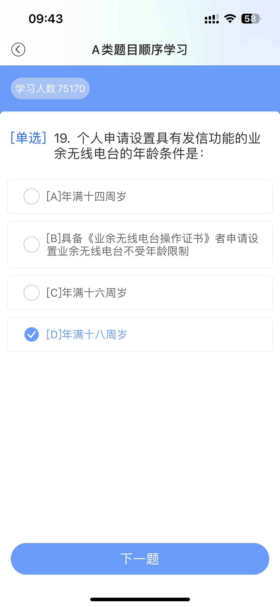
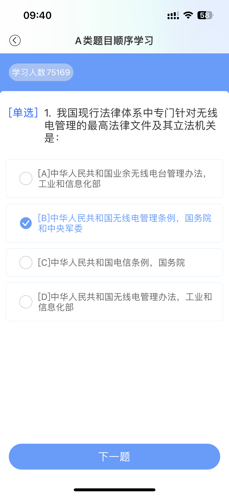
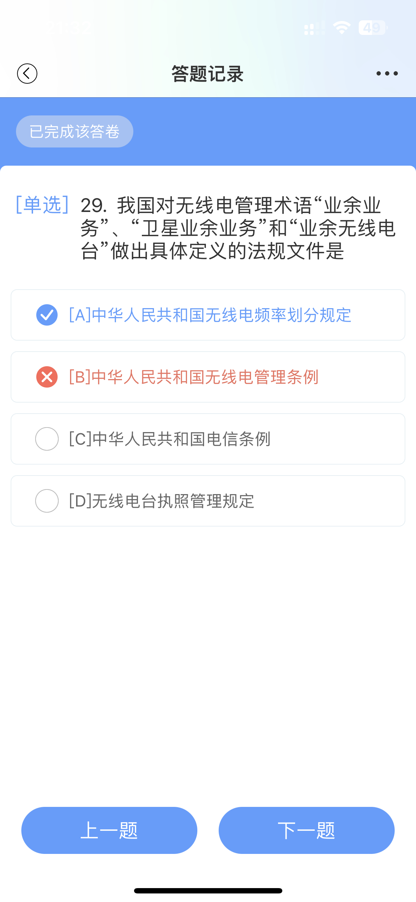

# 错题集
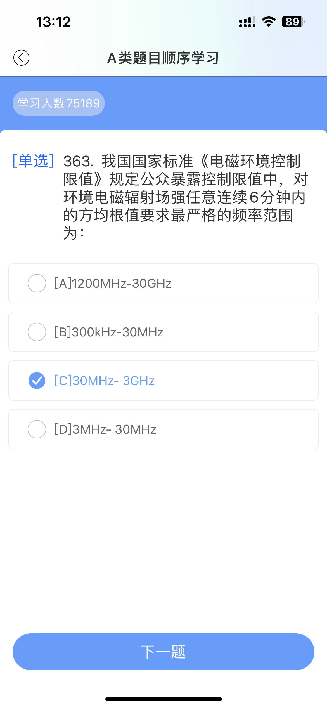
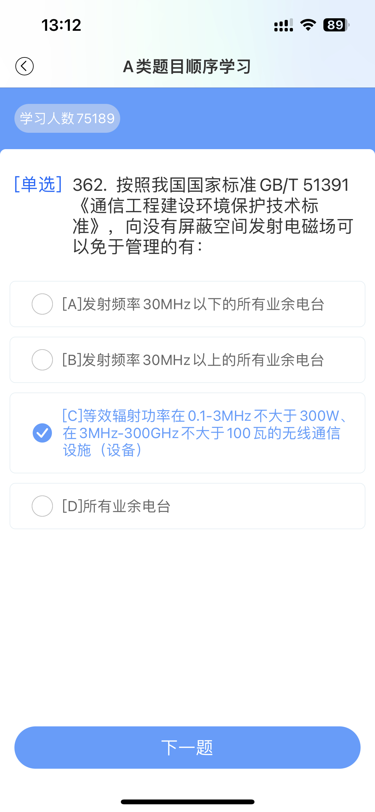
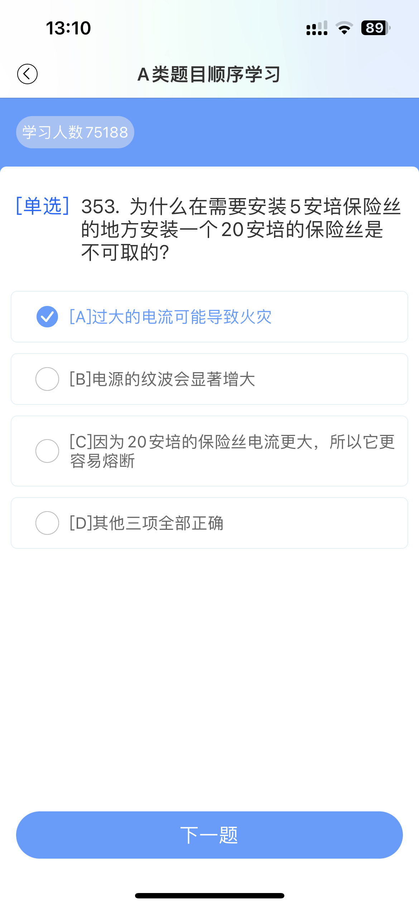
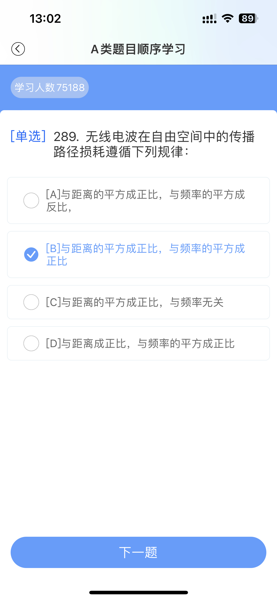
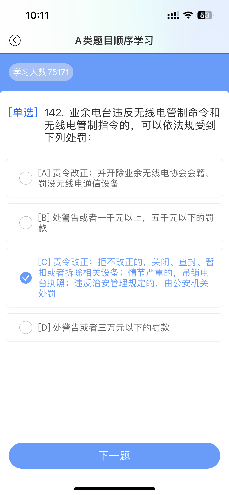
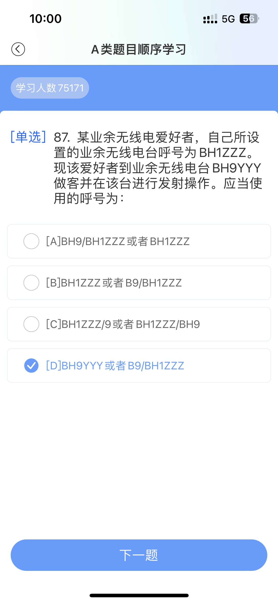
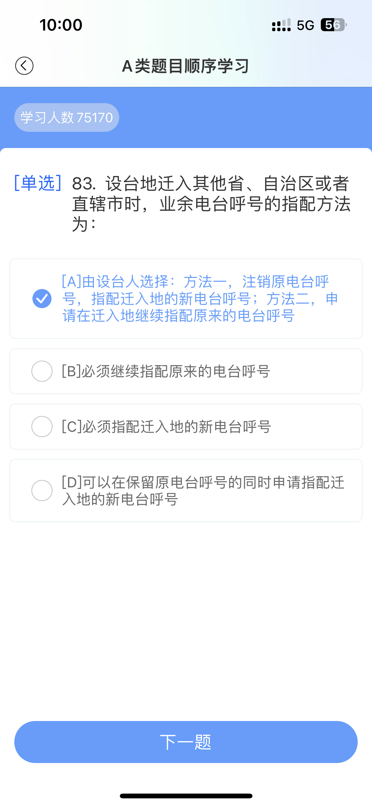
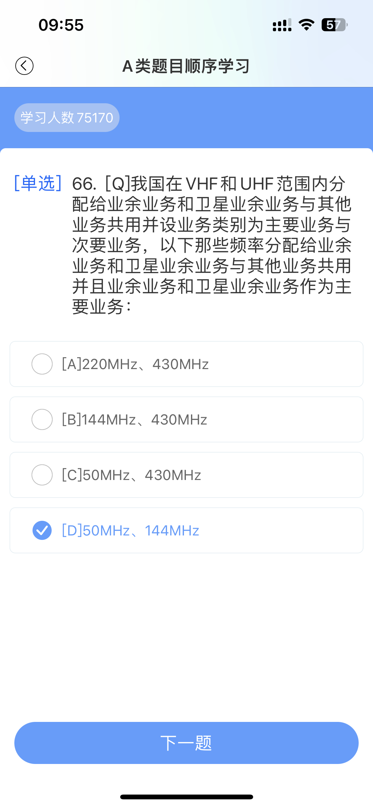
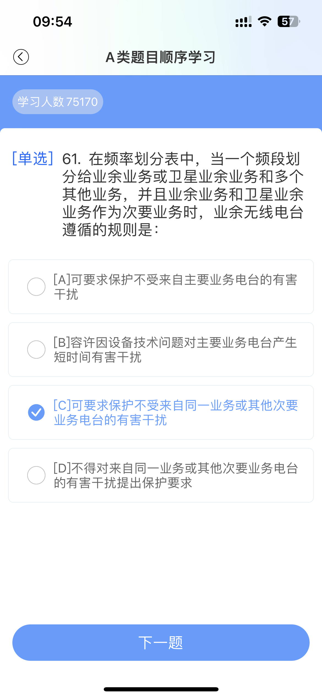
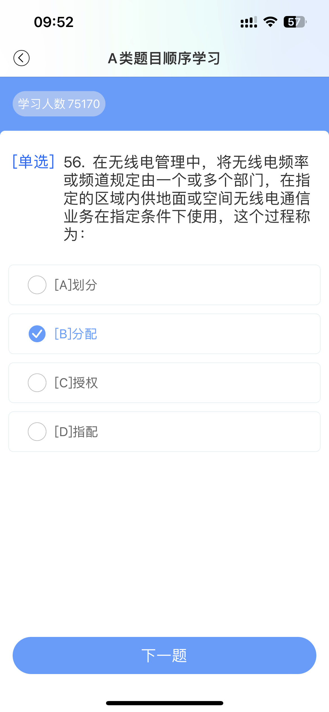
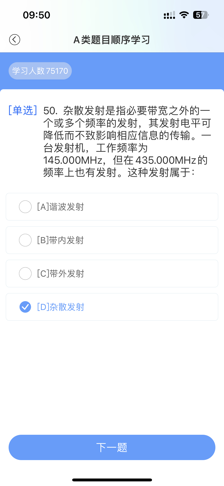
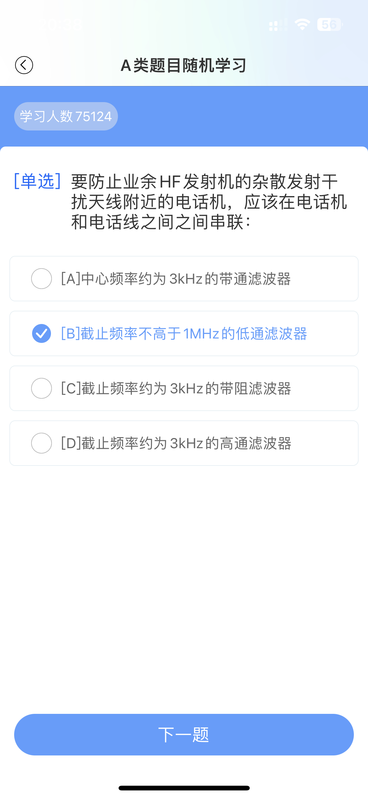
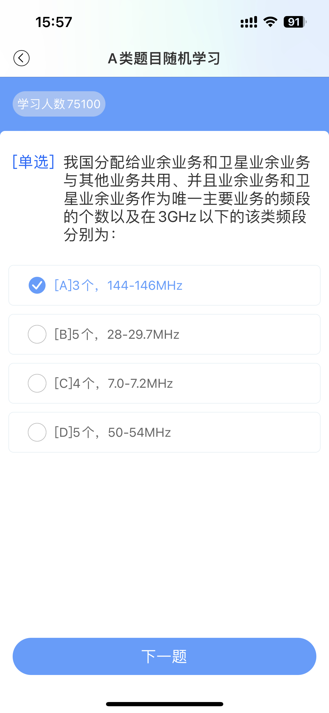

