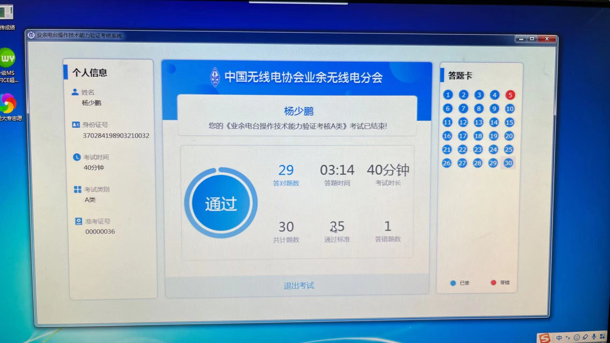

# 考证
[2023年无锡市第一次业余无线电台操作技术能力（A、B类）考试报名通知 (wuxi.gov.cn)](http://gxj.wuxi.gov.cn/doc/2023/05/16/3959048.shtml) 2023年6月10日下午，江阴，A类。
## 为什么要考呢？
兴趣吧，很早之前就知道有这个。另一方面也是希望自己身先士卒，能够为佑佑起个榜样的作用。如果他对这个感兴趣，我就带他一起玩，顺带入门电磁学。

## 准备
我差不多提前一周开始刷题。

## 成绩

我居然只是考场第二个交卷的！！！我居然不是满分！！！

# 电台
考证相当于考驾照，电台相当于买车。
电台需要去注册，呼号全球唯一。
[业余无线电入门指南：概述、考证、购机、设台、呼号、备考难题本一网打尽 - 知乎 (zhihu.com)](https://zhuanlan.zhihu.com/p/348499900)
```txt
申请设台一般是到当地的工业和信息化委员会办理，需要带上：
- 要备案的设备；
- 身份证原件和复印件；
- 操作证原件和复印件；
- 国无管表17 业余无线电台设置（变更）申请表；
- 国无管表19 业余无线电台技术资料申报表。
```


需要的资料和表格以及表格的填写方式可以在当地的社群和你考取操作证的机构打听，你购买设备的地方也许也可以指导你填表。

在你首次设台时，管局会给你分配一个全球唯一的呼号，这个呼号会伴随你的整个业余无线电生涯。

## 选型
### senhaix 8800
pdd价格390左右，刘超（张潇潇她老公）买的这款。
### 泉盛uv k5
pdd价格95左右，算上短天线和耳机什么的。

# ref
1. [在上海考取业余无线电操作证全流程纪实_考试认证_什么值得买 (smzdm.com)](https://post.smzdm.com/p/alx7893o/)
2. [业余无线电入门指南：概述、考证、购机、设台、呼号、备考难题本一网打尽 - 知乎 (zhihu.com)](https://zhuanlan.zhihu.com/p/348499900)
3. [业余无线电台执照申领指南 - 知乎 (zhihu.com)](https://zhuanlan.zhihu.com/p/104765218)
4. [业余无线电爱好者必须知道的事儿——关于电台执照的问与答 - 知乎 (zhihu.com)](https://zhuanlan.zhihu.com/p/22588011)
5. [业余无线电 篇一：入坑和晒下手上设备_对讲机_什么值得买 (smzdm.com)](https://post.smzdm.com/p/a78eep7d/)
6. 
