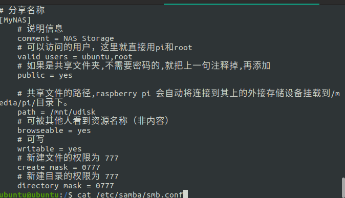

#树莓派 #raspberrypi #samba
# 3B+
## 登录
user: ubuntu
password: fastroad

## IP
192.168.1.217

## 位置
西门子无锡创新中心我的办公桌上

## 外设
* 8G U盘
* 
## 安装的服务
1. docker
	1. daily-check-in
		port:8923
	2. portainer
		port:9000
		fastroad12345
2. nodejs,npm
	1. node-red
		port:1880
	2. pm2
3. emqx
	admin, fastroad
	port:18083
4. sqlite3
5. gitea
	port:3000
	ysp, fastroad
6. samba
  ubuntu, fastroad
7. qbittorrent
  admin, adminadmin
8. ZeroTier
	address：2b35ac1e6b

## 常用命令和配置
### 启动qbitorrent下载
~~~SH
sudo docker run -d \                    
  --name=qbittorrent \                  
  -e PUID=1000 \
  -e PGID=1000 \
  -e TZ=Asia/Shanghai \                 
  -e WEBUI_PORT=8080 \                  
  -p 6881:6881 \
  -p 6881:6881/udp \
  -p 8080:8080 \
  -v /mnt/udisk/config:/config \        
  -v /mnt/udisk/Movies:/Movies \        
  --restart always \
  ghcr.io/linuxserver/qbittorrent
~~~
### samba
教程follow的如下链接：
https://www.v2fy.com/p/2021-10-03-pi-smb-1633231650000/
注意配置账户密码+挂载位置什么的配置文件，树莓派的在如下位置:
```sh
cat /etc/samba/smb.conf
```

Windows的加载samba的服务按照上面教程里面的来就可以。
Ubuntu作为访问端，所需配置参照如下两个教程
https://blog.csdn.net/a1136578584/article/details/115748656
https://blog.csdn.net/u013019701/article/details/124415387
总结一下，就是：
1. 安装cifs-utils
2. 挂载
3. 设置开机自动挂载脚本
注意：挂载时候需要设置dir和file的权限，否则读写会提示权限不够。
