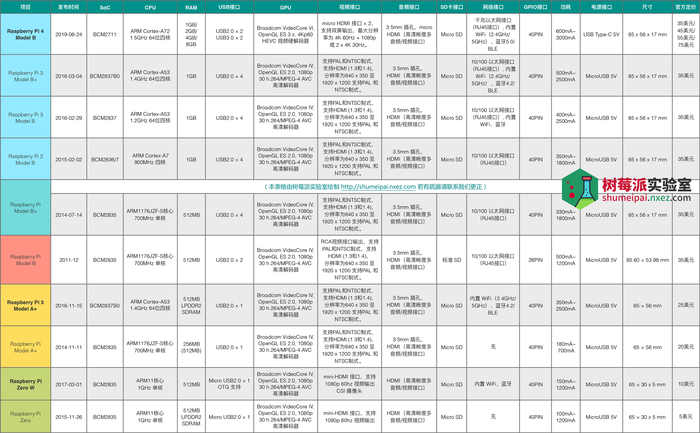
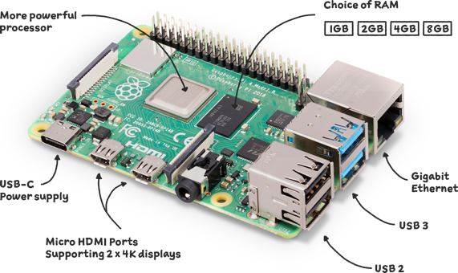
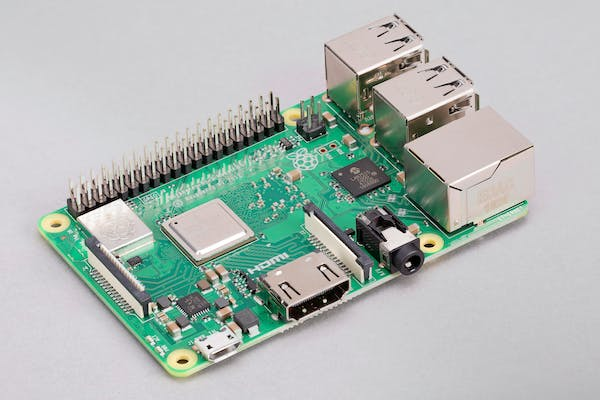

#raspberrypi #树莓派3b #树莓派4B #硬件 #操作系统
# 硬件选型
> 参考文献1，2，3

目前我手头上有一个树莓派3B+和一个4B 4GB内存版本，主要的差异也是对比这两者。之所以选型树莓派，也无非就是冲着硬件可扩展性+资料丰富来的。手头上这两个虽然购买时间和渠道都不同，但居然来自同一个供货商：亚博智能。
根据官网（参考文献1）可以很清楚的看到目前有哪些产品，包含了板子，扩展（摄像头，屏幕，其它扩展板），供电，外壳什么的，还有键鼠，这个就不说了。
## Pi系列
通常我们说的树莓派，指的就是树莓派的Pi 系列。该系列发展到现在已经是第四代（Pi 4）了，性能和接口各方面的都有了较大的升级。同时根据硬件性能又分为 A（A，A+） 和 B（B，B+） 两种版本（B 版本是标准的版本，一般发布也是从B系列开始，然后在B版本基础上裁剪一下硬件配置以及板子尺寸再发布 A 版本，可以说 B 版本就是一个基准的版本）。当然，如果真的是考虑入手一个，**买新不买旧，买B不买A**。
这里有一个树莓派实验室整理的对比图（包括各种硬件参数）：

### Raspberry Pi 4 Model B

### Raspberry Pi 3 Model B+

### 4B对比3B+
1. CPU上两个都是64位4核，但一个A72一个A53，根据参考文献3，所有情况下都快了19.3%。但这个其实真的快的不明显，实际体验上4B比3B+快了不止一倍，看来其他的诸如内存和IO的性能还是好了不少的。
2. 接口上2个usb2换成了usb3，外接硬盘跑得更快。支持双屏显示，4K。百兆升级到千兆以太网，蓝牙从4.2升级到5.0.
3. GPU支持解码4K60帧，这个可厉害了。

# 操作系统
> 参考文献2，4，5

https://www.raspberrypi.com/software/operating-systems/

## 烧录
如果刷官方系统，可以直接官网下载Pi Imager烧录软件，https://www.raspberrypi.com/software/
参照参考文献5进行设置，可以烧录之前通过软件设置好SSH和Wifi信息。

当然其他所有上面提到的官方支持的OS，烧录工具里都有，比如ubuntu server等。如果是特定版本，则需要下载了自己烧录了。

## Raspbian OS
Raspbian OS 是`官方深度定制`的树莓派板卡操作系统。它集成了很多工具，用于教育、编程以及其他广泛的用途。具体来说，它包含了 Python、Scratch、Sonic Pi、Java 和其他一些重要的包。如果你第一次使用树莓派，请下载这个。`最重要，官方一直在维护。`
如果需要用一些原生外设，那么更推荐这个版本。

## Ubuntu server
我个人最喜欢的版本，可以结合ubuntu和树莓派的优点，注意我装的都是64bit的。

# 参考文献
1. https://www.raspberrypi.com/products/
2. https://blog.csdn.net/weixin_44614230/article/details/127544802
3. https://lug.ustc.edu.cn/planet/2019/09/raspberry-4/
4. https://talk.quwj.com/topic/1350
5. https://blog.csdn.net/weixin_44614230/article/details/127541109