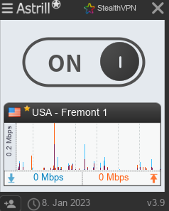
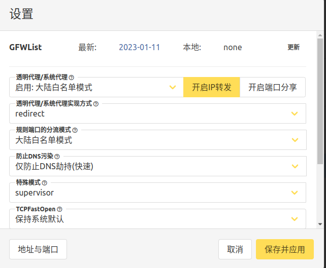

#vpn #ss #ssr #shadowsocks #shadowsocksr #vps #v2ray
# VPN
## AstrillVPN
https://astrillcn.com/
从2022-01-08用到了2023-01-08.
### 配置
#### ubuntu 20.04
和Windows啊，手机上不一样，需要选择一个不一样的vpn设置，注意看图里的StealthVPN。



### 优点
* 速度快，没有限速
* 节点多
* 平台全覆盖，包括linux

### 缺点
* 贵，太贵了，原来是100刀买的，现在年卡半价还180刀
* 节点多，但是经常IPC check failuer，也不知道为啥

# Shadowsocks(SS) , ShadowsocksR (SSR), V2ray
如果时直连线路，Shadowsocks  和 V2ray 的vmess 协议目前已经被精准识别极易被GFW封锁，不建议使用。不过「机场」服务多采用国内中转隧道，流量经过加密处理，可以保证不被GFW识别，所以对翻墙者而言，日常使用三种协议之间，体验不会有太大的区别。

由于三种翻墙协议在使用体验方面并没有比较大的区别，所以如果没有特殊需求，一般「机场」服务提供什么协议用什么协议就行了。

## Shadowsocks 协议

Shadowsocks 协议是一个基于 Socks5 协议的专用翻墙代理协议，Shadowsocks（简写作 SS）由两部分组成，客户端和服务器端。服务端可以自己租用服务器搭建，也可以购买专业的 SS 节点。提供 SS节点的服务商被翻墙者称为SS机场。

**Shadowsocks常见名称**：影梭，SS（Shadowsocks简写），小飞机 （因图标是一架纸飞机），酸酸（SS谐音）

官方网站：[https://shadowsocks.org/](https://shadowsocks.org/)

Shadowsocks 开发时间最早，是非常成熟的翻墙协议，最新 [Shadowsocks-2022 协议](https://2022vpn.net/xray-core-v1-5-7-support-latest-shadowsocks-2022-protocol/)也已经推出。

### Shadowsocks 是如何工作的？

Shadowsock 是一个代理工具，跟所有其他代理的工作流程一样，都是在用户端和目标网络之间增加了一个代理服务器中转流量，帮忙隐藏真实 IP 并以服务器 IP 访问网址，从而绕过企业级或者国家级的防火墙阻碍。


Shadowsocks 代理因为并不会像 VPN 一样对流量进行隧道加密，仅仅只是混淆流量，所以连接速度更快。Shadowsocks 协议专为翻墙而生，比VPN协议更有优势。

### Shadowsocks 的前世今生

Shadowsocks 是由一名叫做 ****clowwindy**** 的开发者研发的自用翻墙软件，于[2012年4月首发于 V2EX](https://www.v2ex.com/t/32777)，后面开源同步到了 GitHub 源代码托管平台。Shadowsocks 因其开源性和简易性受到广大开发者和用户的追捧。但因为主要目的是翻墙自用，初始安全性一般，仅仅使用了“预共享密钥”来对上方身份进行验证。直到后面实现了有密码学意义的相关提案，加入了包含 AES, Chacha20 等在内的 AHEAD 加密方式才让 Shadowsocks 的安全级别有所增加。

Shadowsocks 作为翻墙的鼻祖，其本身不仅被广泛用于突破防火长城，解锁被 GFW 封锁的各种国外站点、社交媒体 app、流媒体站点、谷歌应用等，还有助于衍生了更多的代理协议服务，如 ****ShadowsocksR (又称 SSR)****, V2Ray 和 Trojan，极大的促进了代理软件生态的发展。

时间转至2015年，clowwindy 在8月的某一天突然把 GitHub 上所有 Shadowsocks 有关的代码库和帮助信息都关闭和删除，宣布他本人于该项目的缘分截止于此，并透露原因是被当局邀请去“喝了茶”。虽然最后 clowwindy 依旧享有人身自由，却从此退出了该开源项目的维护，并隐藏了所有社交动态。代码删除后，GitHub 甚至还遭受了DDos / 分布式拒绝服务攻击，但 Shadowsocks 项目并未遭受灭顶之灾。

由于 Shadowsocks 开源后早已在圈内享誉盛名，即使原始作者退出舞台，依旧有大批开发者对其进行更新维护。2022年，[最新 Shadowsocks-2022 协议出炉](https://2022vpn.net/xray-core-v1-5-7-support-latest-shadowsocks-2022-protocol/)，一种重新设计的全新协议，解决了早先被人诟病的重放攻击等安全问题。

GitHub 项目地址: [https://github.com/shadowsocks](https://github.com/shadowsocks)

提供 Shadowsocks 节点的服务商也就是 Shadowsocks 机场，很多国内能用的翻墙VPN，其实也是采用的 Shadowsocks 节点，本质上也可以叫他们 Shadowsocks 机场。

## V2ray 协议

V2ray 协议诞生时间比 Shadowsocks 更晚一些，V2ray 包含了多种翻墙协议，其本质是一个翻墙协议的集合，V2ray 和 Shadowsocks 一样，需要客户端和服务端，服务端同样可以自己租用服务器搭建，也可以直接购买现成的 V2ray 节点。

翻墙者口中的 V2ray 节点或 V2ray 机场，一般提供的是 V2ray 中的 Vmess 协议，其中也有少量机场提供最新的 Vless 协议。

## Trojan 协议

Trojan 协议与Shadowsocks 相反，Trojan不使用自定义的加密协议来隐藏自身。相反，使用特征明显的TLS协议(TLS/SSL)，使得流量看起来与正常的HTTPS网站相同。Trojan 也需要客户端和服务器端搭配使用。

如果是自建的翻墙节点，使用 Trojan 节点应该是最方便的选择。

## 机场
- [ ] 是否已使用
### 搬瓦工  
#### VPS（virtual private server）
官网：https://bwh89.net/cart.php?gid=1
参考：https://vpsxueyuan.com/bandwagonhost-2022-new-year-promotion-code/
知名VPS厂商。
#### Just my socks
- [ ] 已使用 
搬瓦工官方梯子。
https://vpsxueyuan.com/just-my-socks-tutorial/
### 闪电猫 speedcat
- [x] 已使用 
https://aff03.speedcat-aff02.com/user##
可以随便用邮箱注册，不会验证，所以可以无限3天5G免费试用。
2022-02-
### 魔戒
- [ ] 已使用 
最大特点：**按流量收费，不是按时间**
https://mojie.me/#/login


### 其他推荐
https://kerrynotes.com/proxy/best-ssr-v2ray-proxy/#toc3


## 客户端
1. 因为SS是C-S模式，机场就相当于服务器，所以我们需要在本机上安装客户端，来使用代理。
2. Linux上的Shadowsocks客户端都很古老了，像很多人推荐的Shadowsocks-qt5，其github项目都已经archive了。此外，shadowsocks客户端需要config单独的server到json文件里，不好用也基本调不通。
3. V2Ray兼容SS协议，所以直接使用V2Ray协议的客户端就行了。安装分为两部分，1，安装V2Ray客户端服务；2，安装V2Ray客户端。

### Linux
以Ubuntu20.04为例，安装V2Ray服务和V2RayA客户端。
1. 通过snap安装V2Ray，也就是V2Ray-core
```sh
# https://snapcraft.io/install/v2ray-core/ubuntu
sudo snap install v2ray-core
```

2. 安装V2RayA
下载方式（不推荐）
```sh
sudo curl -Ls https://mirrors.v2raya.org/go.sh | sudo bash
```
或者直接使用snap（推荐）
```sh
sudo snap install v2raya
```

3. 配置自动启动
```sh
sudo systemctl enable v2ray
sudo systemctl start v2ray
```
4. 打开Web UI，http://localhost:2017
5. 设置V2ray

7. 剩下的请参考 快速上手 文档：https://v2raya.org/docs/prologue/quick-start/ 和闪电猫的教学 https://speedcat.8f9v.com/steps/ 进行导入和配置。


## Refs
* https://shadowsockshelp.github.io/Shadowsocks/
* https://2022vpn.net/shadowsocks-v2ray-and-trojan-protocol-which-one-is-the-best/

# 免费的才是最贵的
## 蓝灯 Lantern
https://lantern.io/zh-Hans
好多年之前，蓝灯刚出来的时候用过，没多久就连不上了，从那之后就没用过了。
2023-01-09
试了试不好用，

## 免费SS节点
根据SS的原理，只要有人免费出来机场位置，就可以用。反正之前用的，都没几个好用的。
还是需要先安装客户端来使用。
