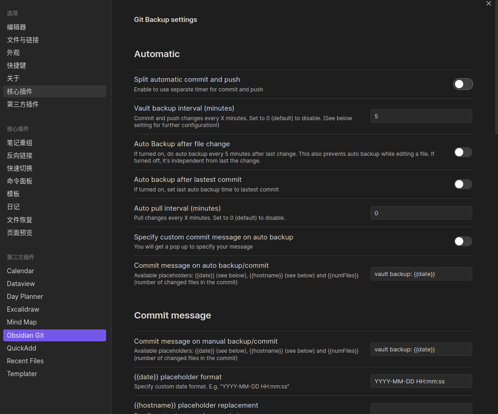

用过evernote，wiznote，obsidian。
#笔记 #双向连接 #obsidian

# Obsidian
## 参考
* Obsidian 中文论坛 https://forum-zh.obsidian.md/
* https://sspai.com/u/4b8zstxp/posts
* https://sspai.com/post/68427
* https://zhuanlan.zhihu.com/p/398625612
* 包含了各种插件的使用教程 https://www.zhihu.com/column/c_1413472005866266624
* 一个神奇的教程网站 https://publish.obsidian.md/chinesehelp/01+2021%E6%96%B0%E6%95%99%E7%A8%8B/%E6%9C%AC%E4%BA%BA%E5%AF%B9obsidian%E6%96%B0%E6%89%8B%E7%9A%84%E5%BB%BA%E8%AE%AE%EF%BC%882022%E7%89%88%E6%9C%AC%EF%BC%89+by+%E8%BD%AF%E9%80%9A%E8%BE%BE

## 为什么使用obsidian

1. 支持markdown，而且是实时预览，类似Typora（但没typora好用）
2. Typora只能编写markdown文件，没有笔记的管理功能。
3. 强大的引用功能：基于双向链接[[双向连接]]
   1. 标签引用
   2. 关键词引用
   3. 文章引用
4. 插件，强大的插件
5. 可以用git同步，icloud同步

## 插件
> 不翻墙装插件： https://zhuanlan.zhihu.com/p/430538023

### Obsidian Git

记得使用的时候要打开的文件夹内必须git initial了一个仓库。

### 爽的和不爽的点

