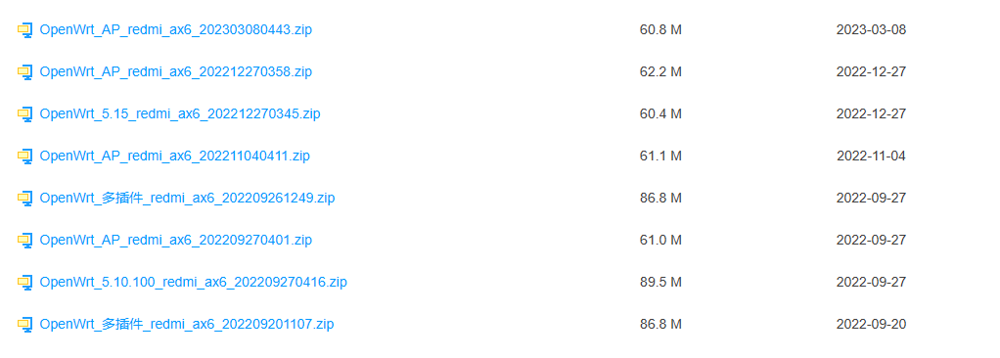

# 购买
原来用的Netgear R6300V2，闲鱼买的，刷了梅林固件，好像是386版本，非常好用。不愧于其电磁炉的造型和散热，后来越来越热，终于在加了12cm风扇后多撑了一年，出现了经常断网的情况。经过一番探索，购买了当时很火，但还不能刷机的AX6.
购买的理由很简单，
1. 性价比
2. CPU和内存够强
3. WiFi6，160MHz
4. 米家集成的生态（事实证明没啥用）

# 配置
最大的优势就是CPU：
```txt
无论是Redmi AX6还是小米AX3600都采用了高通的Networking Pro 600平台，采用了4核CPU+2核NPU的处理芯片，支持最多6个空间流，来提供最大的Wi-Fi 6容量。
```

[Redmi AX6路由器评测：六天线Wi-Fi 6新价格屠夫 - 知乎 (zhihu.com)](https://zhuanlan.zhihu.com/p/188685681)


缺点就是ROM只有128MB，导致后续的刷机有两种方式。

# 刷机前的使用
一直挺好的，无功无过。有一天嘻嘻路过，把水弄到了，洒在了路由器上，挂了。感谢京东，还在质保期内，直接给换新了一个，也算是占了京东一个便宜。

# 刷机的原因
2023年5月份，佑佑爷爷奶奶来带他。但是爷爷沉迷于刷抖音和刷快手视频，不停的刷视频攒的红包体现一个月也就几十块，浪费的水电，不认真带佑佑造成的恶劣影响都远不止这点经济收益。因此我就想从路由器角度看能不能屏蔽抖音这类短视频。小米自带的MiWiFi没有这类插件，openwrt系统貌似有。之后就是搜了一下AX6刷机openwrt的教程，发现可行，就这么做了。

# 刷机openwrt
折腾了一个晚上，成功的刷入了openwrt，也装上了所谓的应用过滤，但根本没用啊。
怎么说呢，其实想想也能明白，是抖音太狡猾了，不停的更改服务器的ip地址和域名即可，我们被动的防御是没用的。
除了更方便的科学上网和各种控制，暂时没发现对于AX6这种小内存的不扩容刷机（一个分区只有30MB），安装完openwrt之后所剩无几的情况下，有什么更多的意义。

## 教程
[红米AX6 Openwrt刷机教程（解锁步骤AX6000、AX9000通用）_哔哩哔哩_bilibili](https://www.bilibili.com/video/BV1q94y1f7fj/?vd_source=462c9e0df89bcb23f1c5be85ce31d8ce)
主要就是上面这个链接，视频里说的非常明白。我用的非扩容刷机，本来是想简单点，没想到后来用到了恢复官方的需求。

需要用到的软件： 
* winscp
* virtualbox（因为给的vmdk格式op虚拟机）
* mobaxterm
### 步骤
1. 解锁SSH
	1. 降级固件，用1.0.18的
	2. 虚拟机弄个op无线出来
	3. 解锁SSH
2. 刷入OP
	1. 刷入名字里含factory的固件先
	2. 然后在web里找到升级，再选sysupgrade的固件

## 固件
### 教程里的
视频里提到的是下面这个链接里面的固件，但是不要用！！！
```txt
帖子链接
https://www.right.com.cn/forum/forum.php?mod=viewthread&tid=5796487&extra=page%3D1%26filter%3Dtypeid%26typeid%3D64
也就是这个
[【20230215】红米AX6自用精简Openwrt，带酸爽乳-小米无线路由器以及小米无线相关的设备-恩山无线论坛 - Powered by Discuz! (right.com.cn)](https://www.right.com.cn/forum/thread-5796487-1-1.html)

下载链接：
百度网盘链接：https://pan.baidu.com/s/1zBtzdk1ERG4SYeTHu-b2lw
提取码：2333
```
后来我也找到了这个链接，里面的固件刷完了之后是没有无线功能的！

 
### 我刷的
在这个链接里找到的[【Openwrt新5.15内核开发版每周五更新】AX6/AX6S/AX3600/AX9000,NSS,组网,及相关教程-小米无线路由器以及小米无线相关的设备-恩山无线论坛 - Powered by Discuz! (right.com.cn)](https://www.right.com.cn/forum/thread-4875974-1-1.html)
里面的这部分：
> **AX6（含最新QSDK固件）**  
**蓝奏云:****https://wws.lanzoui.com/b02c8p8ta**  
**密码:****777s**  
  
 **AX6S**  
**蓝奏云：[https://wwt.lanzouo.com/b02cojtqd](https://wwt.lanzouo.com/b02cojtqd)**  
**密码:**78ey  
  
 **AX3600&AX9000（****含最新QSDK固件****）**  
**蓝奏云:****https://wws.lanzoui.com/b02cafd6j**  
**密码:****8jle**



里面的第一个，这里面有无线功能。

这个Github里也有[Releases · yaya131/Openwrt_Beta (github.com)](https://github.com/yaya131/Openwrt_Beta/releases)

注意里面写的ip地址，登录管理页面的时候要用到。

## openwrt 应用过滤 OAF插件
[用这些 OpenWRT 插件来武装你的路由器 - 知乎 (zhihu.com)](https://zhuanlan.zhihu.com/p/103121214)
[特征库 | 应用过滤(OAF) (destan19.github.io)](https://destan19.github.io/feature/)

研究了一下，OAF是国人开发的，介绍视频里清晰的有屏蔽各种短视频，包括抖音在内的功能。其原理也是通过特征库（猜测是DNS或者hosts）禁止某些应用。后来作者甚至开发出了一个界面称之为路由系统。
[FROS路由系统](http://www.fros.org.cn/ipk.html)
又研究了一下，发现有固件安装和

