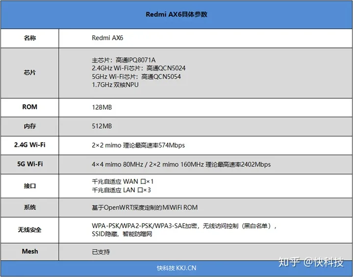

# 购买
原来用的Netgear R6300V2，闲鱼买的，刷了梅林固件，好像是386版本，非常好用。不愧于其电磁炉的造型和散热，后来越来越热，终于在加了12cm风扇后多撑了一年，出现了经常断网的情况。经过一番探索，购买了当时很火，但还不能刷机的AX6.
购买的理由很简单，
1. 性价比
2. CPU和内存够强
3. WiFi6，160MHz
4. 米家集成的生态（事实证明没啥用）

# 配置
最大的优势就是CPU：
```txt
**无论是Redmi AX6还是小米AX3600都采用了高通的Networking Pro 600平台，采用了4核CPU+2核NPU的处理芯片，支持最多6个空间流，来提供最大的Wi-Fi 6容量**。
```


# 刷机前的使用
一直挺好的，无功无过。有一天嘻嘻路过，把水弄到了，洒在了路由器上，挂了。感谢京东，还在质保期内，直接给换新了一个，也算是占了京东一个便宜。

# 刷机的原因
2023年5月份，佑佑爷爷奶奶来带他。但是爷爷沉迷于刷抖音和刷快手视频，不停的刷视频攒的红包体现一个月也就几十块，浪费的水电，不认真带佑佑造成的恶劣影响都远不止这点经济收益。因此我就想从路由器角度看能不能屏蔽抖音这类短视频。小米自带的MiWiFi没有这类插件，openwrt系统貌似有。之后就是搜了一下AX6刷机openwrt的教程，发现可行，就这么做了。
