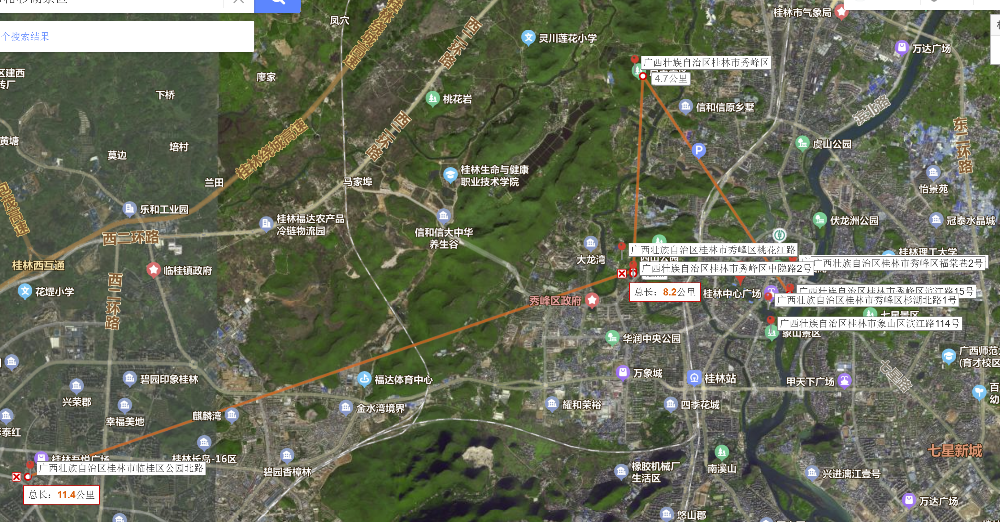
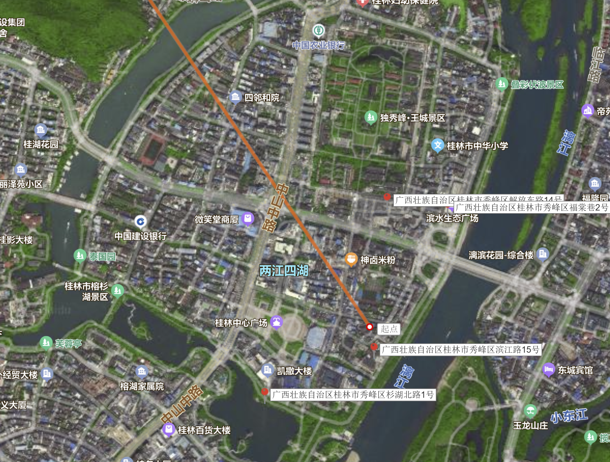
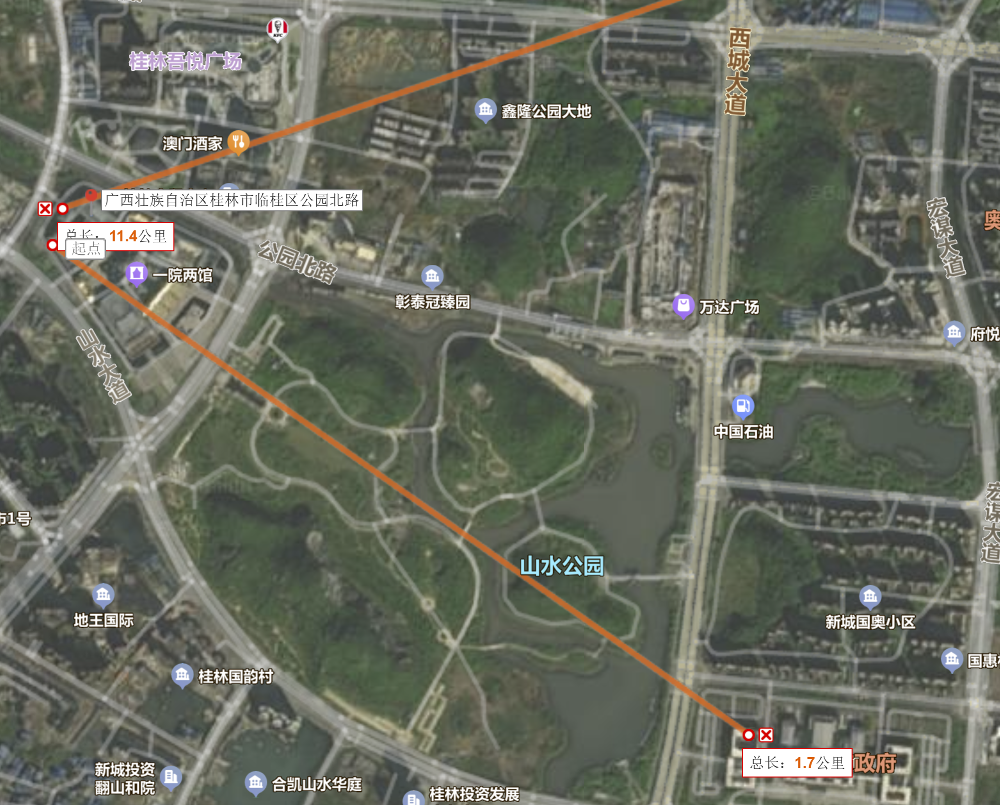
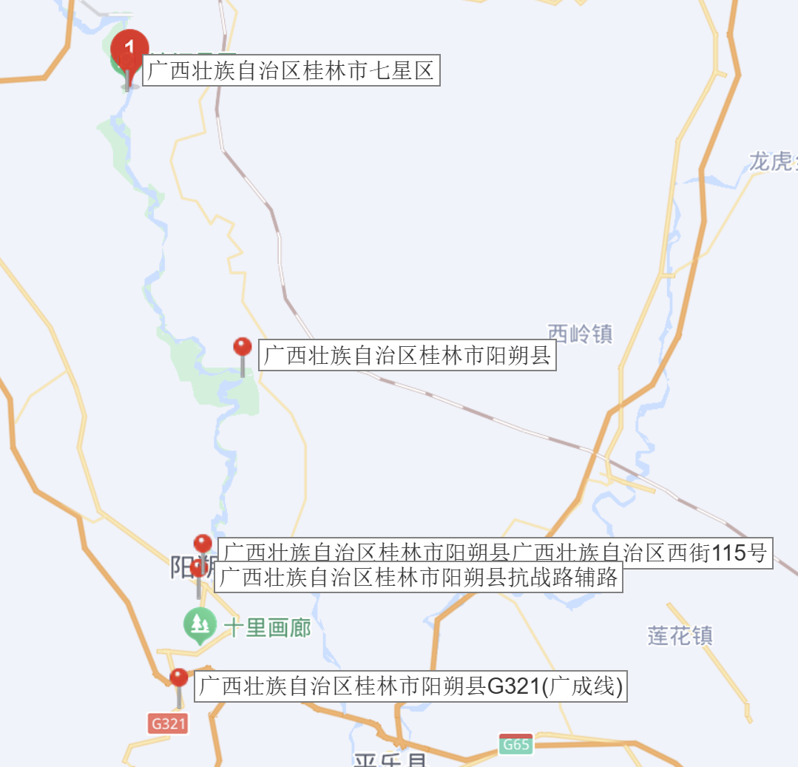

# 6.13 
无锡-两江机场 8：00-10：30
两江机场-喜来登（秀峰区滨江路15号）  32公里 打车50分钟
到达时间：12：00左右，办理入住

午餐：米粉

下午：
独秀峰+王府
    门票：飞猪89 提前一天
下来之后东西巷，逍遥楼，两江四湖，争取到象鼻山

晚餐：找个店多吃点啤酒鱼之类的

晚上：
日月塔公园
	门票35  夜景可以俯瞰桂林市
两江四湖顺时针绕一圈

# 6.14

自然醒（9：00）

上午： 
芦笛岩 
    门票90 飞猪提前一天定82
    游玩时长：1-1.5h
    交通： 打车20分钟-检票口

逛完了去酒店办入住，争取12点左右或之后，早的话就先吃午餐
午餐：随意

下午：
桂林博物馆
	打车12km

晚餐：桂林吾悦广场

晚上：
	溜达溜达吾悦广场或者桂林市政府附近，回酒店休息

# 6.16

