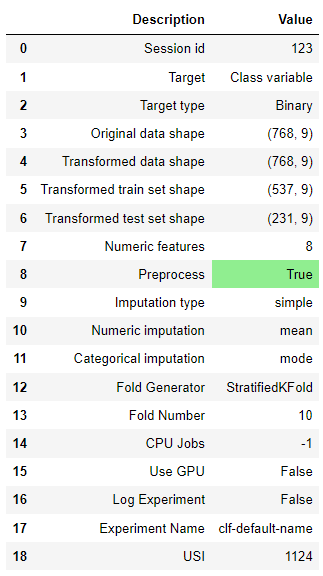
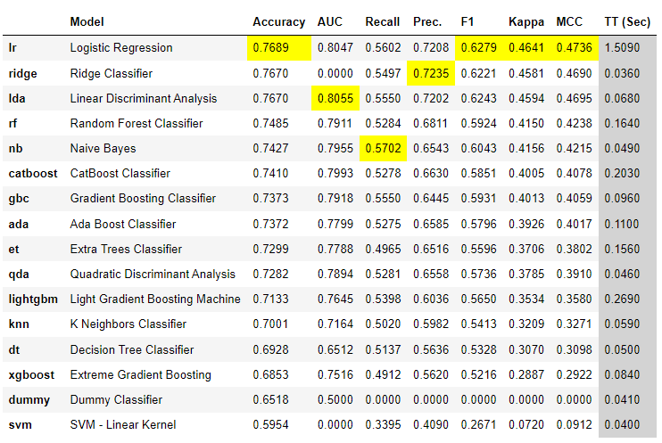
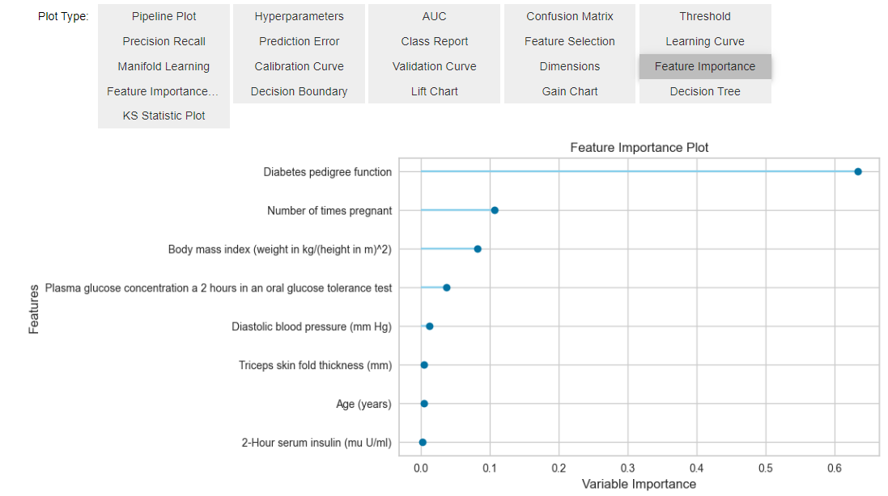
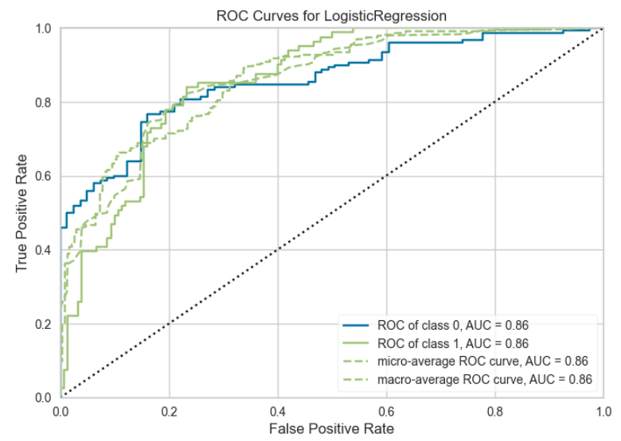
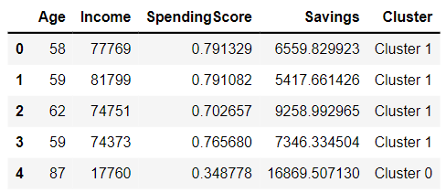
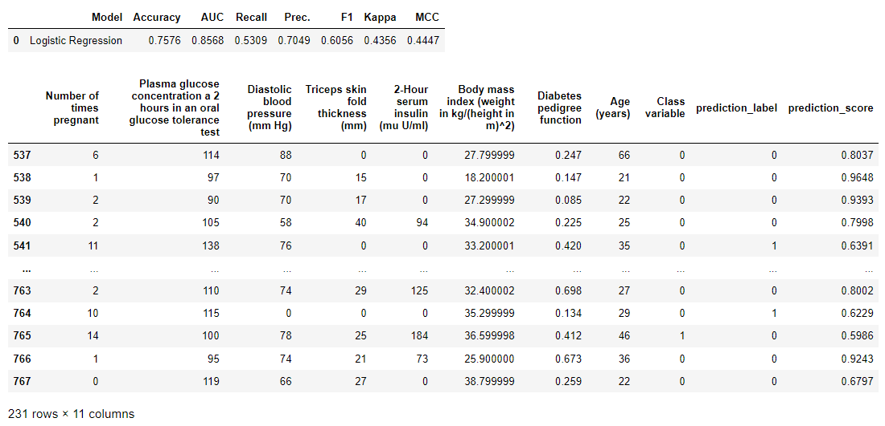
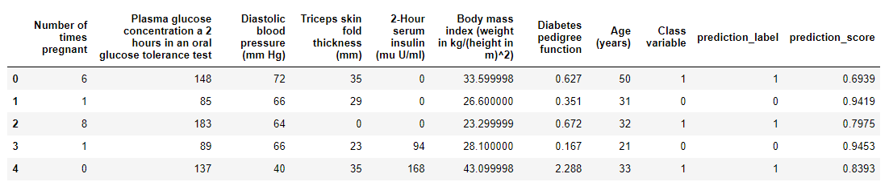

无意中发现的，原来是个建模的好工具。
可以快速的给出各种类型模型的比较，并从中选取最好的那个。

# 教程
[Quickstart - Docs (gitbook.io)](https://pycaret.gitbook.io/docs/get-started/quickstart)  
首先按照模型类型分类，其次每种类型的步骤基本上都是一致的。Classification，regression和time-series这种监督式的会多一个compare models的接口。对于非监督类，会多一个Assign model的接口，也就是把生成的label给弄上去。
## 接口
所有的接口都有两种形式，functional api和OOP api。在开始时候import和调用的时候有区别。
以setup为例，
```python
# Functional API
from pycaret.classification import *
s = setup(data, target = 'Class variable', session_id = 123)
# OOP API
from pycaret.classification import ClassificationExperiment
s = ClassificationExperiment()
s.setup(data, target = 'Class variable', session_id = 123)
```
## 步骤
### load data
加载数据，没啥好说的，顶多预处理一下。
数据格式是pandas的dataframe。
### Setup
用来划分train set，test set之类，同时对数据给出描述。比如下图。
```python
# functional
from pycaret.classification import *
s = setup(data, target = 'Class variable', session_id = 123)
# OOP
from pycaret.classification import ClassificationExperiment
s = ClassificationExperiment()
s.setup(data, target = 'Class variable', session_id = 123)
```

所以setup是所有步骤里面的第二步。
### compare models（监督类）
如上面所述，只有监督式学习的额anomaly detection有。该接口可以直接返回最好的模型。
```python
# functional API
best = compare_models()

# OOP API
best = s.compare_models()

```

### analyze model
可以输出各种图形，用来判断。注意只能在jupyter notebook里，原因是用的是ipywidgets的接口。
接口不叫analyze_model, 是evaluate_model.
```python
# functional API
evaluate_model(best)

# OOP API
s.evaluate_model(best)
```

里面的具体图形可以调用plot_model接口。
```python
# functional API
plot_model(best, plot = 'auc')

# OOP API
s.plot_model(best, plot = 'auc')
```


### assign model（非监督类）
将labels标注回training set。
```python
# functional API
result = assign_model(kmeans)
result.head()

# OOP API
result = s.assign_model(kmeans)
result.head()

```


### predictions
结果存储在prediction_label和prediction_score里。
```python
# functional API
predict_model(best)
# OOP API
s.predict_model(best)
```

训练好后就可以在测试集上使用。
```python
# functional API
predictions = predict_model(best, data=data)
predictions.head()

# OOP API
predictions = s.predict_model(best, data=data)
predictions.head()
```


### save the model
可以save，当然也可以load。
save：
```python
# functional API
save_model(best, 'my_best_pipeline')

# OOP API
s.save_model(best, 'my_best_pipeline')
```
load:
```python
# functional API
loaded_model = load_model('my_best_pipeline')
print(loaded_model)

# OOP API
loaded_model = s.load_model('my_best_pipeline')
print(loaded_model)
```
## 分类
一个分类就是PyCaret里的一个类，需要用到的去里面选择就可以。
### Classification

### Regression

### Clustering

### Anomaly Detection
pycaret把anomaly detection划分成了无监督学习的一种。
### Time Series


# Ref
1. [PyCaret 3.0 - Docs (gitbook.io)](https://pycaret.gitbook.io/docs/)
2. [Home - PyCaret](https://pycaret.org/)
3. [pycaret/pycaret: An open-source, low-code machine learning library in Python (github.com)](https://github.com/pycaret/pycaret)
4. [(42条消息) 机器学习建模工具PyCaret详讲_怎么看pycaret生成的pipeline图_用药的博客-CSDN博客](https://blog.csdn.net/qq_43627540/article/details/107667298)
5. [太赞了！分享一个数据科学利器 PyCaret，几行代码搞定从数据处理到模型部署 - 知乎 (zhihu.com)](https://zhuanlan.zhihu.com/p/146508289)
6. 