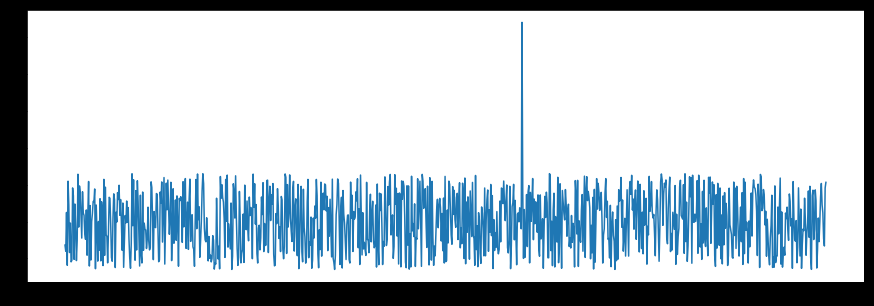
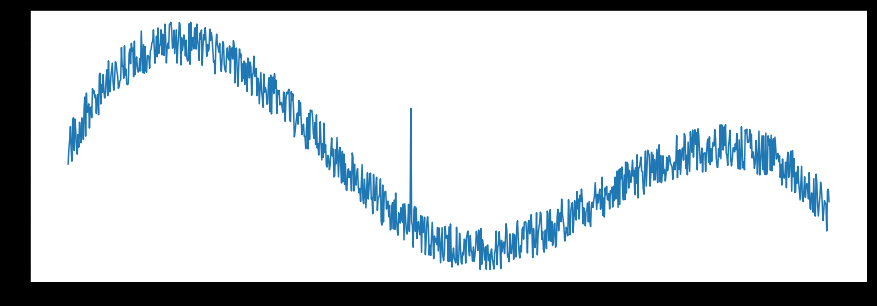
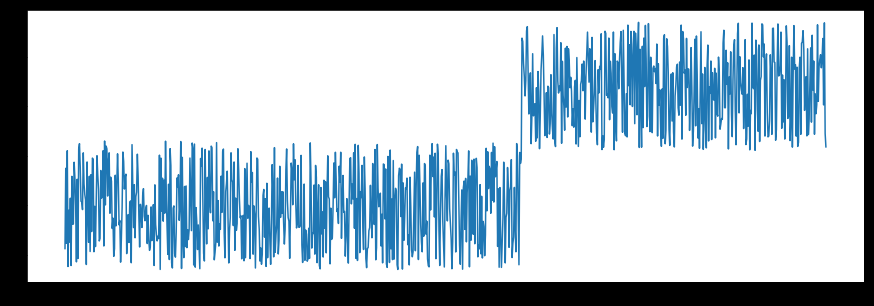
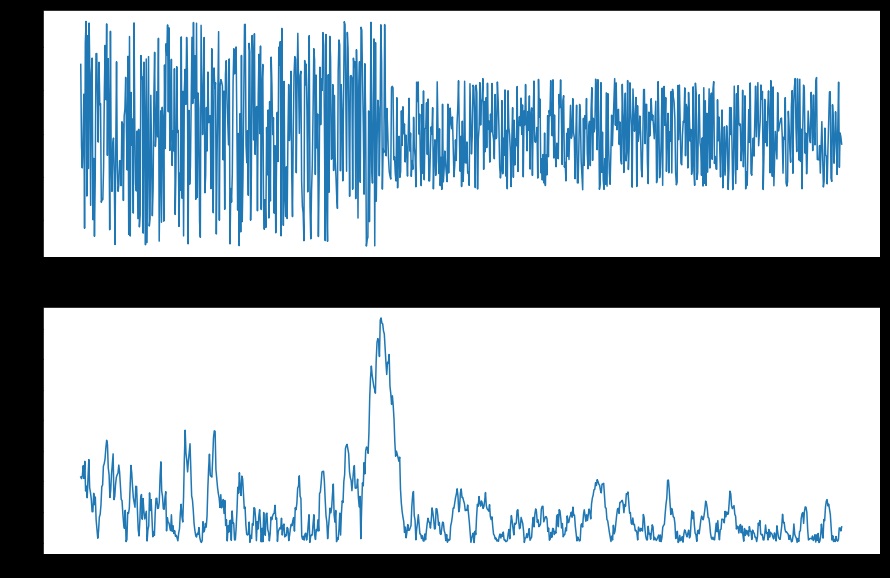
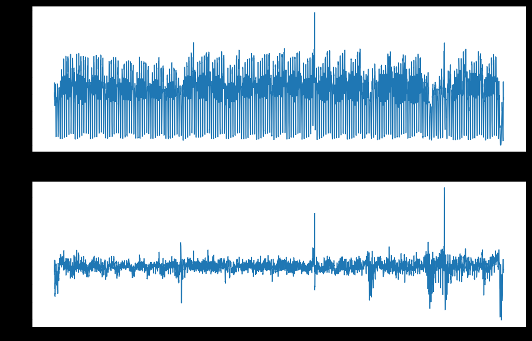

来自[[各种库的比较]]，看着还行，貌似挺简单的。
[Quick Start — ADTK 0.6.2 documentation](https://adtk.readthedocs.io/en/stable/quickstart.html)

# 使用
## 接口
其内置了一些简化的库，可以用来validate，visualize，detect和apply model。
## 异常种类
ARUNDO 分了四类
### outlier
outlier:

### Spike and level shift
spike:

level shift:

### Pattern change

### Seasonality

## univariate vs. multivariate
单变量vs多变量
作者认为对于单变量，直接用univariate的就行了。对于多变量，通常情况下对每个columne或者维度使用univariate然后再汇总看就行。但不排除某些特殊情况下，应该联合多个维度，之后使用。

## Detector, Transformer, Aggregator and Pipe
### Detector
A detector is a component that scans time series and returns anomalous time points. They are all included in module adtk.detector
### Transformer
A transformer is a component that transforms time series such that useful information is extracted. It can also be interpreted as a feature engineering component. They are all included in module adtk.transformer.
### Aggregator
An Aggregator is a component that combines different detection results (anomaly lists). It is an ensemble component. They are all included in module adtk.aggregator.
### Pipe
A model can be a single detector or a combination of multiple components. If the combination is sequential, i.e. one or several transformers connected with a detector sequentially, it can be connected by an adtk.pipe.Pipeline object. If the combination is more complicated and not sequential, it can be connected by an adtk.pipe.Pipenet

# Ref
1. https://adtk.readthedocs.io/en/stable/index.html
2. https://github.com/arundo/adtk
