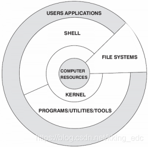
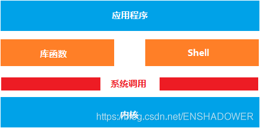
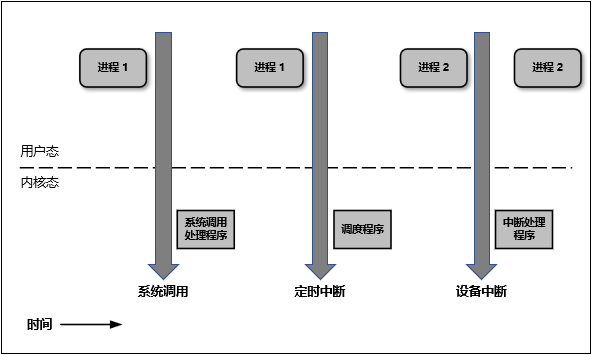

# 什么是内核态和用户态？
参见Refs2，说的非常好。
简单说，内核态与用户态，对应的是CPU提供的权限分级功能的一层封装抽象。设计目标是为了多任务系统：权限分级、数据隔离、任务切换。

**进入内核态不是说CPU进入了某个地方，而是一种工作模式的切换。**

> root相当于皇帝状态，普通用户平民状态，但无论如何这两个都是在人间（用户态）。内核态相当于玉帝状态默默掌控一切，另外求个雨啥的还得找玉帝（系统调用等等）。

Linux CPU stats参见Refs 6

神文！Refs7. 包括地址空间映射的问题也说明白了！

由此简单定义：
参见Refs3

# 什么时候需要kernel space？
答：当需要操作一些内核控制的IO读写资源时候，就需要切换到内核space。
![[imgs/Pasted image 20230913160640.png]]

# kernel space与root有什么关系吗？程序跑在kernel必须要root权限吗？
我的理解是不用，查到的资料也都是不用，但我没办法举反例。

从这个话题又引申出一个问题：Linux的用户管理，而用户管理，又何权限紧密相关，即Linux权限管理。
[[Linux基础（8 权限管理）]]
[[Linux基础（9 用户管理）]]

# Refs
1. https://blog.csdn.net/kking_edc/article/details/108980811
2. https://www.zhihu.com/question/397142622
3. https://blog.csdn.net/ludan_xia/article/details/105695961
4. [User space(用户空间) 与 Kernel space(内核空间) - myseries - 博客园 (cnblogs.com)](https://www.cnblogs.com/myseries/p/12056078.html)
5. https://drawings.jvns.ca/userspace/
6. https://scoutapm.com/blog/understanding-linuxs-cpu-stats
7. https://www.zhihu.com/question/306127044
8. https://zhuanlan.zhihu.com/p/472598132
9. https://www.zhihu.com/question/42926491
