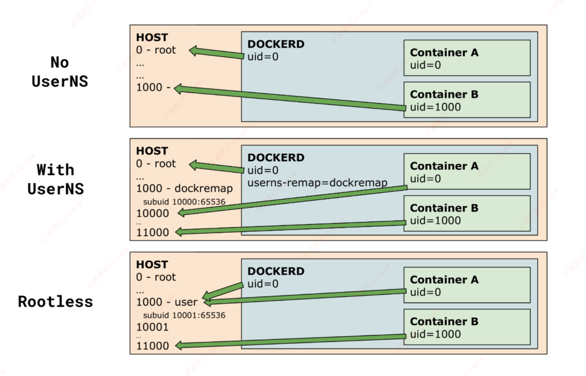

# Background - why sudo is needed 
When we use docker commands, we always use sudo as prefix, otherwise it wil show like below:

which shows lacking of permission.
The reason is:
> The Docker daemon binds to a Unix socket, not a TCP port. By default it’s the `root` user that owns the Unix socket, and other users can only access it using `sudo`. The Docker daemon always runs as the `root` user.

# Manage docker as a non-root user
## Less sudos in commands, but still root privileges
Can we bypass the sudo prefix? Yes we can. 

> If you don’t want to preface the `docker` command with `sudo`, create a Unix group called `docker` and add users to it. When the Docker daemon starts, it creates a Unix socket accessible by members of the `docker` group. On some Linux distributions, the system automatically creates this group when installing Docker Engine using a package manager. In that case, there is no need for you to manually create the group.

But please be noted:
> The `docker` group grants root-level privileges to the user. For details on how this impacts security in your system, see [Docker Daemon Attack Surface](https://docs.docker.com/engine/security/#docker-daemon-attack-surface).

## Operations
Please refer to Refs 1.

# Rootless mode
In docker group, we're still using root-level privileges. Can we run the daemon and contianers as non-root? Yes, rootless mode.

## Why we need rootless mode?
> Rootless mode allows running the Docker daemon and containers as a non-root user to mitigate potential vulnerabilities in the daemon and the container runtime.
	Rootless mode does not require root privileges even during the installation of the Docker daemon, as long as the [prerequisites](https://docs.docker.com/engine/security/rootless/#prerequisites) are met.

In a nutshell, the container cannot use root priviledge in host, so this can **mitigate the most vulnerabilities to the host**.

## How it works
> Rootless mode executes the Docker daemon and containers inside a user namespace. This is very similar to [`userns-remap` mode](https://docs.docker.com/engine/security/userns-remap/), except that with `userns-remap` mode, the daemon itself is running with root privileges, whereas in rootless mode, both the daemon and the container are running without root privileges.


## Prerequisites
- You must install `newuidmap` and `newgidmap` on the host. These commands are provided by the `uidmap` package on most distros.
    
- `/etc/subuid` and `/etc/subgid` should contain at least 65,536 subordinate UIDs/GIDs for the user.

## Known limitations
Check Refs 2.

## Install, Uninstall & Usage
Check Refs 2.

## Best practices
Check Refs 2.
### Rootless docker in docker

To run Rootless Docker inside “rootful” Docker, use the `docker:<version>-dind-rootless` image instead of `docker:<version>-dind`.

```
$ docker run -d --name dind-rootless --privileged docker:24.0-dind-rootless
```

The `docker:<version>-dind-rootless` image runs as a non-root user (UID 1000). However, `--privileged` is required for disabling seccomp, AppArmor, and mount masks.

### Exposing privileged ports

To expose privileged ports (< 1024), set `CAP_NET_BIND_SERVICE` on `rootlesskit` binary and restart the daemon.

```
$ sudo setcap cap_net_bind_service=ep $(which rootlesskit)
$ systemctl --user restart docker
```

Or add `net.ipv4.ip_unprivileged_port_start=0` to `/etc/sysctl.conf` (or `/etc/sysctl.d`) and run `sudo sysctl --system`.

# Userns-remap mode
> Linux namespaces provide isolation for running processes, limiting their access to system resources without the running process being aware of the limitations. For more information on Linux namespaces, see [Linux namespaces](https://www.linux.com/news/understanding-and-securing-linux-namespaces).
> The best way to prevent privilege-escalation attacks from within a container is to configure your container’s applications to run as unprivileged users. For containers whose processes must run as the `root` user within the container, you can re-map this user to a less-privileged user on the Docker host. The mapped user is assigned a range of UIDs which function within the namespace as normal UIDs from 0 to 65536, but have no privileges on the host machine itself.


## How it works
### About remapping and subordinate user and group IDs

The remapping itself is handled by two files: `/etc/subuid` and `/etc/subgid`. Each file works the same, but one is concerned with the user ID range, and the other with the group ID range. Consider the following entry in `/etc/subuid`:

```none
testuser:231072:65536
```

This means that `testuser` is assigned a subordinate user ID range of `231072` and the next 65536 integers in sequence. UID `231072` is mapped within the namespace (within the container, in this case) as UID `0` (`root`). UID `231073` is mapped as UID `1`, and so forth. If a process attempts to escalate privilege outside of the namespace, the process is running as an unprivileged high-number UID on the host, which does not even map to a real user. This means the process has no privileges on the host system at all.

### Prerequisites
Check Refs 3.

## Operations
### Enable userns-remap on the daemon
You can start `dockerd` with the `--userns-remap` flag or follow this procedure to configure the daemon using the `daemon.json` configuration file. The `daemon.json` method is recommended. If you use the flag, use the following command as a model:

```
$ dockerd --userns-remap="testuser:testuser"
```

Other details please check Refs 3.

### Disable namespace remapping for a container
> If you enable user namespaces on the daemon, all containers are started with user namespaces enabled by default. In some situations, such as privileged containers, you may need to disable user namespaces for a specific container. See [user namespace known limitations](https://docs.docker.com/engine/security/userns-remap/#user-namespace-known-limitations) for some of these limitations.
> To disable user namespaces for a specific container, add the `--userns=host` flag to the `docker container create`, `docker container run`, or `docker container exec` command.

## User namespace known limitations
Check Refs 3.

# Comparison
* No UserNS: native docker
* With UserNS: userns-remap
* Rootless




# Refs
1. https://docs.docker.com/engine/install/linux-postinstall/
2. https://docs.docker.com/engine/security/rootless/
3. https://docs.docker.com/engine/security/userns-remap/