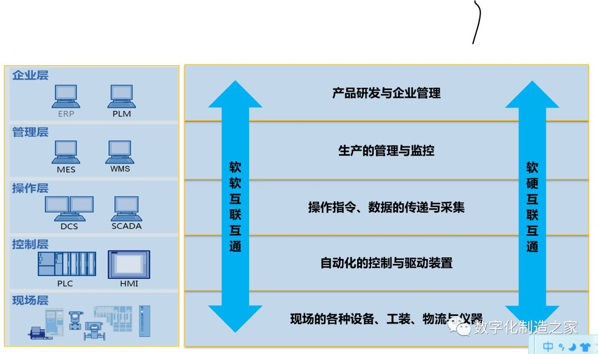
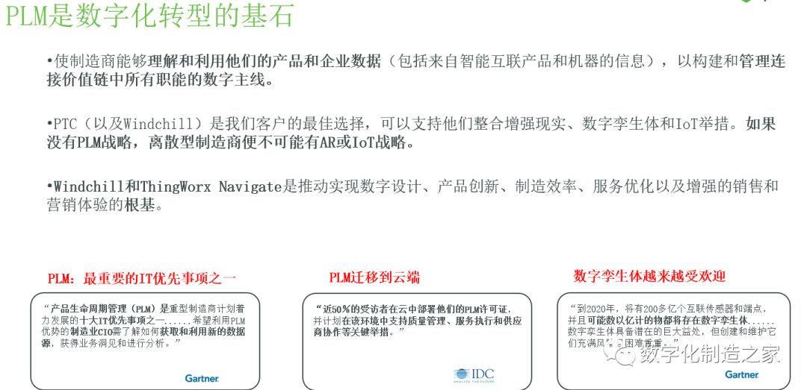

#智能制造 #智能制造之家 #西门子 #达索 #施耐德
# 来源
文章均来自智能制造之家公众号。
# 西门子
## 西家软件知多少
https://mp.weixin.qq.com/s?__biz=MzIwMjMxODAzNA==&mid=2247483949&idx=1&sn=d785d969673f6d390fc553250a6df9c7&chksm=96e1cb90a1964286f12398c98b0a9e3236b4e9a88bfc35d12dfeb23b34df2f906e22fcf9cc6b&scene=21#wechat_redirect
### 五层架构

### 西家软件
#### Teamcenter
https://plm.sw.siemens.com/en-US/teamcenter/

#### TIA Portal 博途
https://mp.weixin.qq.com/s?__biz=MzIwMjMxODAzNA==&mid=2247484055&idx=1&sn=be99dedad4bc11130d31547a0f49f85f&chksm=96e1cb2aa196423c375417ff10ffced3727b6f7579acba1d48758060602098019fea188dadb7&scene=21#wechat_redirect

### PS：没那么复杂
在上面提到的网址上，https://plm.sw.siemens.com/en-US/teamcenter/，点击software&products，如图，可以看到主要的软件产品，然后点进去看就好了其实。

比如提到的Teamcenter，NX，Simcenter等。

### PS：Camstar去哪了？
毕竟曾经和Camstar打了那么久的交道，顺手一查，现在Camstar已经是Opcenter的一部分了。
https://www.plm.automation.siemens.com/global/en/our-story/glossary/camstar-systems/84297

## 西门子工业软件的历史介绍
https://mp.weixin.qq.com/s?__biz=MzIwMjMxODAzNA==&mid=2247495567&idx=1&sn=55873d7a5109e463b50ce2216859454a&chksm=96e22632a195af24d67753b656b138bd6c6e763ab8cb455058a3706acccd7ca8154bb37cc3e6&cur_album_id=1338543623163691011&scene=190#rd

### 名词
* PLM：产品生命周期管理
* MOM：生产运营管理。Manufacturing Operation Management
* ISA-95：MES标准。美国仪器、系统和自动化协会(Instrumentation, System, and Automation Society, ISA)于2000年开始发布的ISA-95标准。
* SCADA：Supervisory Control And Data Acquisition

### 节点和变更
1. 2019，Siemens PLM Software更名为Siemens Digital Industries Software
2. 2016，推出MindSpere
3. 2018.8，收购Mendix

### 产品线
看链接里吧，感觉变化很快，直接参照官网也行。

## 罗克韦尔 Rockwell
### 罗克韦尔的软件全家桶
https://mp.weixin.qq.com/s?__biz=MzIwMjMxODAzNA==&mid=2247484233&idx=1&sn=d13f59b2c16c8e11d2cca97ca4c3527e&chksm=96e1caf4a19643e2aece0437818d5a96171894c8b506ae2d654d5b7aa1c14f0a8fb2ffff50a9&scene=21#wechat_redirect

## PTC 美国参数技术公司
### 侃侃PTC的数字化制造
> PTC: **工业企业的目标不是要成为一家数字公司，而是利用数字技术来捍卫和提升他们的竞争优势.** 简单却又清晰明了的说明了数字化转型的必要性。

#### 知名产品
Thingworx

## 达索
### 达索的数字化全家桶
https://mp.weixin.qq.com/s?__biz=MzIwMjMxODAzNA==&mid=2247484380&idx=1&sn=78a260cda1823fd4aa23ef605997b234&chksm=96e1ca61a1964377602fa9b2599abe68198ae71ba41c52168ba231bdae81454f1417e61e66c1&scene=21#wechat_redirect
#### 知名产品
1. 3DExperience
2. 

## 施耐德
### 施耐德Wonderware system platform介绍
https://mp.weixin.qq.com/s?__biz=MzIwMjMxODAzNA==&mid=2247484348&idx=1&sn=9c88472767946abd903e108f055245e2&chksm=96e1ca01a1964317389fed714950eafa06ed8eb7ff08f3b85d4b836e99cf4086d87baf7013d3&scene=21#wechat_redirect

