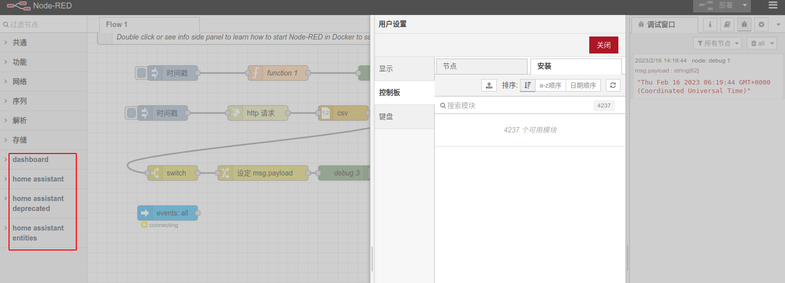

#node-red #iot #流处理 #flow-control
官网： https://nodered.org/
# 初步接触感受
1. 全平台安装，依赖于node，甚至可以安装在树莓派上。但在我的树莓派3B上性能不够，官网推荐的也是树莓派4.
2. 流控制的理念非常好用，容易理解。组件类型非常多，还可以通过插件扩展，兼容诸如home assistant等。把小米的通过插件形式安装后，非常好用。所以通过与ha等智能家居的组合，居然达到了意想不到的效果。看得我真是跃跃欲试。
3. 居然是IBM在2013年才推出的，新的东西推广和使用是越来越快了。

# 安装
用的是docker，这样可以避开node.js的安装和版本问题，推荐。
```sh
sudo docker run -it -p 1880:1880 --name mynodered nodered/node-red
```

# 概念
https://nodered.org/docs/user-guide/concepts
## 流
输入->处理->输出
## 插件
### home-assistant
https://blog.csdn.net/weixin_45820944/article/details/104256208

遗留问题：用了ha节点后，一直显示connecting。

## 部署deploy
任何对节点的修改，都应该点击部署。
目前我对部署的理解类似于：commit + deploy。点了部署才能开始真正用。

# 2025-06-18 update node-red vs. airflow
这俩在功能上很相似，但从各自简介上来看，体量完全不同。
Airflow：[Apache Airflow](https://airflow.apache.org/)
[快速入门 — Airflow 文档 - Airflow 工作流管理平台](https://airflow.apache.ac.cn/docs/apache-airflow/stable/start.html)
[(99+ 封私信 / 50 条消息) Airflow 入门及使用 - 知乎](https://zhuanlan.zhihu.com/p/84332879)

Airflow是基于DAG（Directed acyclic graph 有向无环图）来管理任务流程的任务调度工具， 不需要知道业务数据的具体内容，设置任务的依赖关系即可实现任务调度。所以Airflow的主要功能是：任务调度。从他的组件也能看出来，基于调度器和执行器。

两者对比：
[Node-RED vs. Apache Airflow: A Thorough Comparision of Workflow Management Platform](https://blog.excellimatrix.com/post/node-red-vs-apache-airflow-a-thorough-comparision-of-workflow-management-platform)

来自deepseek对比：
```markdown
Node-RED和Airflow是两种不同定位的工作流工具，以下是它们的对比分析：

### Node-RED的优势：
1. **可视化编程**：提供图形化界面，通过拖放节点连接数据流，降低开发门槛[1]
2. **IoT领域专长**：特别适合物联网场景，能轻松连接传感器、设备和云服务[1]
3. **轻量高效**：基于Node.js，适合I/O密集型任务和高并发场景[1]
4. **快速原型开发**：丰富的预置节点库支持快速搭建数据流应用[1]
5. **边缘计算友好**：可部署在树莓派等边缘设备上[1]

### Node-RED的劣势：
1. **计算能力有限**：单线程架构不适合CPU密集型任务[1]
2. **多核利用不足**：无法充分利用多核处理器性能[1]
3. **复杂逻辑支持弱**：对需要复杂计算或事务处理的场景支持不足[1]

### Airflow的优势：
1. **复杂工作流支持**：专为数据管道设计，支持任务依赖、重试等高级特性
2. **分布式架构**：可水平扩展，适合大规模数据处理
3. **丰富的Operator**：提供各种数据处理的预制组件
4. **完善的调度系统**：支持定时任务、任务监控等
5. **Python生态**：适合数据科学和ETL场景

### Airflow的劣势：
1. **学习曲线陡峭**：需要理解DAG等概念，配置较复杂
2. **资源消耗大**：相比Node-RED更重量级
3. **实时性较弱**：更适合批处理而非实时数据流
4. **可视化有限**：主要通过代码定义工作流

总结：Node-RED更适合物联网、设备控制和快速原型开发，而Airflow更适合复杂的数据管道和批处理任务。选择取决于具体场景需求[1]。
```

