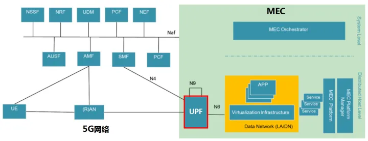

# 5G三大应用场景
国际电信联盟无线电通信局（ITU-R）定义了5G的三大典型应用场景为：
* 增强型移动宽带（eMBB）
* 超可靠低时延通信（uRLLC）
* 海量大规模连接物联网（mMTC）

其中，eMBB主要面向虚拟现实（VR）/增强现实（AR）、在线4K视频等高带宽需求业务；mMTC主要面向智慧城市、智能交通等高连接密度需求的业务；最后uRLLC主要面向车联网、无人驾驶、无人机等时延敏感的业务。5G通信网络更加去中心化，需要在网络边缘部署小规模或者便携式数据中心，进行终端请求的本地化处理，以满足URLLC和mMTC的超低延时需求，因此边缘计是5G核心技术之一。

# 5G核心技术——边缘计算
5G的三大典型应用场景对网络性能的要求有显著差异，但为控制成本，运营商必然选择一张承载网+网络切片/边缘计算技术，实现在最少的资本投入下最丰富的网络功能。在5G时代，承载网的带宽瓶颈、时延抖动等性能瓶颈难以突破，引入边缘计算后将大量业务在网络边缘终结。

## 为什么需要边缘计算？

https://zhuanlan.zhihu.com/p/322462428

## 什么是MEC？
最早是mobile edge computing，后来是multi-access edge computing。

## 怎么部署MEC？

△5G核心网最关键的网元：UPF（User Plane Function，用户面功能），是连接5G核心网和MEC的纽带，可提供数据分流及流量统计等功能。 
如上图所示，左侧是5G网络，包含核心网（含AMF，SMF，PCF等一系列控制面网元，以及用户面网元UPF），接入网（RAN）以及终端（UE）。右侧则是MEC，包含MEC平台，管理编排域，以及多个提供服务的APP。

5G网络和MEC之间的结合点就是UPF。这个网元的全称是User Plane Function，顾名思义，就是处理核心网用户面功能的。所有的数据，必须经过UPF转发，才能流向外部网络。

也就是说，负责边缘计算的MEC设备，必须连接在5G核心网的UPF这个网元之后。

5G的核心网设计是十分灵活的，为了减少数据传输的迂回，UPF的部署位置也一般比控制面网元要靠下，这就叫做UPF下沉。

PS：更详细的内容在上面的链接里有。核心：MEC和UPF联合起来可以进行灵活的数据分流，内网数据直接走内网通道，私密数据不出园区；外网数据也可直通互联网，并行不悖，两不耽误。

> PS： 我的理解是，5G和4G的核心区别，就是这个UPF下沉，导致可以加入MEC进行边缘计算。

# 参考资料
https://www.cnblogs.com/jmilkfan-fanguiju/p/11825026.html
https://zhuanlan.zhihu.com/p/67640553
https://zhuanlan.zhihu.com/p/406326850

