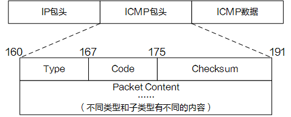
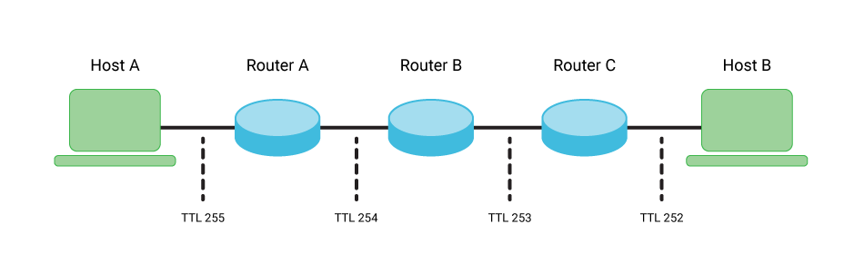

记录一些遇到的不懂的名词和知识。

# 分层
## TCP/IP四层模型
基于TCP/IP协议四层的模型概念：
* 应用层
* 传输层
	* Layer 3
	* IP
	* ICMP
	* TCP/UDP
* 互联层（数据链路层）
	* Layer 2
	* Ether
* 网络接口层

# 协议
* 网际协议IP：负责在主机和网络之间寻址和路由数据包。  
* 地址解析协议ARP：获得同一物理网络中的硬件主机地址。  
* 网际控制消息协议ICMP：发送消息，并报告有关数据包的传送错误。  
* 互联组管理协议IGMP：被IP主机拿来向本地多路广播路由器报告主机组成员

## ICMP 因特网控制报文协议
因特网控制报文协议ICMP（Internet Control Message Protocol）是一个差错报告机制，是TCP/IP协议簇中的一个重要子协议，通常被IP层或更高层协议（TCP或UDP）使用，属于网络层协议，主要用于在IP主机和路由器之间传递控制消息，用于报告主机是否可达、路由是否可用等。这些控制消息虽然并不传输用户数据，但是对于收集各种网络信息、诊断和排除各种网络故障以及用户数据的传递具有至关重要的作用。

[什么是ICMP？ICMP如何工作？ - 华为 (huawei.com)](https://info.support.huawei.com/info-finder/encyclopedia/zh/ICMP.html)
[深入理解ICMP协议 - 知乎 (zhihu.com)](https://zhuanlan.zhihu.com/p/369623317)

### 应用
#### Ping
#### Tracert(Traceroute)
#### 网络质量分析NQA(Network Quality Analysis)

### 安全
#### DOS(Denial of Service)攻击

# 命令，工具，参数
## traceroute(tracert)
前者是linux命令，后者是windows命令。
[What is Traceroute: What Does it Do & How Does It Work? (fortinet.com)](https://www.fortinet.com/resources/cyberglossary/traceroutes)
本质就是利用ICMP报文。

## TTL(time-to-live)
> TTL — which, as we’ve mentioned, stands for “Time to Live” — is a setting that determines how long your data (in packet form) is valid and available from within a network before the router clears it.
> We can also refer to this time as “hops,” which is the number of times it bounces between different routers.

[What Is TTL (And How Do You Choose the Right One)? (kinsta.com)](https://kinsta.com/knowledgebase/what-is-ttl/)
[What is TTL Value? Definition & FAQs | ScyllaDB](https://www.scylladb.com/glossary/ttl-value/)

> **In data networking,** TTLs are applied to packets so that the packet is discarded entirely if it exists too long in a network without reaching its destination. TTL in IPv4 was supposed to represent the number of seconds remaining in the valid lifespan of a packet. However, due to the high speed of networking equipment these days, it is often used as a simple “hop count,” decremented by one for each router the packet passes through.

