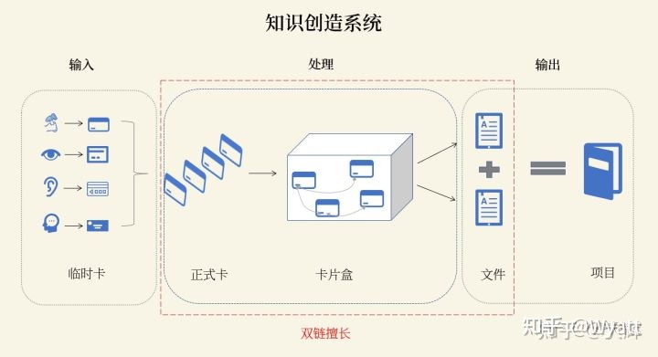
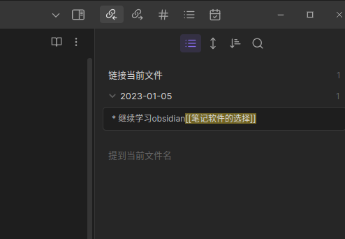

#单向链接 #双向连接 #笔记 #obsidian #知识星图

# 单向链接（one-way link）
是指链接到一个网页的超链接，而没有相应链接到原来的网页。

# 双向连接
既可以是大的页面（Page），也可以是更小的单元（Block）。 所谓双向链接，就是当你做笔记时，增加笔记A→笔记B的链接后，软件会自动加上B→A的链接。我们只要能找到这两个笔记中的任何一个，就可以找到另外一个。让笔记不再成为孤岛，增加了发现的可能性。

牛逼就在于，依据**网络的六度分隔理论**，只要我们对笔记多建立双向关联，哪怕你的数据库中有几十亿条笔记，也能通过中间的6条笔记找到你要找的那条回忆不起来的笔记。

双链笔记的**优势**在于关联卡片，让结构浮现，进而生成可以分享的文件（图中红虚线框出来的部分）。

## Obsidian中的双向链接示意图

总之：**双链笔记的核心是关联**，关联是双链笔记的最核心动作。我们可以用一句话来串联多个笔记。

而且要善于利用tag。

