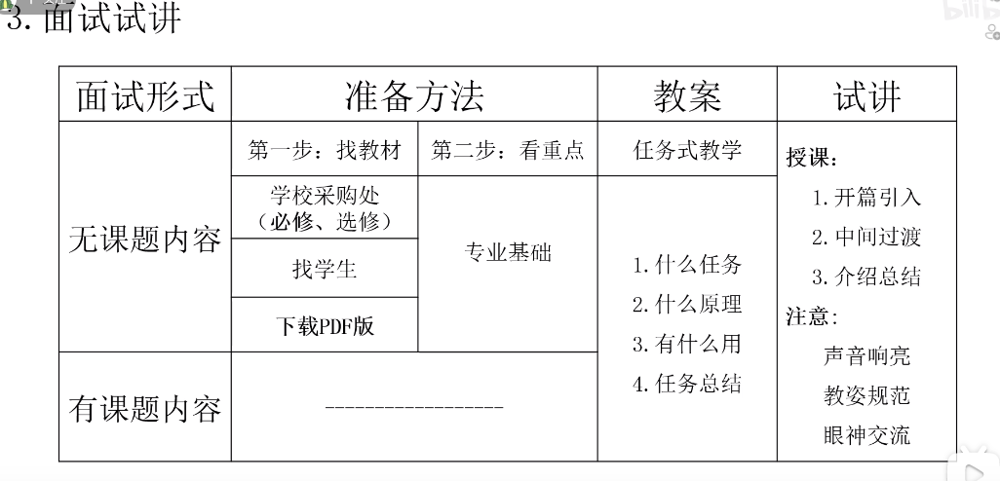
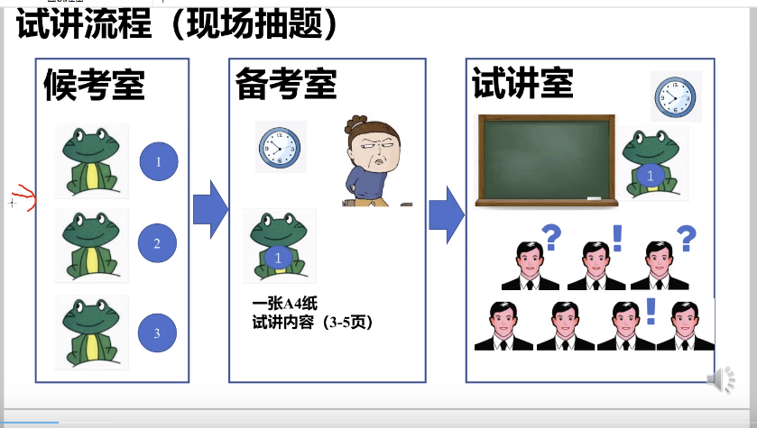
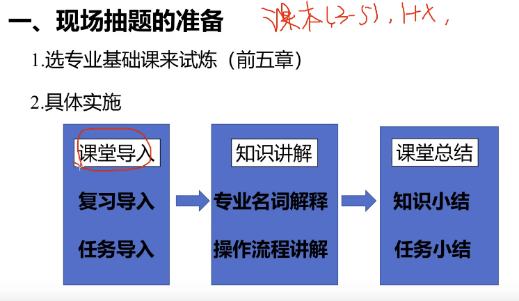

#上岸 #教师 #最后机会 #机电 #高职 #大数据专业 #学习笔记
# 背景
2023年无锡教师招聘，能报的就是5049，机电高职的大数据专业。问了唐鹏伟，新专业，无教材，无参考。所以自己找资料吧。
http://jy.wuxi.gov.cn/doc/2023/04/10/3927373.shtml
## 具体考察内容要求
jszp.wxeea.cn
专业笔试+技能考核
掌握常用大数据算法编程语言（如Python等），熟悉pytorch、MySql、MongDB、Redis，了解Hadoop，Spark。

## to-do
* [x] 打印准考证：2023年4月20日上午9:00—4月21日下午16:00 
* [x] 4月25日周二早7点，旅游商贸考试，需要提前请假
* [ ] 面试衣着
* [ ] 资料审核资料
	* [ ] 学位证，学历证原件和复印件
	* [ ] 身份证原件和复印件
	* [ ] 其他奖状原件和复印件？

# 学习资料
## 大数据技术原理与应用
https://www.icourse163.org/course/XMU-1002335004

# 笔试+技能考核
最终得分76.5，虽然是笔试第一，但也只比第二名多了0.5，比第三名多了2.5.

# 面试准备
## 1
https://www.bilibili.com/video/BV12L4y1L7Cn/?spm_id_from=333.880.my_history.page.click&vd_source=462c9e0df89bcb23f1c5be85ce31d8ce

### 评论区里的
指出几个有差别的地方哈。  
1.现在高职有编制的招聘，是在试讲前抽题的，然后才知道试讲的内容，大概只有15分钟准备。这个对相近专业的学生不友好。  
2.高职的教材，跟本科不一样的。**高职的教材是任务式的，就是：理论＋实践。这要求上课的时候，要有侧重点，一般是讲实践部分的操作。**  
3.试讲准备时候，给你一张白纸，一份试讲课程内容。你根本没时间去准备什么教学目的，教学任务之类的，又不是写教案。那15分钟准备，你能把这个知识点熟悉了，抄下来就已经不错了。  
3.融入时政是对的。不要为了引入而引入就好了。  
4.**板书问题，直接写几个字就行了，简单一定要简单，还要有逻辑性。不要全抄，不要全抄，不要全抄。**  
5.【重点】试讲内容分为有课题试讲和无课题试讲，重点是准备：无课题试讲。这个我就不说了。

## 2
https://www.bilibili.com/video/BV1p3411Y7Fq/?spm_id_from=333.880.my_history.page.click&vd_source=462c9e0df89bcb23f1c5be85ce31d8ce

https://www.bilibili.com/video/BV1Zt4y1t7qT/?vd_source=462c9e0df89bcb23f1c5be85ce31d8ce

