#上岸 #教师 #最后机会 #机电 #高职 #大数据专业 #学习笔记
# 背景
## 最开始
2023年无锡教师招聘，能报的就是5049，机电高职的大数据专业。问了唐鹏伟，新专业，为了参加技能大赛的，后面可能会招收相关专业的学生，无教材，无参考。所以自己找资料吧。
http://jy.wuxi.gov.cn/doc/2023/04/10/3927373.shtml
http://jy.wuxi.gov.cn/doc/2023/04/28/3945527.shtml
http://jy.wuxi.gov.cn/doc/2023/04/28/3945571.shtml

## 2023-05-06
晚上和老卢的谈话，她提到了姜黎黎现在的生活状态，不停地参加技能大赛，指导技能大赛，每个月发中千，出差还要自己先垫钱，问我想不想过这种生活。
说实话，我不知道。
老卢又问我，你看看那些男老师，你以前说瞧不起他们，活成自己讨厌的样子很好吗？
这个问题问得我都不知道怎么回答了。
potential中年失业 vs 长期没钱，这个账怎么算？
anyway，先把明天的试讲演完了再说。

## 具体考察内容要求
报名：jszp.wxeea.cn
### 专业笔试+技能考核
掌握常用大数据算法编程语言（如Python等），熟悉pytorch、MySql、MongDB、Redis，了解Hadoop，Spark。
### 试讲15mins+答辩5mins
现场抽题

## to-do
* [x] 打印准考证：2023年4月20日上午9:00—4月21日下午16:00 
* [x] 4月25日周二早7点，旅游商贸考试，需要提前请假
* [x] 面试衣着
* [x] 资料审核资料
	* [x] 学位证，学历证原件和复印件
	* [x] 身份证原件和复印件
	* [x] 其他奖状原件和复印件？
	* [ ] 面试通知书 + 身份证

# 学习资料
## 大数据技术原理与应用
https://www.icourse163.org/course/XMU-1002335004

# 笔试+技能考核
最终得分76.5，虽然是笔试第一，但也只比第二名多了0.5，比第三名多了2.5. 幸好学习了厦门大学的这个大数据原理与应用，还是挺管用的，至少笔试部分帮我争取了20分不止。

# 试讲准备
## 1
https://www.bilibili.com/video/BV12L4y1L7Cn/?spm_id_from=333.880.my_history.page.click&vd_source=462c9e0df89bcb23f1c5be85ce31d8ce

### 视频里的
考察基本教学素质
	1. 教资教态
	2. 教学内容
	3. 教学方式

教学流程+教学形式
1. 试讲内容不能讲错，基本底线。
2. 教案：
	1. 教学目标
	2. 教学难重点
	3. 教学方法
	4. 教学手段
	5. 教学设计（流程）
		1. 复习就知，
		2. 新课讲授，
		3. 实验探究，
		4. 总结结论
		5. 作业布置
	时间分配：15分钟
	1. 导入<3mins，联系生活案例，时政新闻
		1. 案例导入
		2. 视频导入
		3. 提问导入
	2. 教学设计：**重点内容**+流程中体现其他内容
	3. 教学活动：教师活动+学生活动。e.g.教师辅导做实验+学生通过实验探究。
	注意：
	1. 知识点之间的承接转合，顺畅。
	2. 以学生为主的理念，引导学生去探究。-> 互动提问
3. 课程思政
价值观的一种传递，引导正确的在生活中使用。
4. 细节和注意点
	1. 板书清晰明了，板书设计
	2. 规定时间内讲完，如果超时，一定要做好收尾
	3. 准备逐字稿，行程肌肉记忆
	4. 进门礼仪

### 评论区里的
指出几个有差别的地方哈。  
1.现在高职有编制的招聘，是在试讲前抽题的，然后才知道试讲的内容，大概只有15分钟准备。这个对相近专业的学生不友好。  
2.高职的教材，跟本科不一样的。**高职的教材是任务式的，就是：理论＋实践。这要求上课的时候，要有侧重点，一般是讲实践部分的操作。**  
3.试讲准备时候，给你一张白纸，一份试讲课程内容。你根本没时间去准备什么教学目的，教学任务之类的，又不是写教案。那15分钟准备，你能把这个知识点熟悉了，抄下来就已经不错了。  
3.融入时政是对的。不要为了引入而引入就好了。  
4.**板书问题，直接写几个字就行了，简单一定要简单，还要有逻辑性。不要全抄，不要全抄，不要全抄。**  
5.【重点】试讲内容分为有课题试讲和无课题试讲，重点是准备：无课题试讲。这个我就不说了。

## 2
https://www.bilibili.com/video/BV1p3411Y7Fq/?spm_id_from=333.880.my_history.page.click&vd_source=462c9e0df89bcb23f1c5be85ce31d8ce

https://www.bilibili.com/video/BV1Zt4y1t7qT/?vd_source=462c9e0df89bcb23f1c5be85ce31d8ce

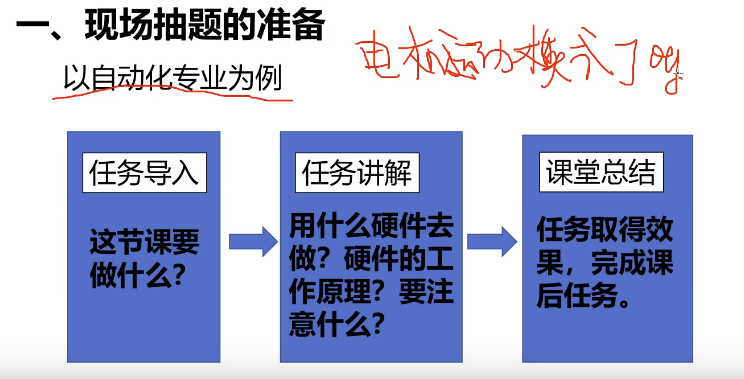
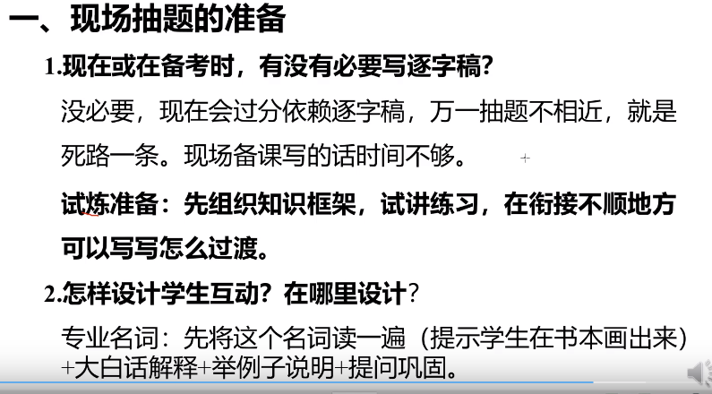
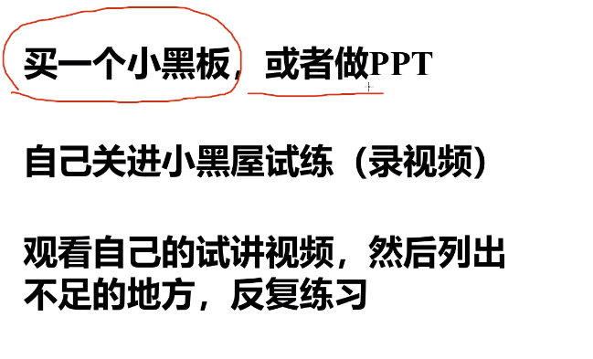
https://www.bilibili.com/video/BV1cG411x7WU/?vd_source=462c9e0df89bcb23f1c5be85ce31d8ce
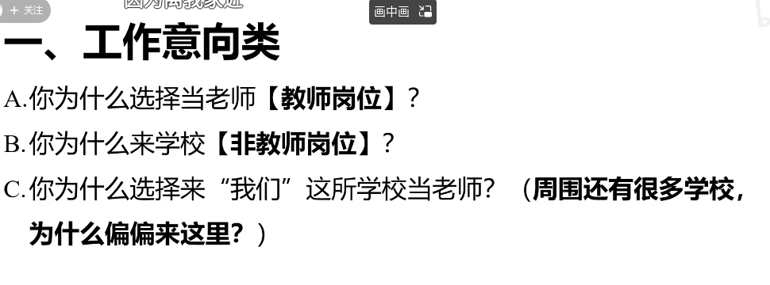
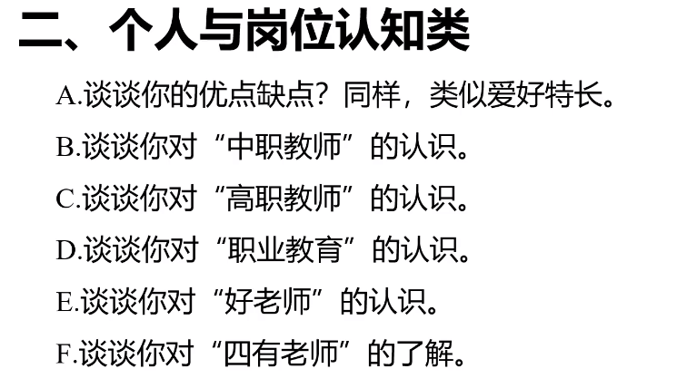
四有老师：有理想信念，有道德情操，有扎实学识，有仁爱之心
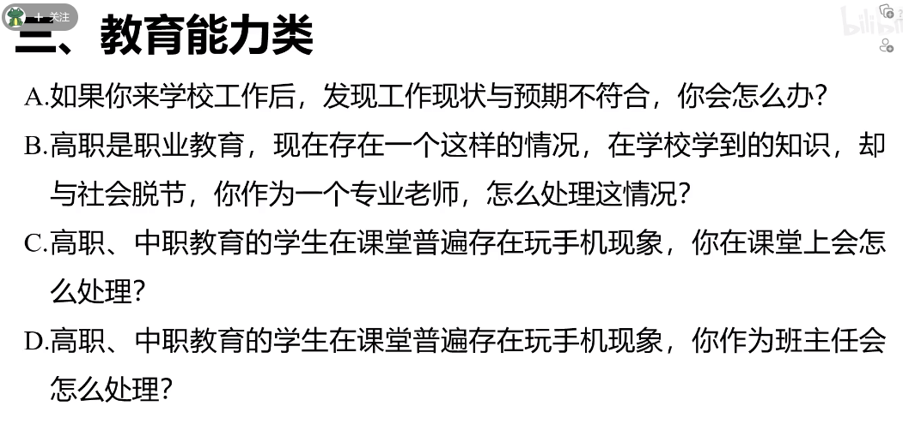
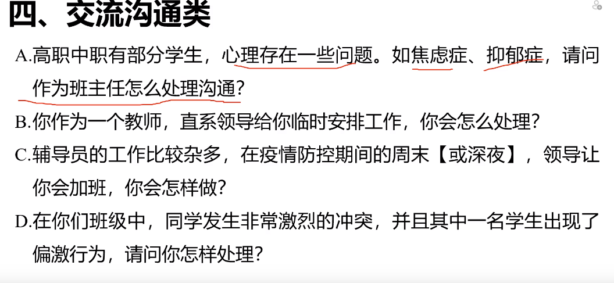
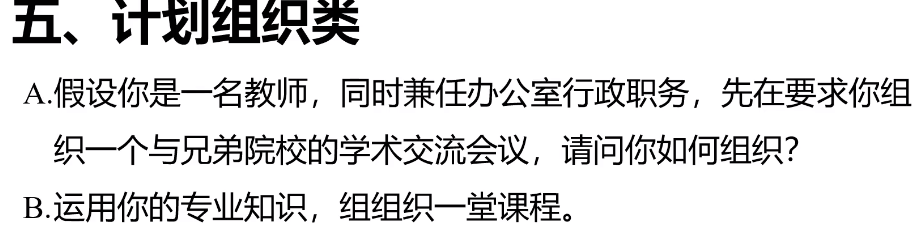
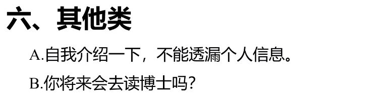
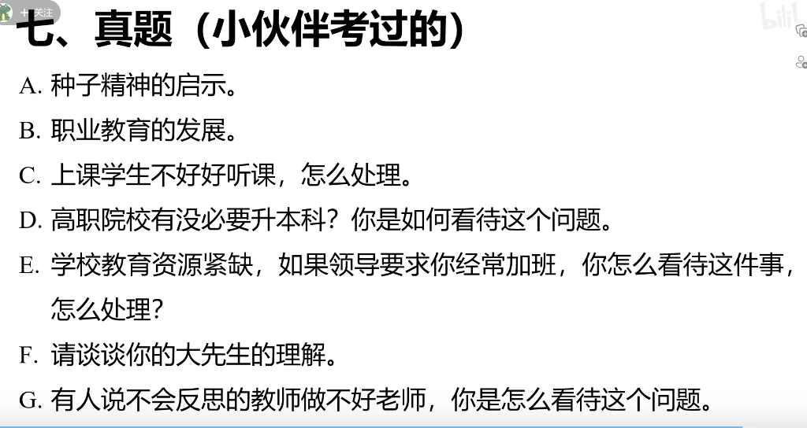

## 案例，模板
https://space.bilibili.com/474257800/video

https://search.bilibili.com/all?keyword=%E6%95%99%E5%B8%88+%E8%AF%95%E8%AE%B2+%E6%A8%A1%E6%9D%BF&from_source=webtop_search&spm_id_from=333.1007&search_source=2

## 3
https://www.bilibili.com/video/BV1Wa411X7Ws/?spm_id_from=333.337.search-card.all.click&vd_source=462c9e0df89bcb23f1c5be85ce31d8ce
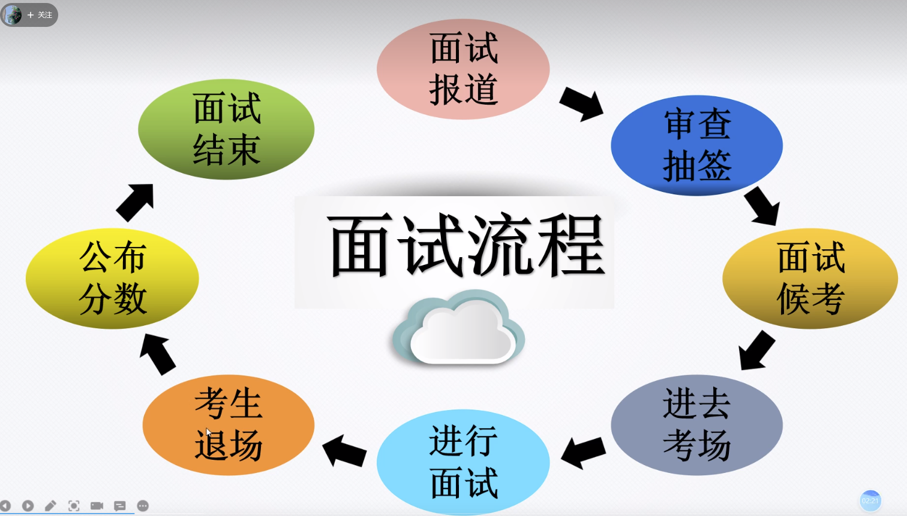
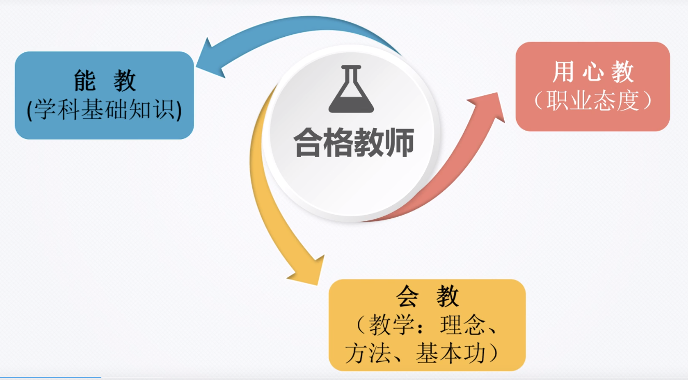
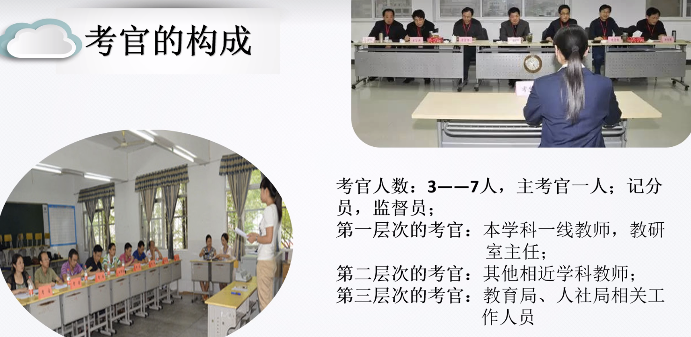
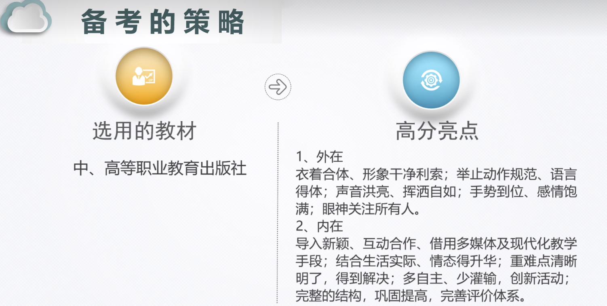
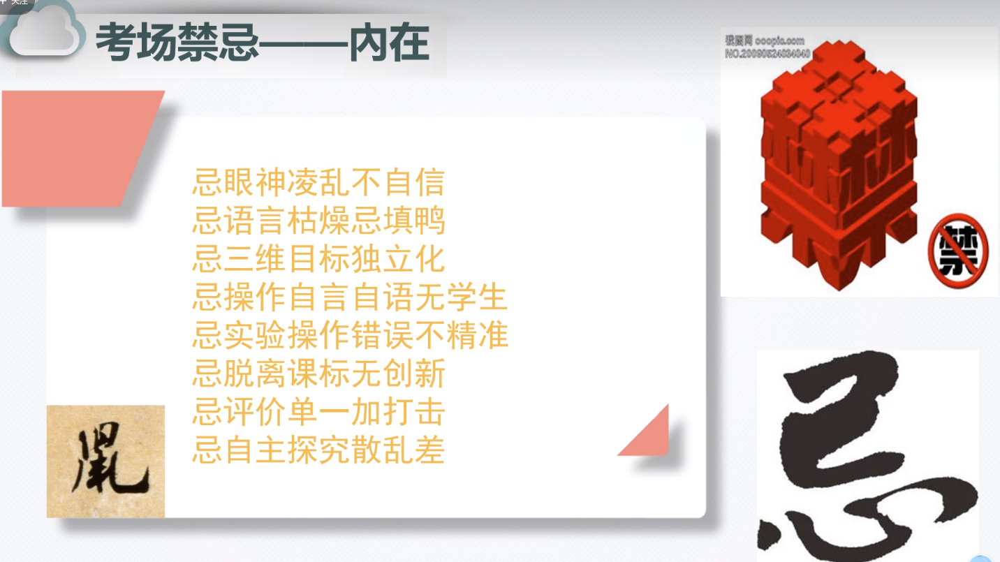
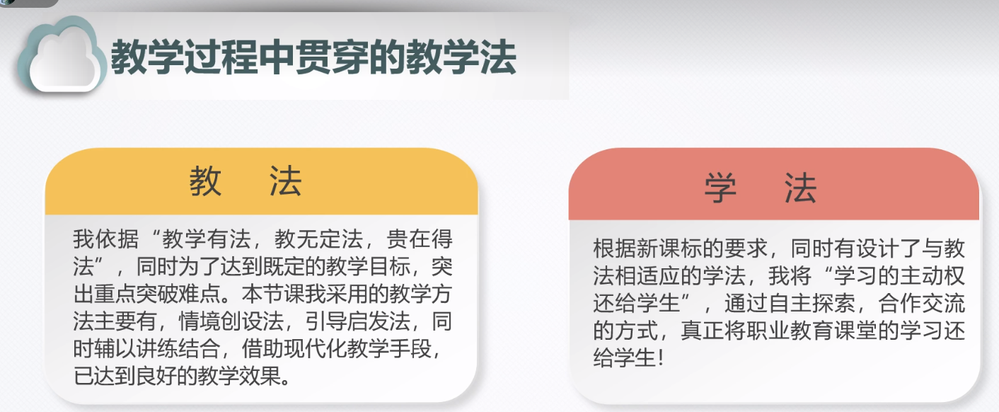
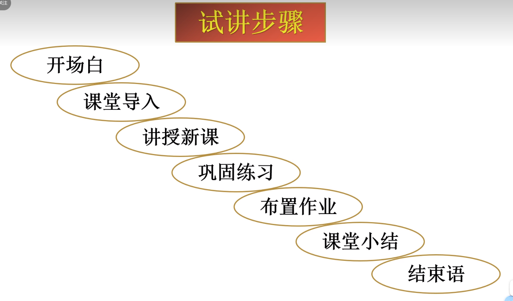
1. 开场白
2. 课堂导入
3. 讲授新课
4. 巩固练习
5. 布置作业
6. 课堂小结
7. 结束语

### 试讲稿
1. 开场白
2. 各位评委老师，大家上午好，我是XX号考生，我试讲的题目是*****。（说完这句话之后，要和评委有一个眼神上的沟通，也要提防评委问：准备好了吗？之类的问题）
3. 转身走上讲台，站好以后，再和同学们打招呼。“同学们好，开始上课~”XXX
4. 导入环节，生活案例，结合实际，结合新闻热点，结合**用人单位任务需求，结合技能大赛**。埋一个大数据的升华的案例，比如相关并非因果。去掉想不想，要不要，好不好等无效。用陈述句，让我们XXXX一笔带过。
5. 讲授新课。写板书标题。讲解重点难点，选择2~3个，剩下的不重要的用分组讨论的形式带过。如何转接知识点？接下来，XXXX。光XXX够吗？接下来我们还需要XXX。那除了这两点，我们还需要？对，这边同学说了XXX。
6.  巩固练习，实践环节。1下面就到了XXXX的时候了。2现在请同学们、让我们XXXX。3学习了XXXX，那我们可以XXXX。4好了，老师看大家已经迫不及待的XXXX。
7. 布置作业。
8. 课堂小结，找一位同学说一下本节课的收获。嗯，本同学列出了3点总结。结合板书进行下归纳强调。1今天我们在XXX中，XXX。总结，梳理逻辑：承上启下，层层递进。
9. 结束语，点出前面例子的破坏性和重要性，强调和学习内容的关联以及对学科的理解，进行升华。

提问
1. 问大家的。什么感觉？对，特别刺激，有点意思。适合简单的集体讨论。
2. 有没有哪位同学想要补充一下？
3. 有引导的。这个问题有点难，那咱们从XXX入手。
4. 有启发的。

知识点
1. 拿到课题，首先找出知识点，列出123.
2. 确定难重点。找出学生学起来可能困难的点。也可能是一种123的综合体现。
3. 解决重难点。解决简单的：一问一答，或者教师给指令+学生做。解决复杂的：1追问。2纠偏。3找茬。
4. 解决效果如何。针对难点，评价。

## 4 备课
https://www.bilibili.com/video/BV1R34y1L77x/?spm_id_from=333.788.recommend_more_video.-1&vd_source=462c9e0df89bcb23f1c5be85ce31d8ce

https://space.bilibili.com/540051876/video

https://space.bilibili.com/1817047180/video?tid=0&page=1&keyword=&order=pubdate

