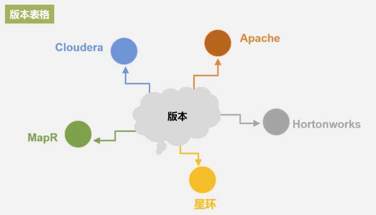
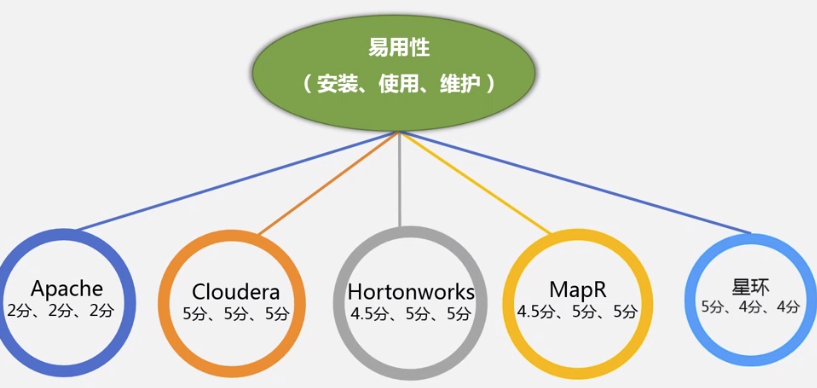
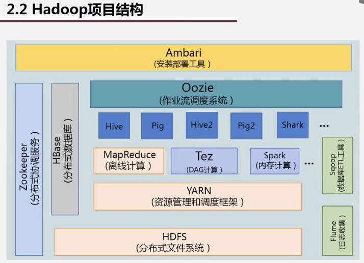
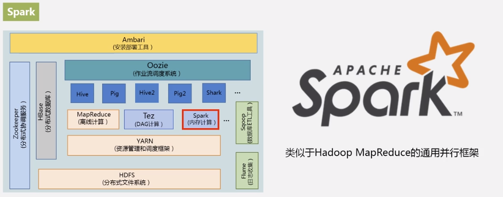
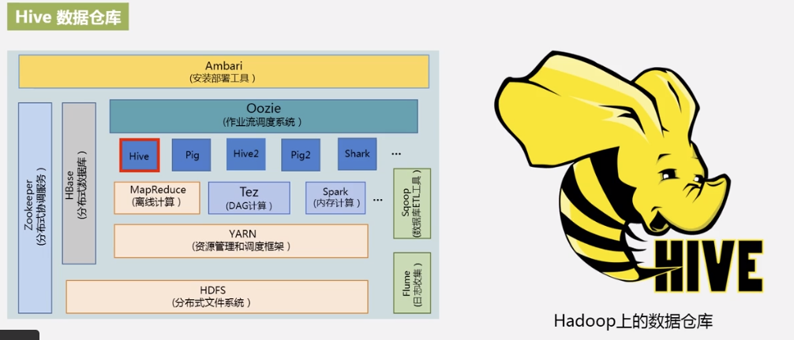
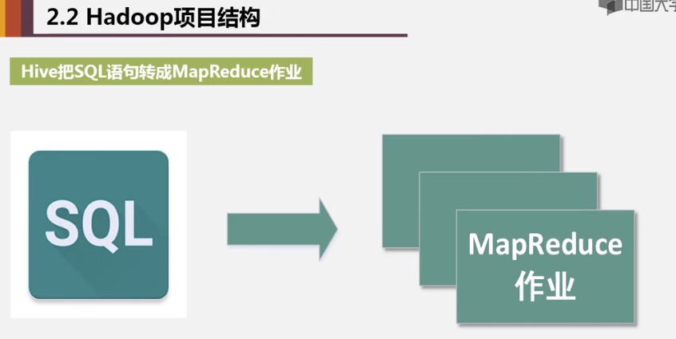

# 2.1 Hadoop简介和版本演变
## 2.1.1 Hadoop简介
两大核心：HDS，MapReduce
## 2.1.2 版本

### 发行版
1. Hortonworks 企业版
2. Cloudera，CDH：cloudera distribution hadoop

# 2.2 Hadoop项目结构

Spark基于内存，MapReduce基于磁盘。

ZooKeeper作用：分布式锁管理，集群管理。
