# 7.1 MapReduce简介
概述：MapReduce是一种分布式并行编程框架。

分布式并行编程： 借助一个集群通过多台机器同时并行处理大规模数据集。

# 7.2 MapReduce的体系结构
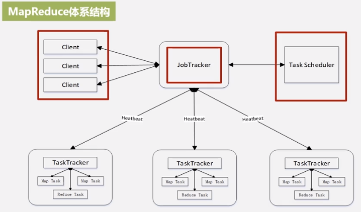
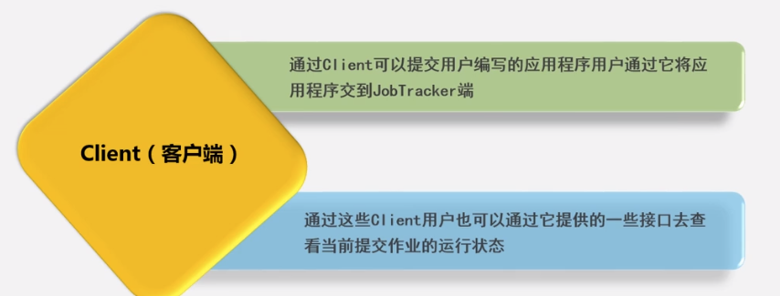
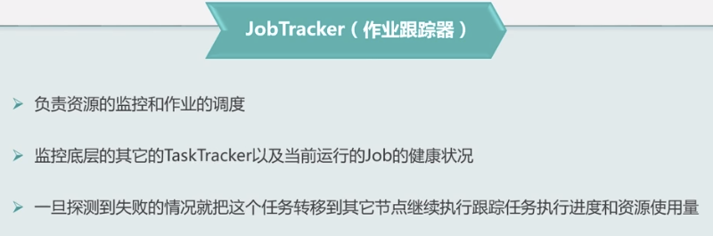
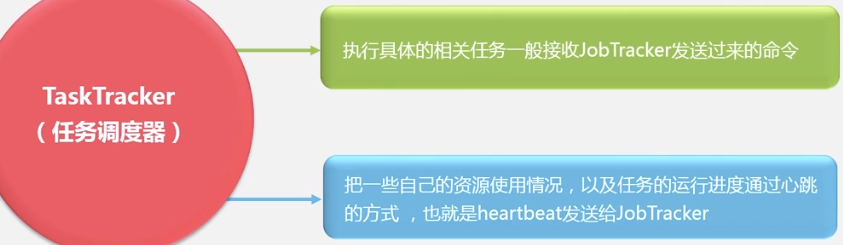
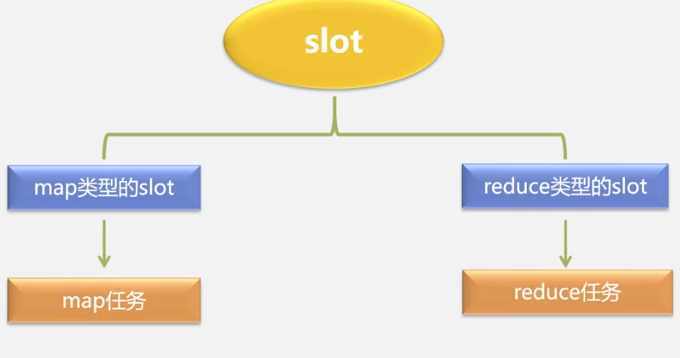
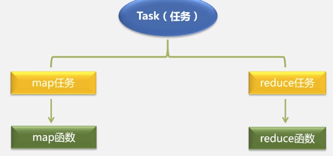

# 7.3 MapReduce的工作流程概述
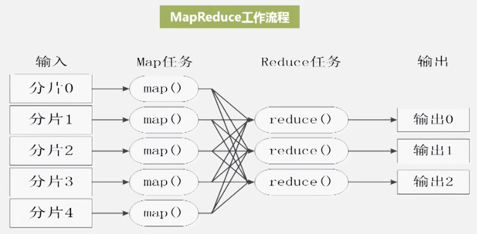
map到reduce之间的映射和变换，叫做shuffle。
不同的map，不同的reduce之间，都不会进行通信。
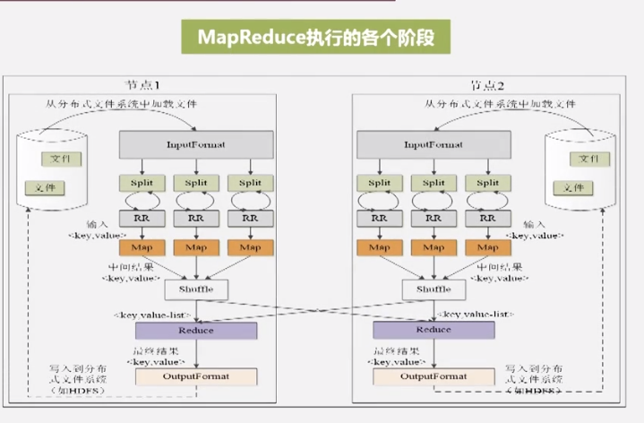
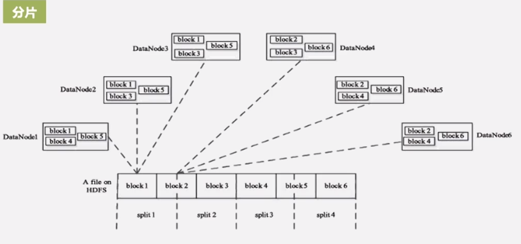
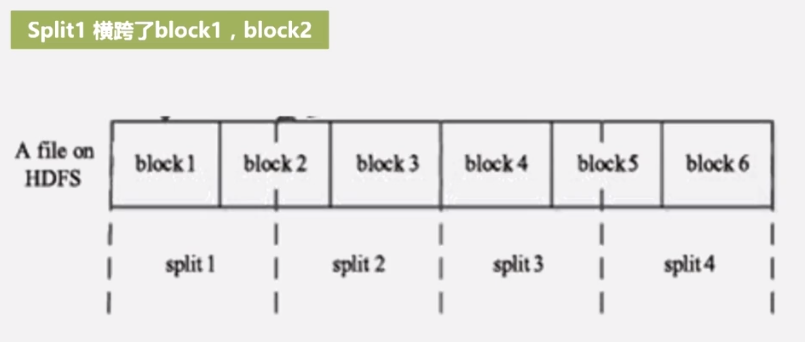
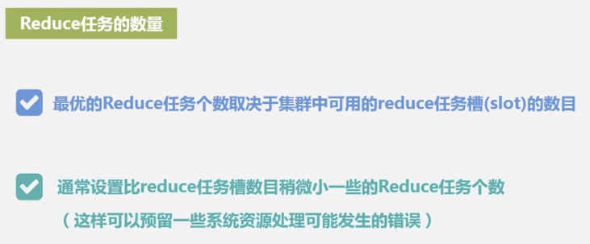

# 7.4 Shuffle过程
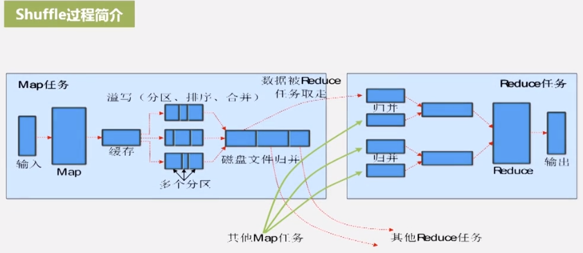
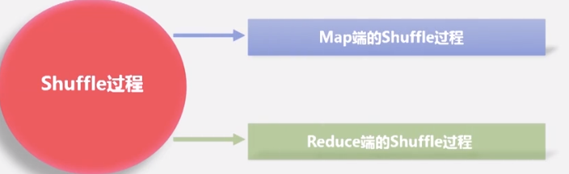
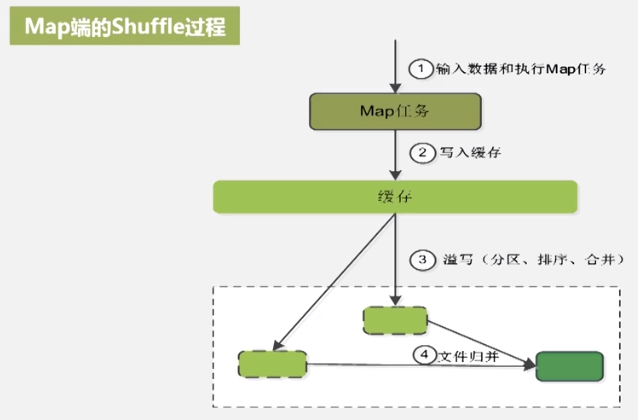
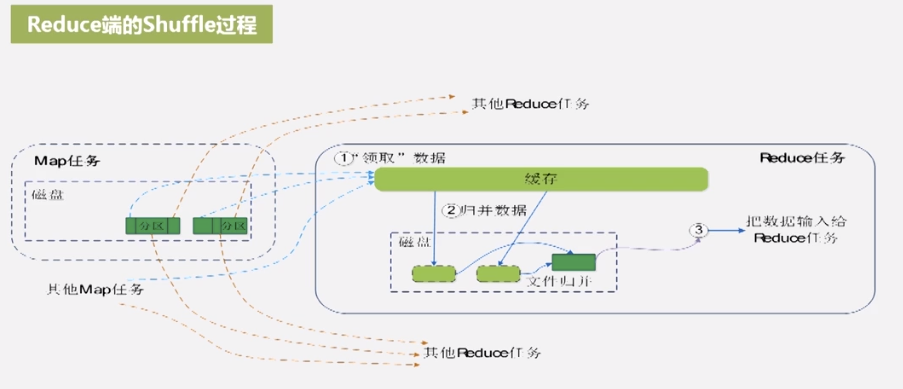

# 7.5 MapReduce应用程序执行过程
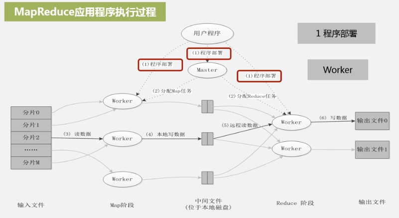
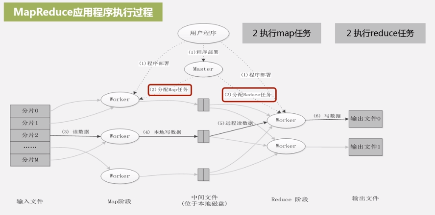
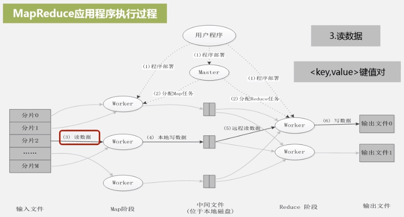
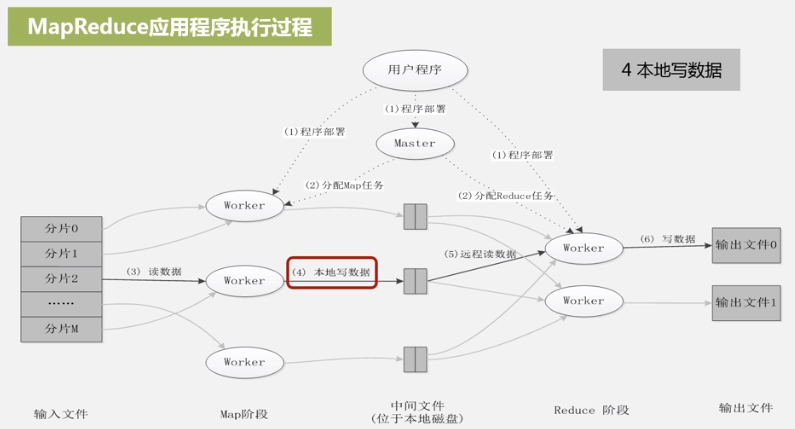
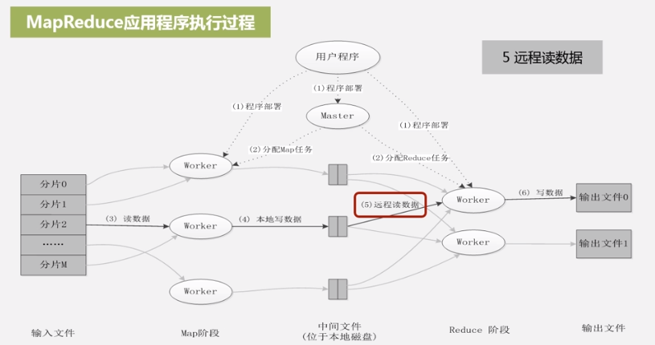

