# 8.1 Hadoop的优化与发展
## Hadoop的局限和不足

## 优化与发展

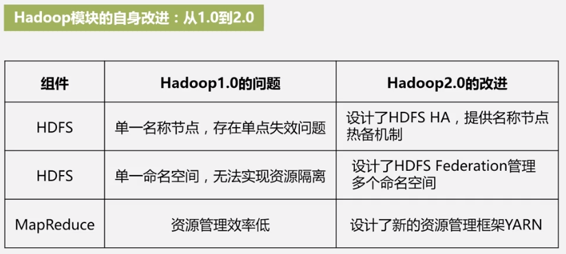
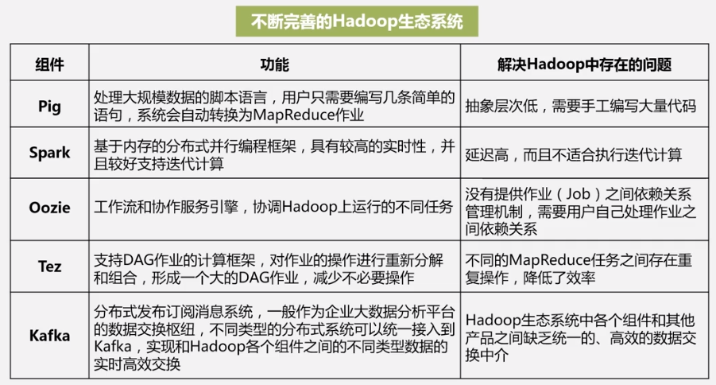

# 8.2 HDFS HA和HDFS Federation

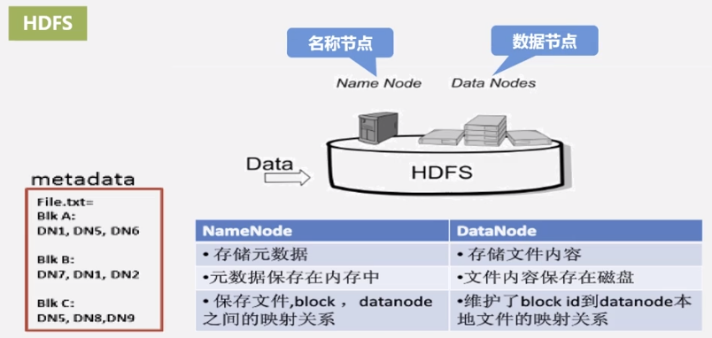

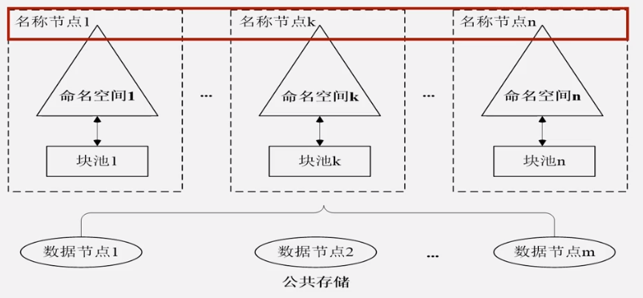

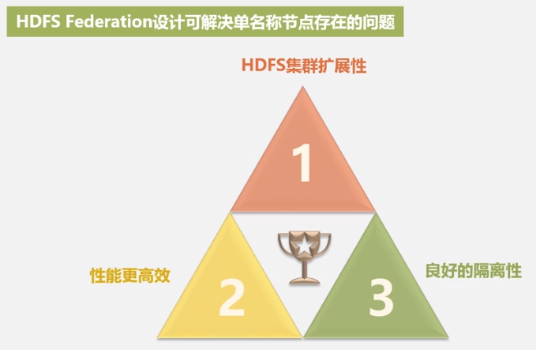

# 8.3 YARN
## 8.3.1 MapReduce1.0的缺陷

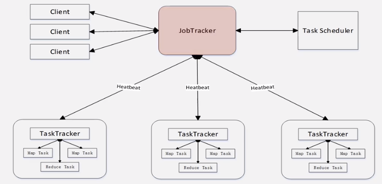
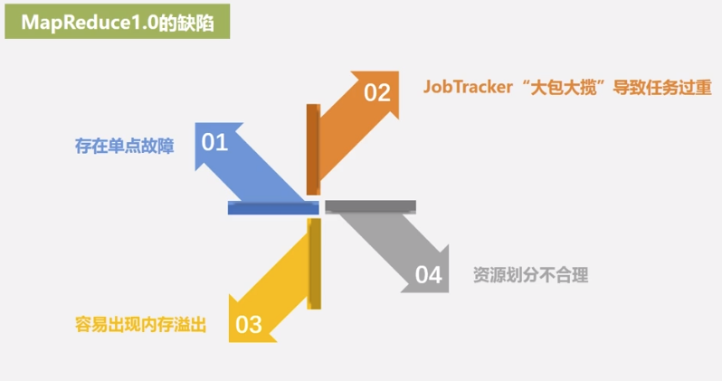
## 8.3.2 YARN架构设计思路
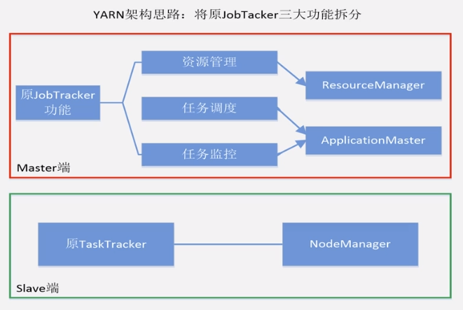
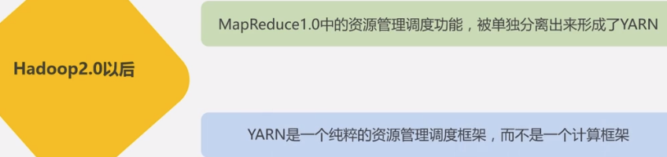

## 8.3.3 YARN体系结构
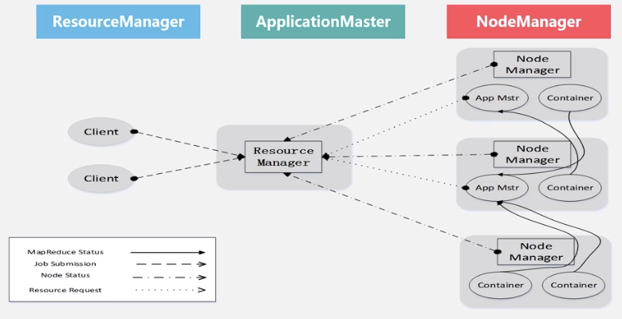
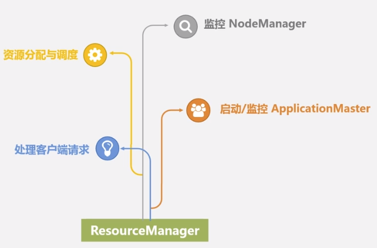

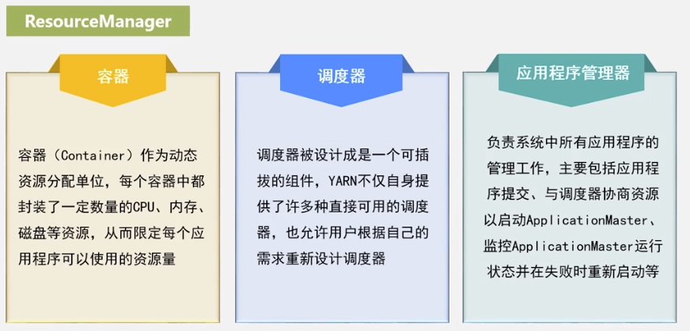

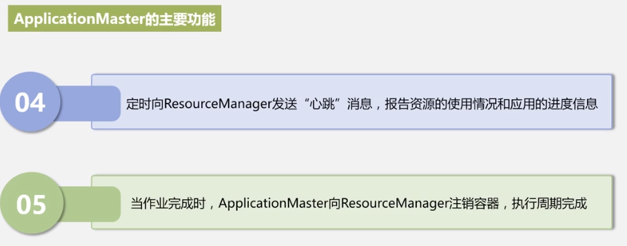
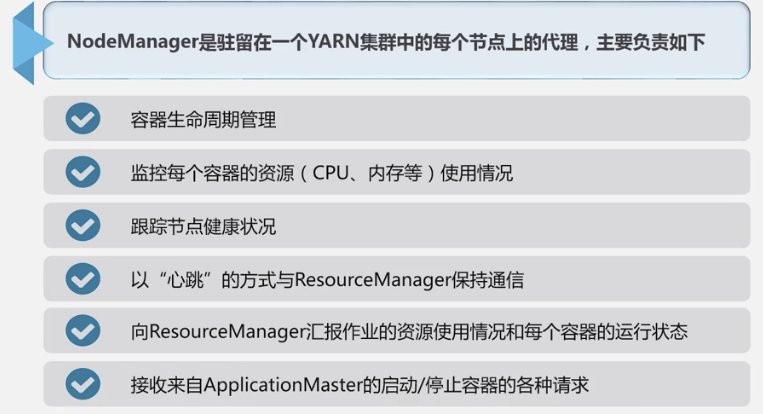
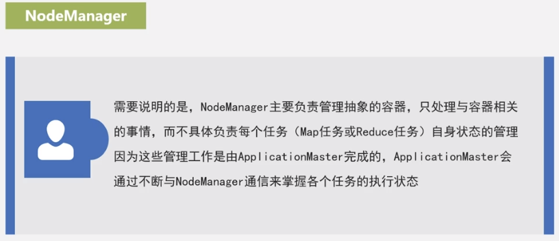

## 8.3.4 YARN工作流程
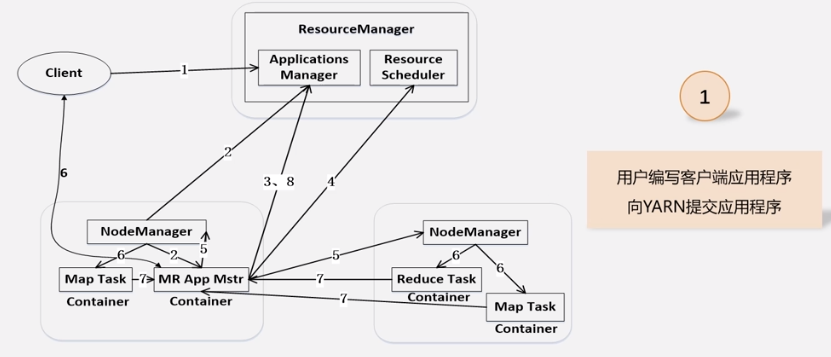

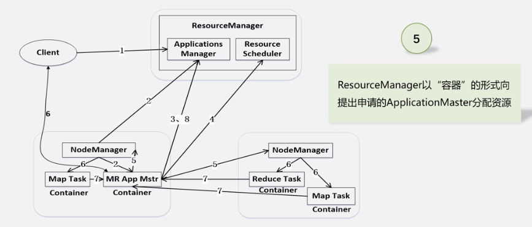

## 8.3.5 YARN框架和MapReduce1.0框架的对比
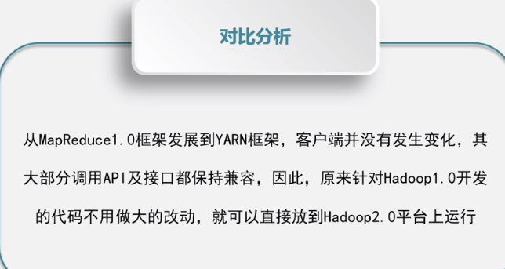

