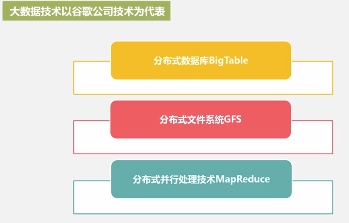
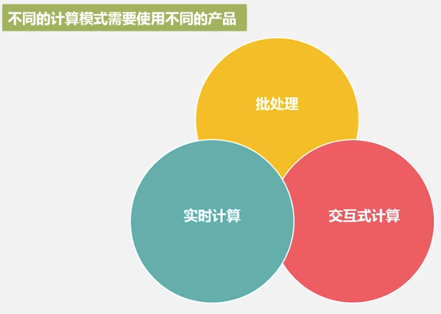

# 1.1 大数据时代
## 信息化浪潮

## 技术支撑
存储，计算，网络
## 阶段
运营式系统阶段，用户原创内容阶段，感知式系统阶段（IoT）
## 发展历程

# 1.2 大数据的概念和影响
## 概念
### 4V

### 大数据摩尔定律
人类在最近两年产生的数据量，相当于之前产生的全部数据量，即每两年增长一倍。
#### Dremel 交互式查询
### 大数据对思维方式的影响
实验，理论，计算，数据
1. 全样而非抽样
2. 效率而非精确
3. 相关而非因果
# 1.3 大数据的应用
# 1.4 大数据的关键技术
## 大数据技术的层次
数据采集，数据存储与管理，数据处理与分析，数据隐私与安全
### 两大核心技术
#### 分布式存储
解决海量数据的存储
#### 分布式处理

