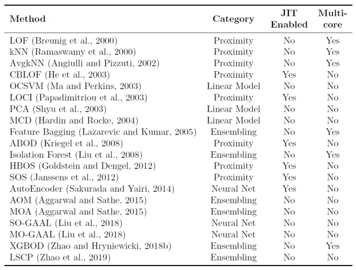

# 介绍
**[Python Outlier Detection（PyOD）](https://link.zhihu.com/?target=https%3A//github.com/yzhao062/pyod)** 是当下最流行的Python异常检测工具库，其主要亮点包括：

-   包括近40种常见的异常检测算法，比如经典的LOF/LOCI/ABOD以及最新的**深度学习**如对抗生成模型（GAN）和**集成异常检测**（outlier ensemble）
-   **支持不同版本的Python**：包括2.7和3.5+；**支持多种操作系统**：windows，macOS和Linux
-   **简单易用且一致的API**，**只需要几行代码就可以完成异常检测**，方便评估大量算法
-   使用JIT和并行化（parallelization）进行优化，加速算法运行及扩展性（scalability），可以处理大量数据

# 安装
```shell
pip install pyod
```

# 算法
[PyOD](https://link.zhihu.com/?target=https%3A//github.com/yzhao062/pyod)提供了约40种异常检测算法（详见图1），部分算法介绍可以参考「[数据挖掘中常见的「异常检测」算法有哪些？](https://www.zhihu.com/question/280696035/answer/417091151)」或异常检测领域的经典教科书[[7]](https://zhuanlan.zhihu.com/p/58313521#ref_7)。同时该工具库也包含了一系列辅助功能，包括数据可视化及结果评估等：


# API
特别需要注意的是，**异常检测算法**基本都是**无监督学习**，所以只需要X（输入数据），而不需要y（标签）。[PyOD](https://link.zhihu.com/?target=https%3A//github.com/yzhao062/pyod)的使用方法和Sklearn中聚类分析很像，它的检测器（detector）均有统一的API。所有的[PyOD](https://link.zhihu.com/?target=https%3A//github.com/yzhao062/pyod)检测器clf均有统一的API以便使用，完整的API使用参考可以查阅（[API CheatSheet - pyod 0.6.8 documentation](https://link.zhihu.com/?target=https%3A//pyod.readthedocs.io/en/latest/api_cc.html)）：

-   **fit(X)**: 用数据X来“训练/拟合”检测器clf。即在初始化检测器clf后，用X来“训练”它。
-   **fit_predict_score(X, y)**: 用数据X来训练检测器clf，并预测X的预测值，并在真实标签y上进行评估。此处的y只是用于评估，而非训练
-   **decision_function(X)**: 在检测器clf被fit后，可以通过该函数来预测未知数据的异常程度，返回值为原始分数，并非0和1。返回分数越高，则该数据点的异常程度越高
-   **predict(X)**: 在检测器clf被fit后，可以通过该函数来预测未知数据的异常标签，返回值为二分类标签（0为正常点，1为异常点）
-   **predict_proba(X)**: 在检测器clf被fit后，预测未知数据的异常概率，返回该点是异常点概率

当检测器clf被初始化且fit(X)函数被执行后，clf就会生成两个重要的属性：

-   **decision_scores**: 数据X上的异常打分，分数越高，则该数据点的异常程度越高
-   **labels_**: 数据X上的异常标签，返回值为二分类标签（0为正常点，1为异常点）

不难看出，当我们初始化一个检测器clf后，可以直接用数据X来“训练”clf，之后我们便可以得到X的异常分值（clf.decision_scores）以及异常标签（clf.labels_）。当clf被训练后（当fit函数被执行后），我们可以使用decision_function()和predict()函数来对未知数据进行训练。


# Refs
-  [用PyOD工具库进行「异常检测」 - 知乎 (zhihu.com)](https://zhuanlan.zhihu.com/p/58313521)
-   **Github地址:** [pyod](https://link.zhihu.com/?target=https%3A//github.com/yzhao062/pyod)
-   **PyPI下载地址:** [pyod](https://link.zhihu.com/?target=https%3A//pypi.org/project/pyod/)
-   **文档与API介绍（英文）**: [Welcome to PyOD documentation!](https://link.zhihu.com/?target=https%3A//pyod.readthedocs.io/en/latest/)
-   **Jupyter Notebook示例（notebooks文件夹）**: [Binder (beta)](https://link.zhihu.com/?target=https%3A//mybinder.org/v2/gh/yzhao062/pyod/master)
-   **JMLR论文:** [PyOD: A Python Toolbox for Scalable Outlier Detection](https://link.zhihu.com/?target=http%3A//www.jmlr.org/papers/volume20/19-011/19-011.pdf)


