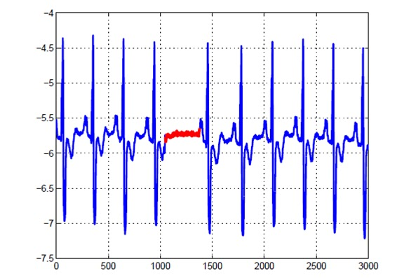
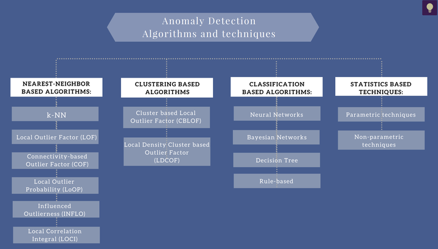

#异常检测 #pyod
# 定义
**异常检测**（又称outlier detection、anomaly detection，离群值检测），**可以找到与“主要数据分布”不同的异常值**（deviant from the general data distribution），比如从信用卡交易中找出诈骗案例，从正常的网络数据流中找出入侵，有非常广泛的商业应用价值。同时它可以被用于机器学习任务中的预处理（preprocessing），防止因为少量异常点存在而导致的训练或预测失败。

**异常检测（Outlier Detection）**，顾名思义，是识别与正常数据不同的数据，与预期行为差异大的数据。

异常检测需要满足两个基本的假设：
-   异常在整个数据集中发生频率是很小的
-   异常数据的特征显著区别于正常数据

根据数据特征数量的多少又可以将异常检测区分为单变量（univariate）和多变量（multivariate）异常检测问题，但由于客观世界的复杂性，绝大多数情况下我们面对的都是多变量问题。

另外要说明的是，异常并不总是坏事，虽然在大多数情况下，异常是我们不期望看到的，但也有时候异常本身是一种“好的异常”，例如某一天电商交易额暴增，这时候我们就要分析异常背后的原因，尝试将这样异常变成正常。

# 类型
## 点异常
指的是少数个体实例是异常的，大多数个体实例是正常的，例如正常人与病人的健康指标。

## 上下文异常
又称上下文异常，指的是在特定情境下个体实例是异常的，在其他情境下都是正常的，例如在夏天每天花10块钱买冰激凌吃正常的，在冬天这么做是异常的。

## 群体异常
指的是一组相关数据相对于整体而言是异常的，而单独的数据点本身可能是正常的，例如下图中的红色区域群体。

# 任务分类
## 有监督
训练集的正例和反例均有标签

## 无监督
训练集无标签

## 半监督
在训练集中只有单一类别（正常实例）的实例，没有异常实例参与训练

# 常用方法
异常检测算法有很多种，按照算法思路大致可以分为以下四类：
-   基于最近邻的算法
-   基于聚类的算法
-   基于分类的算法
-   基于统计学的算法
另外也可以根据按照训练模式将算法分为有监督，无监督，半监督三类。

## 基于最近邻的算法
### k-NN k近邻算法

k-NN是最简单的异常检测算法之一，基本思路是对每一个点，计算其与最近k个相邻点的距离，通过距离的大小来判断它是否为离群点。

k-NN也是一种懒算法，意思是说k-NN在训练过程中主要是存储数据集，并不会做过多的事情。

k近邻算法的优缺点：
1.  简单；
2.  基于邻近度的方法需要O(m2)时间，大数据集不适用；
3.  对参数的选择敏感；
4.  不能处理具有不同密度区域的数据集，因为它使用全局阈值，不能考虑这种密度的变化。

### **LOF（局部离群因子）算法**

LOF算法与k近邻类似，不同的是它以相对于其邻居的局部密度偏差而不是距离来进行度量。它将相邻点之间的距离进一步转化为“邻域”，从而得到邻域中点的数量（即密度），认为密度远低于其邻居的样本为异常值。

LOF算法的优缺点：
1.  给出了对离群度的定量度量；
2.  能够很好地处理不同密度区域的数据；
3.  对参数的选择敏感。

## 基于聚类的算法

基于集群（簇）的检测，如DBSCAN等聚类算法，以及LOF的优化算法。

聚类算法是将数据点划分为一个个相对密集的“簇”，而那些不能被归为某个簇的点，则被视作离群点。这类算法对簇个数的选择高度敏感，数量选择不当可能造成较多正常值被划为离群点或成小簇的离群点被归为正常。因此对于每一个数据集需要设置特定的参数，才可以保证聚类的效果，在数据集之间的通用性较差。聚类的主要目的通常是为了寻找成簇的数据，而将异常值和噪声一同作为无价值的数据而忽略或丢弃，在专门的异常点检测中使用较少。

聚类算法的优缺点：

1.  能够较好发现小簇的异常；
2.  通常用于簇的发现，而对异常值采取丢弃处理，对异常值的处理不够友好；
3.  产生的离群点集和它们的得分可能非常依赖所用的簇的个数和数据中离群点的存在性；
4.  聚类算法产生的簇的质量对该算法产生的离群点的质量影响非常大。

## 基于分类的算法

所有传统机器学习中的分类算法也都可以用于异常检测，如决策树，贝叶斯网络。

缺点是异常检测场景下数据标签是不均衡的，所以在应用时需要尤其注意如何处理不平衡数据集。

# 选型
## PyOD

# Refs
[异常检测专题（1）- 异常检测介绍 - 知乎 (zhihu.com)](https://zhuanlan.zhihu.com/p/343415797)
