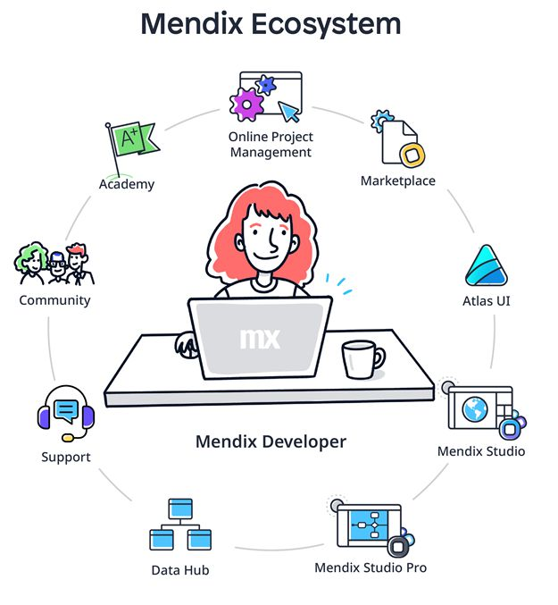
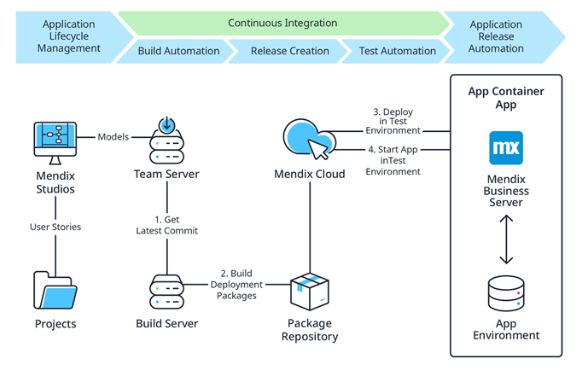
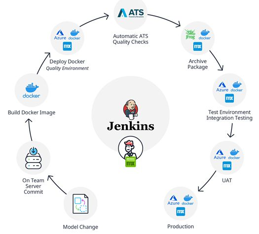
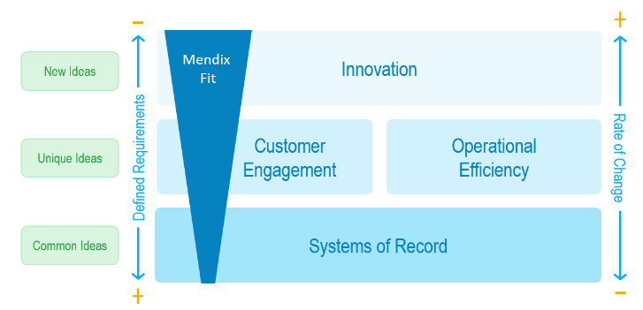
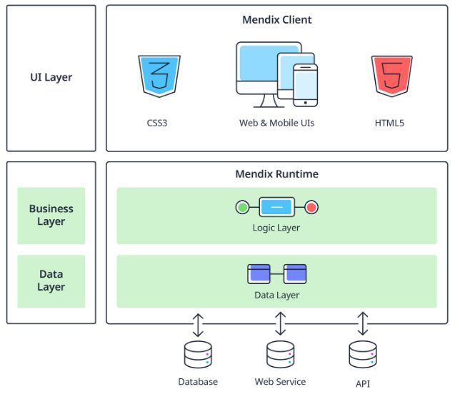

#lowcode #mendix #siemens
2023年2月1日
https://www.mendix.com/

# 背景
Mendix号称低代码平台的佼佼者，那正好试着玩一玩。mendix可以用西门子员工登录，登陆之后跟着Academy搞了一个礼拜左右，试了一些基本功能。

# 初学之后的心得
1. Mendix主要开发Web app，但这个app，其实指的就是网站开发，包含前后端。
2. Mendix集合了
3. Microflow是mendix的核心，取代了传统开发中需要在前端和后端中定制的小逻辑，比如检验表单输入，进行处理和判断等。
4. Mendix的licensing和pricing还是非常贵的，目前单server多app，50个user，需要27万人民币不含税。这里就存在一个部署问题，是单机部署，还是依赖云平台的部署呢？如果是云平台部署，国内是腾讯与，那这本身也造成了客户选择少。
5. 网上对于mendix的看法非常多，但很少有质疑其在当前低代码平台领域的领先地位。主要还是集中于app的所有权，数据所有权，隐私，颗粒度之类的。
6. 在开发方面，Mendix开发既有基于网页版本的Studio，也有离线desktop版本的Studio pro。但离线版本的Studio pro的学习成本也不算低。如果一个企业真的需要养活专门从事mendix开发的人来开发和维护，那么这么做的生态绑定和风险性是不是太大了？此外，在mendix中的debug也是一件非常麻烦和不那么底层的事情。
7. 但有一说一，目前低代码平台需要这么一个

# 官网自学历程和笔记
主要就是跟着Academy
## Academy

### Mendix Development Process

Agile + DevOps

### Creating Pages

Atlas UI

### Domain Model

The domain model is an abstracted relational database based upon standard UML notation and object-oriented principles. In other words, this is a visual representation of the data that your application consists of.

This visual approach to application development allows you to build apps with Agility. Mendix gives you the ability to quickly build and grow your application over time.

The domain model consists of three main elements:

-   Entities which represents objects.
-   Attributes which assigns properties and values to entities.
-   Associations which allow entities to communicate with one another.

To store data in Mendix, you’ll need to use the Domain Model, an Object Relational Mapping (or ORM) included in Mendix. You can compare it to Hibernate, Entity Framework, or Django. Let’s get familiar with the Mendix way of structuring data!

### Team Server

The Team Server is the Mendix host environment that hosts all your applications. It also facilitates [versioning of apps](https://www.mendix.com/evaluation-guide/app-lifecycle/version-control), allowing for team members to sync updated projects.

### Microflows

Microflows model custom logic instead of custom code. This makes understanding the underlying structure of an application much easier, even years after it was created, no matter who is looking at it. This also allows for non-technical business interests and customers to easily understand how the application works.

### Data Validation and Consistency

Validation rules in Mendix are conditions that need to be met before objects can be stored in the database.

Domain model validations are added directly to the attributes of entities. This can control if data entered is unique or matches a specific datatype.

Validations can also be added to microflows and can be used to generate custom error messages for actions and inputs of the end user.

[Data consistency](https://www.mendix.com/evaluation-guide/app-lifecycle/model-consistency) is controlled by the relation of association between two objects. This controls what data can be deleted from each object.

### Application Security

At the project level, you can set who has access to the application and what they have access to, by setting user and module roles.

At the administrator level, you can preview the app, toggling each user role to view how they would experience the application, ensuring desired configuration.

### Microflows

表单条件判断等特定逻辑。

一个start event，一个或多个end event，其中包含activities和decisions。

### Widgets & Building blocks

Widgets are single elements that can be configured and used in your pages.

Building blocks are pre-configured sets of widgets.

### User Roles

User roles are not developer roles!

User roles are security measures, control access to pages and microflows.

Developer roles are used to manage access for app developers.

App -> Settings -> Roles & Permissions

## Crash Course

Mendix runtime, Mendix client, Mendix model

### Application lifecycle management

The Mendix platform provides a development life cycle that is familiar to people who are used to agile software development. What are the differences?

1.  The result is the model, which is interpreted by the runtime in the cloud.
2.  In the team, the business analyst and the developer work together on the app. This helps create a common understanding of the application.

### Integration with Existing CI/CD Pipeline

### Capabilities of Mendix

### Mendix Architecture

### Database

HSQL, that comes with the Mendix Runtime

The domain model supports several databases. You can choose the internal database, which is fine for small apps, or one of the enterprise databases supported by Mendix. These include:

-   IBM DB2.

-   Microsoft SQL Server.

-   MySQL/MariaDB.

-   Oracle Database.

-   PostgreSQL.

### Entities and Attributes