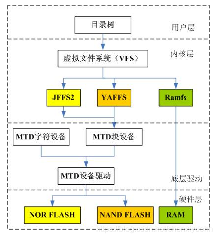
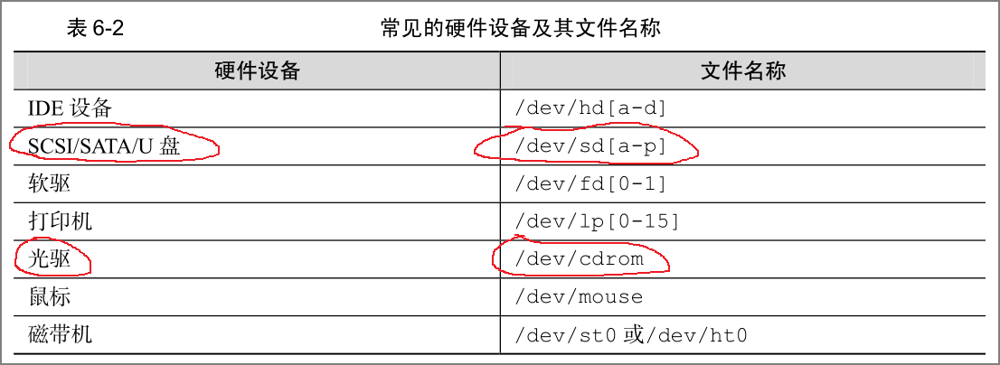
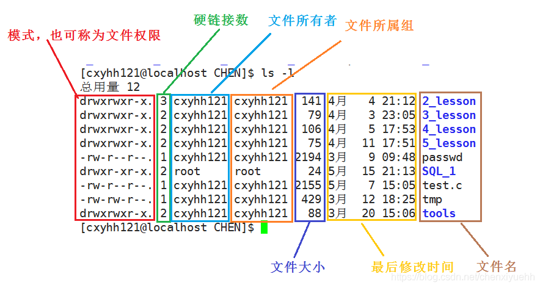
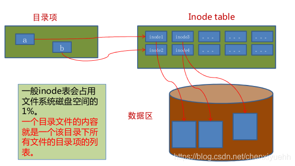
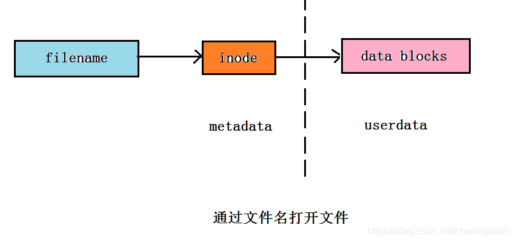
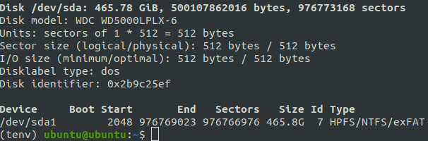
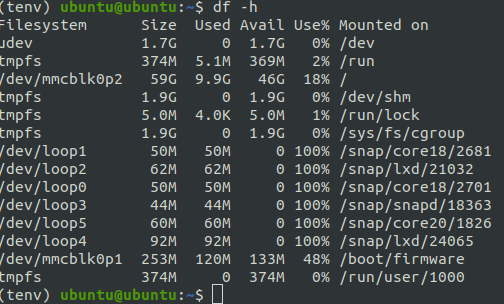
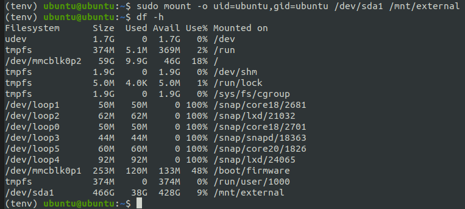

# Linux文件系统
简单来说，博主觉得学习Linux非常重要的思维就是：
> 根据用户权限来区分文件目录，系统级别放在公共目录，用户级别放在各自用户目录下。

https://zhuanlan.zhihu.com/p/351675403
https://blog.csdn.net/weixin_44614230/article/details/127661184
```txt
/bin：这个目录存放着最经常使用的命令
/sbin：这里存放的是系统管理员使用的系统管理程序
/home：存放普通用户的主目录,在Linux中每个用户都有一个自己的目录，一般该目录是以用户的账号命名
/root：该目录为系统管理员的用户主目录
/lib：系统开机所需要最基本的动态连接共享库，几乎所有的应用程序都需要用到这些共享库
/etc：所有的系统管理所需要的配置文件和子目录，比如安装mysql数据库的my.conf
/usr：这是一个非常重要的目录，用户的很多应用程序和文件都放在这个目录下
/boot：存放的是启动Linux时使用的一些核心文件，包括一些连接文件以及镜像文件
/tmp：存放一些临时文件
/media：Linux系统会自动识别一些设备，例如U盘，当识别后，Linux会把识别的设备挂载到这个目录下
/opt：这是给主机额外安装软件所存放的目录
/var：这个目录中存放着在不断扩充着的东西，习惯将经常修改的目录放在这个目录下，包括各种日志文件
```
还有很多，感兴趣的可以去网上查一查，这些都不用背的，了解即可


# 为什么一切皆文件？
文件类型
https://scoolor.github.io/2018/11/08/linux-everything-is-file/
用户，文件权限，chmod
https://zhuanlan.zhihu.com/p/150886291
每种文件类型举了例子
https://linux.cn/article-7669-1.html

## 文件结构




## 文件属性
查看文件属性的命令
```sh
ls -l
```


## 文件数据

所以在linux中，文件属性和数据是分开存储的。通过inode进行mapping。


## 软硬链接
https://blog.csdn.net/chenxiyuehh/article/details/90636675

用户数据 (user data) 与元数据 (metadata)。

用户数据，即文件数据块 (data block)，数据块是记录文件真实内容的地方；
元数据，则是文件的附加属性，如文件大小、创建时间、所有者等信息。

在 Linux 中，元数据中的 **inode 号（inode 是文件元数据的一部分但其并不包含文件名，inode 号即索引节点号）才是文件的唯一标识而非文件名**。文件名仅是为了方便人们的记忆和使用，系统或程序通过 inode 号寻找正确的文件数据块。为方便读者理解，我们这里画一个图来展示了程序通过文件名获取文件内容的过程。



PS：怎么理解软硬链接参照上面链接的内容，举例非常清晰。简单说删除硬链接，删除的是filename到inode的那条映射关系。删除软连接，对源文件根本没影响，因为原文件的路径只是软连接的data blocks。而删除源文件，软连接会变成死链。

软链接也叫符号链接 Symbolic Link。


# 硬盘挂载
## 显示设备
移动硬盘和U盘插入后不一定会被直接挂在，这时候运行
```sh
sudo fdisk -l
```
可以显示所有设备，比如我的外接硬盘

注意：/dev/sda意思是整个硬盘，所以前面是Disk。/dev/sda1的意思是分区，所以前面是Device。我们实际挂载的是分区。
## 显示已挂载设备
```sh
df -h
```
比如这是我的显示

就没有这块硬盘
## 挂载命令
```sh
sudo mount -o uid=ubuntu,gid=ubuntu /dev/sda1 /mnt/external
```
uid和gid可以通过执行id命令查询，/mnt/external就是挂载的目的地

## 显示挂载后
再次执行
```sh
df -h
```

出现了，挂载成功

## 取消挂载
```sh
sudo umount /mnt/external
```
注意umount后面跟的路径是挂在之后的路径，执行了umount之后再运行df -
命令会显示和挂载前一样的结果。