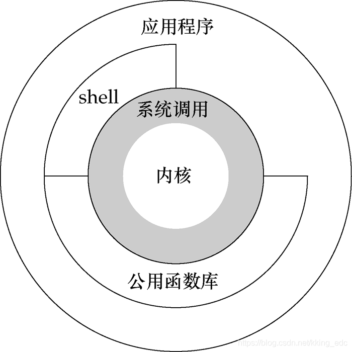

# 什么是内核态和用户态？
参见Refs2，说的非常好。
简单说，内核态与用户态，对应的是CPU提供的权限分级功能的一层封装抽象。设计目标是为了多任务系统：权限分级、数据隔离、任务切换。

由此简单定义：
参见Refs3

# Refs
1. https://blog.csdn.net/kking_edc/article/details/108980811
2. https://www.zhihu.com/question/397142622
3. https://blog.csdn.net/ludan_xia/article/details/105695961
4. [User space(用户空间) 与 Kernel space(内核空间) - myseries - 博客园 (cnblogs.com)](https://www.cnblogs.com/myseries/p/12056078.html)
