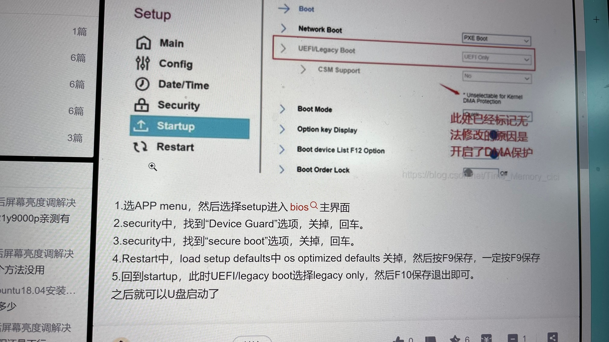
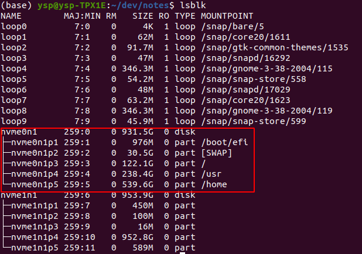

# ubuntu物理机安装和开发环境配置

## 写在最前：

### 1. 使用win10+vmware的痛点：
- 无法很好的在ubuntu里分屏。

- 无法很好的利用GPU资源。
- win中干扰项太多，还是想专心的开发。
- 更多的体会到在win中开发不如在linux中流畅。感谢领导支持，直接搞了个nvme硬盘物理安装ubuntu。

### 2. 为什么不用mac

- 对于intel mac来说，开发上mac有的ubuntu也有， mac没有的linux也有。

- 对于non-intel mac来说，开发上坑太多，暂时不会考虑。

## 安装过程

### 1. 电脑配置

机器是Thinkpad X1 Extreme Gen3, 没想到想在单独的第二块硬盘上装系统也要关闭第一块硬盘上win的bitlocker。关闭完bitlocker后从U盘启动，死活进不去引导，后来关闭bios中Security里的secure boot就好了。参照下图，但只需要第三条即可。



### 2. 分区

好久没安装了，忘记了linux分区的知识，边手机搜索边分区，说什么的都有，但咱有1TB，不怕。最后结果如图，先这么用着吧。

```bash
lsblk
```




## 备份
用的timeshift，策略师每周，保留3个最近的


