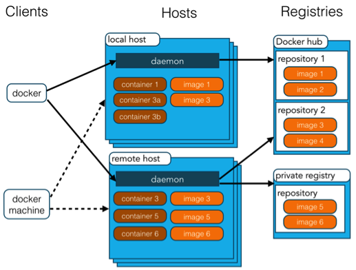
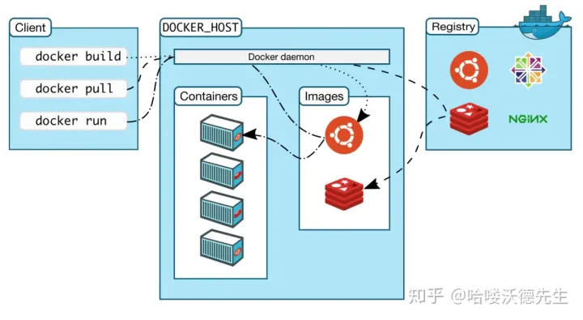

#docker #basic #基础
# 资源
## 官网
https://www.docker.com/

# 原理
> Docker 技术使用 [Linux 内核](https://www.redhat.com/zh/topics/linux/what-is-the-linux-kernel)和内核功能（例如 [Cgroup](https://www.redhat.com/zh/blog/world-domination-cgroups-rhel-8-welcome-cgroups-v2) 和[命名空间](https://lwn.net/Articles/528078/)）来分隔进程，以便各进程相互独立运行。这种独立性正是采用容器的目的所在；它可以独立运行多种进程、多个应用，更加充分地发挥基础设施的作用，同时[保持各个独立系统的安全性](https://www.redhat.com/zh/topics/security)。

下面这个讲的很到位
[(43条消息) Docker原理（图解+秒懂+史上最全）_40岁资深老架构师尼恩的博客-CSDN博客](https://blog.csdn.net/crazymakercircle/article/details/120747767)


# 教程
### 安装
https://docs.docker.com/desktop/install/linux-install/

# 应用场景
1. Web 应用的自动化打包和发布。
2. 自动化测试和持续集成、发布。
3. 在服务型环境中部署和调整数据库或其他的后台应用。
4. 从头编译或者扩展现有的 OpenShift 或 Cloud Foundry 平台来搭建自己的 PaaS 环境。

# 架构
https://www.runoob.com/docker/docker-architecture.html
https://zhuanlan.zhihu.com/p/191539801

## 基本概念
Docker 包括三个基本概念:
 1. 镜像（Image）：Docker 镜像（Image），就相当于是一个 root 文件系统。比如官方镜像 ubuntu:16.04 就包含了完整的一套 Ubuntu16.04 最小系统的 root 文件系统。
2. 容器（Container）：镜像（Image）和容器（Container）的关系，就像是面向对象程序设计中的类和实例一样，镜像是静态的定义，容器是镜像运行时的实体。容器可以被创建、启动、停止、删除、暂停等。
 3. 仓库（Repository）：仓库可看成一个代码控制中心，用来保存镜像。

## C/S 架构
看下图中的Host，对比Portainer里面的进入页。

其他的就是关键词，镜像，容器，等等。

另一个图


## Docker daemon
linux是在 
```bash
vim /etc/docker/daemon.json
```
文件里，可以做诸如镜像加速的事情。
```json
{
  "registry-mirrors": ["http://hub-mirror.c.163.com", "https://docker.mirrors.ustc.edu.cn"]
}
```


# 管理Docker命令
## 启动与停止
```bash
```bash
# 启动 docker
sudo systemctl start docker
# 停止 docker
sudo systemctl stop docker
# 重启 docker
sudo systemctl restart docker
# 设置开机启动
sudo systemctl enable docker
# 查看 docker 状态
sudo systemctl status docker
# 查看 docker 内容器的运行状态
sudo docker stats
# 查看 docker 概要信息
sudo docker info
# 查看 docker 帮助文档
sudo docker --help
```


# 容器连接
https://www.runoob.com/docker/docker-container-connection.html
指定端口号

# Dockerfile
https://www.runoob.com/docker/docker-dockerfile.html

# Docker compose
https://www.runoob.com/docker/docker-compose.html
https://juejin.cn/post/7042663735156015140


# Docker 命令
Official: https://docs.docker.com/reference/
https://www.runoob.com/docker/docker-command-manual.html
https://zhuanlan.zhihu.com/p/196754771

Generally speaking, use docker + type + command, for example, for image related, just type
```bash
docker image
```

And this will give you the instruction what to continue later.
All below run as root, if not, add sudo as prefix
## image
```bash
# list images
docker images
docker image ls
# list all images id
docker images -q
# search images
docker search image_name
# pull image
# e.g. docker pull centos:7
docker pull image_name[:tag_name]
# delete image
docker rmi image_id
docker rmi image_id1 image_id2 image_id3
# delete all images
docker rmi 'docker images -q'

```

## container
### list
```bash
# list 
docker container ls
docker ps
# list stopped containers
docker ps -f status=exited
# list all (including running and exited)
docker ps -a
# check last running container
docker ps -l
```
### create & run
> 注意：Docker 容器运行必须有一个前台进程， 如果没有前台进程执行，容器认为是空闲状态，就会自动退出。

#### 为什么docker需要前台进程？
https://www.bing.com/search?q=Docker+%E5%AE%B9%E5%99%A8%E8%BF%90%E8%A1%8C%E5%BF%85%E9%A1%BB%E6%9C%89%E4%B8%80%E4%B8%AA%E5%89%8D%E5%8F%B0%E8%BF%9B%E7%A8%8B&aqs=edge..69i57j69i64&FORM=ANCMS9&PC=U531

#### 守护进程
https://blog.51cto.com/u_16175446/6627567
https://www.yzktw.com.cn/post/1307727.html
```txt
Docker 守护进程
Docker 是一种用于开发、交付和运行应用程序的开放平台。它可以通过在容器中打包应用程序及其所有依赖项，提供一种轻量级、可移植和自给自足的环境来运行应用程序。而 Docker 守护进程（Docker daemon）则是 Docker 的核心组件之一，它负责管理和运行容器。

Docker 守护进程的作用
Docker 守护进程是一个长时间运行的后台进程，负责管理 Docker 的主要功能。它负责处理容器的创建、启动、停止、删除等操作，并且监控容器的运行状态。它还负责管理 Docker 镜像的下载、更新和存储，以及网络和存储卷的管理。
```
#### docker run
```bash
docker run [OPTIONS] IMAGE [COMMAND] [ARG...]
```
```txt
`-i`：表示运行容器；
`-t`：表示容器启动后会进入其命令行。加入这两个参数后，容器创建就能登录进去。即分配一个伪终端；
`--name`：为创建的容器命名；
`-v`：表示目录映射关系（前者是宿主机目录，后者是映射到宿主机上的目录），可以使用多个 -v 做多个目录或文件映射。注意：最好做目录映射，在宿主机上做修改，然后共享到容器上；
`-d`：在 run 后面加上 -d 参数，则会创建一个守护式容器在后台运行（这样创建容器后不会自动登录容器，如果只加 -i -t 两个参数，创建容器后就会自动进容器里）；
`-p`：表示端口映射，前者是宿主机端口，后者是容器内的映射端口。可以使用多个 -p 做多个端口映射。
`-P`：随机使用宿主机的可用端口与容器内暴露的端口映射。
```

```bash
# create a container based on a image, /bin/bash can be ignored if the image doesn't fit
docker run -it --name 容器名称 镜像名称:标签 /bin/bash
# create daemon container
docker run -di --name container_name image_name:tag_name
# logon to daemon container
docker exec -it container_name|container_id /bin/bash


```

### start & stop
```bash
# 停止容器
docker stop 容器名称|容器ID
# 启动容器
docker start 容器名称|容器ID
```

### file copy
如果我们需要将文件拷贝到容器内可以使用 cp 命令。

```bash
docker cp 需要拷贝的文件或目录 容器名称:容器目录
```

也可以将文件从容器内拷贝出来。

```bash
docker cp 容器名称:容器目录 需要拷贝的文件或目录
```

### volume & mount

