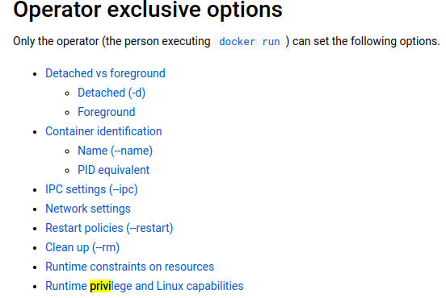

# 原理
> Docker runs processes in isolated containers. A container is a process which runs on a host. The host may be local or remote. When an operator executes `docker run`, the container process that runs is isolated in that it has its own file system, its own networking, and its own isolated process tree separate from the host.

# 命令格式
## 格式


```bash
# 基本格式
docker run [OPTIONS] IMAGE[:TAG|@DIGEST] [COMMAND] [ARG...]
# 常用参数
`-i`：表示运行容器；
`-t`：表示容器启动后会进入其命令行。加入这两个参数后，容器创建就能登录进去。即分配一个伪终端；
`--name`：为创建的容器命名；
`-v`：表示目录映射关系（前者是宿主机目录，后者是映射到宿主机上的目录），可以使用多个 -v 做多个目录或文件映射。注意：最好做目录映射，在宿主机上做修改，然后共享到容器上；
`-d`：在 run 后面加上 -d 参数，则会创建一个守护式容器在后台运行（这样创建容器后不会自动登录容器，如果只加 -i -t 两个参数，创建容器后就会自动进容器里）；
`-p`：表示端口映射，前者是宿主机端口，后者是容器内的映射端口。可以使用多个 -p 做多个端口映射。
`-P`：随机使用宿主机的可用端口与容器内暴露的端口映射。
```

常用的需要设置的选项：



## 例子
```bash
# create a container based on a image, /bin/bash can be ignored if the image doesn't fit
docker run -it --name 容器名称 镜像名称:标签 /bin/bash
# create daemon container
docker run -di --name container_name image_name:tag_name
# logon to daemon container
docker exec -it container_name|container_id /bin/bash
```

# 参数
## --privileged
参见
[[Docker-2.1-Privileged_mode]]

## --pid=""
> --pid=""  : Set the PID (Process) Namespace mode for the container,
             'container:<name|id>': joins another container's PID namespace
             'host': use the host's PID namespace inside the container

By default, all containers have the PID namespace enabled.

PID namespace provides separation of processes. The PID Namespace removes the view of the system processes, and allows process ids to be reused including pid 1.

简单说就是pid用谁的，比如--pid=container:my-redis， 那就用一个现有的叫做my-redis的container。

## --ipc="MODE"
IPC： inter-process communication. The following values are accepted:

|Value|Description|
|---|---|
|””|Use daemon’s default.|
|“none”|Own private IPC namespace, with /dev/shm not mounted.|
|“private”|Own private IPC namespace.|
|“shareable”|Own private IPC namespace, with a possibility to share it with other containers.|
|“container: <_name-or-ID_>"|Join another (“shareable”) container’s IPC namespace.|
|“host”|Use the host system’s IPC namespace.|

If not specified, daemon default is used, which can either be `"private"` or `"shareable"`, depending on the daemon version and configuration.

简单来说，就是利用共享内存机制加速IPC通信。可以是自己的，其他container的，或者是host的。

例子参见：
https://docs.docker.com/engine/reference/run/#pid-settings---pid

## Network-settings
[[Docker-2.2-Network_settings]]


# Refs
1. https://docs.docker.com/engine/reference/run/